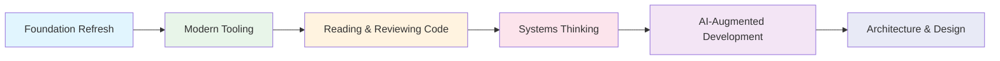

# Roadmap: From Developer to Systems Architect 🗺️

A structured path to ramp back into tech as an **AI-augmented systems thinker**.

You're not starting from zero—you have a CS degree and real experience with C#, HTML, CSS, and JavaScript. This roadmap builds on that foundation, updates your mental models for modern tooling, and elevates your thinking from "writing code" to "designing systems."

---

## The Big Picture

Each phase builds on the last. You'll create deliverables—diagrams, documentation, small code projects—that demonstrate mastery before moving on.

---

## Phase 1: Foundation Refresh 🧱

**Goal**: Reconnect with core programming concepts through a new lens—understanding *what they represent* in the human mind.

### 1.1 Mental Models: Variables & Memory

> A variable is like a labeled box in your mind. When you learn someone's name, you're storing it in a "variable." When you forget, the reference is gone but the memory might still exist somewhere.

**Concepts**:
- Variables as named memory locations
- Value types vs reference types (owning vs pointing)
- Scope as context (what you can "see" depends on where you're standing)

**Deliverable**: 
- Mermaid diagram showing memory allocation for value vs reference types
- Short code example in C# demonstrating the difference

### 1.2 Functions as Habits & Procedures

> A function is a habit your code has learned. You define it once, and it can be triggered whenever needed. Just like your morning routine—brushing teeth, making coffee—you don't rethink the steps each time.

**Concepts**:
- Functions as reusable procedures
- Parameters as inputs (what you need to start)
- Return values as outputs (what you produce)
- Side effects (things that change outside the function)

**Deliverable**:
- Flowchart of a function's execution
- Refactor a "messy" code block into clean functions

### 1.3 Objects & Identity

> A class is like a blueprint for identity. You are an instance of "Human"—you have properties (name, height) and behaviors (walk, speak). Your specific values make you unique, but you share structure with all humans.

**Concepts**:
- Classes as templates
- Objects as instances with state
- Encapsulation as privacy (what you show vs what you keep internal)
- Methods as behaviors

**Deliverable**:
- Class diagram of a real-world concept (e.g., a Library system)
- Implement the class in C# with properties and methods

### 1.4 Data Flow: From Input to Output

> Every program is a journey. Data enters, gets transformed, and exits. Like food → digestion → energy. Understanding this flow is key to reading any codebase.

**Concepts**:
- Input/Process/Output model
- Tracing data through a system
- Debugging as following the flow

**Deliverable**:
- Trace a simple program's data flow with a sequence diagram
- Annotate an existing code snippet showing the data journey

---

## Phase 2: Modern Tooling ⚙️

**Goal**: Get comfortable with the tools that have become standard since you last coded.

### 2.1 Git & GitHub Fluency

> Git is like a time machine for your code. Every commit is a snapshot you can return to. Branches are parallel timelines you can explore safely.

**Concepts**:
- Commits as checkpoints
- Branches as experiments
- Pull requests as conversations
- Merge conflicts as reconciliation

**Deliverable**:
- Create a branch, make changes, open a PR, merge it
- Draw a Mermaid gitGraph showing your branching strategy

### 2.2 Markdown & Documentation

> Code tells the computer what to do. Documentation tells humans why and how.

**Concepts**:
- Markdown syntax
- READMEs as first impressions
- Inline comments vs external docs
- Writing for your future self

**Deliverable**:
- Write a README for a fictional project
- Document a code function with clear explanations

### 2.3 Mermaid Diagrams

> A diagram is worth a thousand lines of documentation. Mermaid lets you write diagrams as code.

**Concepts**:
- Flowcharts for logic
- Sequence diagrams for interactions
- Class diagrams for structure
- Entity-relationship diagrams for data

**Deliverable**:
- Create one of each diagram type for a sample system
- Embed them in a markdown document

### 2.4 Terminal & Command Line

> The terminal is a direct conversation with your computer. No buttons, no menus—just you and the machine.

**Concepts**:
- Navigation (cd, ls, pwd)
- File operations (touch, mkdir, rm, cp, mv)
- Running programs
- Environment variables

**Deliverable**:
- Complete a terminal scavenger hunt (navigate, create, move files)
- Write a cheat sheet of your most useful commands

---

## Phase 3: Reading & Reviewing Code 📖

**Goal**: Shift from writing code to *understanding* existing code. This is the senior skill.

### 3.1 Codebase Archaeology

> Every codebase is a historical artifact. The structure tells you what the original authors valued. The comments tell you what they worried about.

**Concepts**:
- Project structure patterns (where things live)
- Entry points (where does execution start?)
- Following imports and dependencies
- README-first exploration

**Deliverable**:
- Analyze a small open-source project
- Create a "map" of the codebase as a diagram

### 3.2 Code Review Fundamentals

> Code review isn't about finding bugs—it's about sharing knowledge and maintaining quality.

**Concepts**:
- What to look for (clarity, correctness, consistency)
- Asking questions vs making demands
- The "why" behind style guides
- Approval, request changes, comment

**Deliverable**:
- Review a sample PR (provided)
- Write constructive feedback with specific suggestions

### 3.3 Tracing Execution

> Reading code is like reading a choose-your-own-adventure book. You follow the path that data takes.

**Concepts**:
- Call stacks and function chains
- Conditional branches
- Loops and iteration
- Async/await and the event loop

**Deliverable**:
- Trace execution of a provided code sample
- Annotate with a sequence diagram

---

## Phase 4: Systems Thinking 🌐

**Goal**: Zoom out. See the forest, not just the trees.

### 4.1 Components & Boundaries

> Every system is made of parts with boundaries. Your body has organs. A company has departments. Software has services.

**Concepts**:
- Decomposition (breaking big things into small things)
- Interfaces as contracts
- Coupling (how connected are the parts?)
- Cohesion (how focused is each part?)

**Deliverable**:
- Decompose a familiar app (e.g., Spotify, Twitter) into components
- Diagram the boundaries and interfaces

### 4.2 Data & State

> State is the current reality of a system. Data is information in motion. Understanding both is understanding the system's "now" and "flow."

**Concepts**:
- Stateless vs stateful
- Databases as long-term memory
- Caches as short-term memory
- Events as announcements

**Deliverable**:
- Diagram where state lives in a sample application
- Identify what triggers state changes

### 4.3 Failure Modes & Resilience

> Every system fails. The question is how gracefully.

**Concepts**:
- Error handling strategies
- Retries and backoff
- Graceful degradation
- Monitoring and observability

**Deliverable**:
- Analyze a system for potential failure points
- Propose resilience strategies with diagrams

---

## Phase 5: AI-Augmented Development 🤖

**Goal**: Learn to work *with* AI as a pair programmer and force multiplier.

### 5.1 Prompt Engineering for Code

> AI is your junior developer with infinite patience. The quality of its work depends on the quality of your instructions.

**Concepts**:
- Context is king (give background)
- Be specific about constraints
- Iterate and refine
- Verify output—always

**Deliverable**:
- Complete a coding task using only AI assistance
- Document your prompts and the iterations

### 5.2 Agentic Workflows

> You're the architect. AI is the builder. Your job is to specify, review, and guide.

**Concepts**:
- Task decomposition for AI
- Review before commit
- Using AI for refactoring
- Using AI for documentation

**Deliverable**:
- Use Cursor to build a small feature from scratch
- Document your workflow and decision points

### 5.3 AI for Understanding

> Don't just use AI to write—use it to explain. Ask it to diagram. Ask it to summarize. Ask it to teach.

**Concepts**:
- Explaining code with AI
- Generating diagrams from descriptions
- Summarizing complex systems
- Learning new concepts on-demand

**Deliverable**:
- Take an unfamiliar codebase and use AI to understand it
- Produce a summary document with AI-generated diagrams

---

## Phase 6: Architecture & Design 🏛️

**Goal**: Think like a senior architect. Make decisions. Justify tradeoffs.

### 6.1 Design Patterns (Conceptual)

> Patterns are proven solutions to recurring problems. You don't need to memorize them—you need to recognize when you're facing the problem they solve.

**Concepts**:
- Factory (creating objects without specifying exact class)
- Observer (notifying dependents of changes)
- Strategy (swapping algorithms at runtime)
- Repository (abstracting data access)

**Deliverable**:
- Identify patterns in an existing codebase
- Diagram how a pattern would solve a given problem

### 6.2 Architecture Decision Records (ADRs)

> Every significant decision should be documented. ADRs capture *why* you chose A over B.

**Concepts**:
- Title, Status, Context, Decision, Consequences
- Living documentation
- Tradeoff analysis

**Deliverable**:
- Write an ADR for a hypothetical decision
- Include alternatives considered and reasons for rejection

### 6.3 System Design Fundamentals

> How do large systems stay up? How do they scale? How do teams work on them simultaneously?

**Concepts**:
- Client-server architecture
- APIs as contracts
- Microservices vs monoliths
- Load balancing and scaling

**Deliverable**:
- Design a simple system (e.g., URL shortener)
- Diagram the architecture with Mermaid

### 6.4 Capstone: Full System Analysis

> Put it all together. Analyze a real system end-to-end.

**Deliverable**:
- Choose a product you use daily
- Produce a comprehensive analysis:
  - Component diagram
  - Data flow diagram
  - Sequence diagram for a key user action
  - Identified failure modes
  - Proposed ADR for one design decision

---

## Progress Tracking

| Phase | Module | Status | Card Link |
|-------|--------|--------|-----------|
| 1 | Mental Models: Variables & Memory | ⬜ Not Started | |
| 1 | Functions as Habits & Procedures | ⬜ Not Started | |
| 1 | Objects & Identity | ⬜ Not Started | |
| 1 | Data Flow | ⬜ Not Started | |
| 2 | Git & GitHub Fluency | ⬜ Not Started | |
| 2 | Markdown & Documentation | ⬜ Not Started | |
| 2 | Mermaid Diagrams | ⬜ Not Started | |
| 2 | Terminal & Command Line | ⬜ Not Started | |
| 3 | Codebase Archaeology | ⬜ Not Started | |
| 3 | Code Review Fundamentals | ⬜ Not Started | |
| 3 | Tracing Execution | ⬜ Not Started | |
| 4 | Components & Boundaries | ⬜ Not Started | |
| 4 | Data & State | ⬜ Not Started | |
| 4 | Failure Modes & Resilience | ⬜ Not Started | |
| 5 | Prompt Engineering for Code | ⬜ Not Started | |
| 5 | Agentic Workflows | ⬜ Not Started | |
| 5 | AI for Understanding | ⬜ Not Started | |
| 6 | Design Patterns | ⬜ Not Started | |
| 6 | Architecture Decision Records | ⬜ Not Started | |
| 6 | System Design Fundamentals | ⬜ Not Started | |
| 6 | Capstone: Full System Analysis | ⬜ Not Started | |

---

## Estimated Timeline

- **Phase 1-2**: 2-3 weeks (foundations + tooling)
- **Phase 3**: 2 weeks (reading/reviewing)
- **Phase 4**: 2-3 weeks (systems thinking)
- **Phase 5**: 2 weeks (AI-augmented dev)
- **Phase 6**: 3-4 weeks (architecture + capstone)

**Total**: ~12-16 weeks at moderate pace

---

*The goal isn't to write more code. It's to understand systems deeply and direct AI to build them with you.*

