# Roadmap: From Developer to Systems Architect 🗺️

A structured, **project-driven** path to ramp back into tech as an **AI-augmented systems thinker**.

---

## Your Background

You're not starting from zero. You bring real experience:

- **CS Degree** from Davenport University
- **Languages**: C#, HTML, CSS, JavaScript
- **AI/ML Experience**: Decision trees, classification algorithms
- **Project Experience**: Biometrics app — fingerprint recognition across 5 material types using iPhone sensor data

This roadmap builds on that foundation. You've built real projects before. You'll build real projects again — just with modern tools and an architectural mindset.

---

## How Each Module Works

Every module follows this structure:

```mermaid
flowchart LR
    A[📚 Learn] --> B[📊 Diagram]
    B --> C[📝 Quiz]
    C --> D[🔨 Build]
    D --> E[🚀 Ship]
    
    style A fill:#e3f2fd
    style B fill:#f3e5f5
    style C fill:#fff8e1
    style D fill:#e8f5e9
    style E fill:#ffebee
```

| Step | What You Do |
|------|-------------|
| **📚 Learn** | Read the lesson markdown, watch linked resources |
| **📊 Diagram** | Create Mermaid diagrams explaining the concepts |
| **📝 Quiz** | Answer comprehension questions (in the lesson file) |
| **🔨 Build** | Complete a mini-project applying what you learned |
| **🚀 Ship** | Push to your folder, open PR, get review, merge |

**All work lives in**: `bparker/<module-folder>/`

---

## The Big Picture

Each phase ends with a **milestone project** that combines everything you learned.

---

## Phase 1: Foundation Refresh 🧱

**Goal**: Reconnect with core concepts through a new lens — and build something immediately.

### 1.1 Mental Models: Variables & Memory

> A variable is like a labeled box in your mind. When you learn someone's name, you're storing it in a "variable."

**📚 Concepts**:
- Variables as named memory locations
- Value types vs reference types (owning vs pointing)
- Scope as context

**📊 Diagram Deliverable**:
- Mermaid diagram: memory allocation for value vs reference types

**📝 Quiz**: 5 questions on memory, scope, and references

**🔨 Mini-Project**: **Memory Visualizer**
- Build a simple console app that demonstrates value vs reference behavior
- Print memory addresses or hash codes to show the difference
- Include comments explaining what's happening

---

### 1.2 Functions as Habits & Procedures

> A function is a habit your code has learned. Define it once, trigger it whenever needed.

**📚 Concepts**:
- Functions as reusable procedures
- Parameters as inputs, return values as outputs
- Side effects (things that change outside the function)
- Pure functions vs impure functions

**📊 Diagram Deliverable**:
- Flowchart of a function's execution path

**📝 Quiz**: 5 questions on function design and side effects

**🔨 Mini-Project**: **Recipe Calculator**
- Build a program that scales recipe ingredients
- Input: recipe ingredients + servings, desired servings
- Output: scaled ingredient amounts
- Must use pure functions with clear inputs/outputs

---

### 1.3 Objects & Identity

> A class is a blueprint for identity. You are an instance of "Human" with properties and behaviors.

**📚 Concepts**:
- Classes as templates, objects as instances
- Encapsulation (what you show vs hide)
- Methods as behaviors
- Inheritance vs composition

**📊 Diagram Deliverable**:
- Class diagram for a domain you choose

**📝 Quiz**: 5 questions on OOP principles

**🔨 Mini-Project**: **Contact Book**
- Build a contact management system
- Classes: Contact, ContactBook
- Features: add, search, list, delete contacts
- Demonstrate encapsulation (private fields, public methods)

---

### 1.4 Data Flow: From Input to Output

> Every program is a journey. Data enters, transforms, exits. Like food → digestion → energy.

**📚 Concepts**:
- Input/Process/Output model
- Tracing data through a system
- Debugging as following the flow

**📊 Diagram Deliverable**:
- Sequence diagram tracing data through a program

**📝 Quiz**: 5 questions on data flow and debugging

**🔨 Mini-Project**: **Data Pipeline**
- Build a program that reads a CSV, transforms data, outputs JSON
- Log each transformation step
- Include error handling for bad data

---

### 🏆 Phase 1 Milestone: **Decision Engine**

*Leverage your decision tree experience!*

Build a simple **decision tree classifier** from scratch:
- Input: a dataset (provided or create your own)
- Process: implement a basic decision tree algorithm
- Output: predictions on new data + visualization of the tree

**Deliverables**:
- Working code in `bparker/phase-1-milestone/`
- README explaining your approach
- Mermaid diagram of your decision tree structure
- 3-slide summary: Problem → Approach → Results

---

## Phase 2: Modern Tooling ⚙️

**Goal**: Master the tools that define modern development workflows.

### 2.1 Git & GitHub Fluency

> Git is a time machine for code. Commits are checkpoints. Branches are parallel timelines.

**📚 Concepts**:
- Commits, branches, merges
- Pull requests as conversations
- Merge conflicts as reconciliation
- Git log and history exploration

**📊 Diagram Deliverable**:
- Mermaid gitGraph showing a feature branch workflow

**📝 Quiz**: 5 questions on Git workflows

**🔨 Mini-Project**: **Git Time Travel**
- Create a repo with intentional history
- Practice: branch, commit, merge, resolve conflict
- Document your commands in a cheat sheet

---

### 2.2 Markdown & Documentation

> Code tells computers what to do. Documentation tells humans why and how.

**📚 Concepts**:
- Markdown syntax mastery
- READMEs as first impressions
- Technical writing principles
- Inline vs external documentation

**📊 Diagram Deliverable**:
- Documentation structure diagram for a project

**📝 Quiz**: 5 questions on documentation best practices

**🔨 Mini-Project**: **Project Template**
- Create a reusable project template with:
  - README.md (with badges, sections, examples)
  - CONTRIBUTING.md
  - Architecture overview with Mermaid diagram

---

### 2.3 Mermaid Diagrams

> A diagram is worth a thousand lines of documentation.

**📚 Concepts**:
- Flowcharts for logic
- Sequence diagrams for interactions
- Class diagrams for structure
- ERD for data relationships
- State diagrams for workflows

**📊 Diagram Deliverable**:
- Create ALL five diagram types for one system

**📝 Quiz**: 5 questions on choosing the right diagram type

**🔨 Mini-Project**: **System Illustrated**
- Pick an app you use daily (Instagram, Spotify, etc.)
- Create a complete diagram set:
  - User flow (flowchart)
  - API interaction (sequence)
  - Data model (ERD)
  - Core classes (class diagram)
  - User state (state diagram)

---

### 2.4 Terminal & Command Line

> The terminal is a direct conversation with your computer.

**📚 Concepts**:
- Navigation and file operations
- Pipes and redirection
- Environment variables
- Shell scripting basics

**📊 Diagram Deliverable**:
- Flowchart of a shell pipeline

**📝 Quiz**: 5 questions on terminal commands

**🔨 Mini-Project**: **Automation Script**
- Write a shell script that automates a repetitive task
- Examples: project setup, file organization, backup
- Include help text and error handling

---

### 🏆 Phase 2 Milestone: **Developer Portfolio Site**

Build and deploy a personal portfolio site:
- Static HTML/CSS/JS (or use a generator)
- Hosted on GitHub Pages
- Includes: About, Projects, Contact
- Fully documented with README
- All diagrams embedded

---

## Phase 3: Reading & Reviewing Code 📖

**Goal**: Shift from writing code to *understanding* existing code.

### 3.1 Codebase Archaeology

> Every codebase is a historical artifact. Structure reveals values. Comments reveal fears.

**📚 Concepts**:
- Project structure patterns
- Entry points and execution flow
- Dependency mapping
- README-first exploration

**📊 Diagram Deliverable**:
- Codebase map of an open-source project

**📝 Quiz**: 5 questions on code exploration strategies

**🔨 Mini-Project**: **Codebase Report**
- Pick a small open-source project (< 5k lines)
- Produce a report:
  - Purpose and architecture
  - Key files and their roles
  - Dependency diagram
  - "If I had to change X, I'd start here"

---

### 3.2 Code Review Fundamentals

> Code review is about sharing knowledge, not finding bugs.

**📚 Concepts**:
- What to look for: clarity, correctness, consistency
- Constructive feedback techniques
- The "why" behind style guides
- Review etiquette

**📊 Diagram Deliverable**:
- Flowchart of your code review process

**📝 Quiz**: 5 questions on code review best practices

**🔨 Mini-Project**: **Review Practice**
- Review 3 sample PRs (provided)
- Write detailed, constructive feedback
- Identify one thing you learned from each

---

### 3.3 Tracing Execution

> Reading code is like a choose-your-own-adventure. Follow the data.

**📚 Concepts**:
- Call stacks and function chains
- Conditional branches and loops
- Async/await patterns
- Debugging tools and techniques

**📊 Diagram Deliverable**:
- Sequence diagram of code execution

**📝 Quiz**: 5 questions on execution tracing

**🔨 Mini-Project**: **Execution Tracer**
- Take provided code with a bug
- Trace execution to find the bug
- Document your debugging process
- Fix and explain the solution

---

### 🏆 Phase 3 Milestone: **Open Source Contribution**

Make a real contribution to an open-source project:
- Find a "good first issue"
- Understand the codebase (document your exploration)
- Submit a PR
- Respond to feedback

**Deliverables**:
- Link to your merged PR (or detailed attempt)
- Codebase analysis document
- Reflection: what you learned

---

## Phase 4: Systems Thinking 🌐

**Goal**: Zoom out. See the forest, not just the trees.

### 4.1 Components & Boundaries

> Every system has parts with boundaries. Software has services. Your body has organs.

**📚 Concepts**:
- Decomposition strategies
- Interfaces as contracts
- Coupling and cohesion
- API boundaries

**📊 Diagram Deliverable**:
- Component diagram with clear boundaries

**📝 Quiz**: 5 questions on system decomposition

**🔨 Mini-Project**: **System Breakdown**
- Decompose a complex app into components
- Define interfaces between components
- Identify coupling risks

---

### 4.2 Data & State

> State is the system's "now." Data is information in motion.

**📚 Concepts**:
- Stateless vs stateful services
- Databases as long-term memory
- Caches as short-term memory
- Event-driven architecture

**📊 Diagram Deliverable**:
- State diagram for a user journey

**📝 Quiz**: 5 questions on state management

**🔨 Mini-Project**: **State Machine**
- Build a finite state machine for a real process
- Examples: order fulfillment, user authentication, game logic
- Visualize with Mermaid state diagram

---

### 4.3 Failure Modes & Resilience

> Every system fails. The question is how gracefully.

**📚 Concepts**:
- Error handling strategies
- Retries, timeouts, circuit breakers
- Graceful degradation
- Monitoring and alerting

**📊 Diagram Deliverable**:
- Failure mode analysis diagram

**📝 Quiz**: 5 questions on resilience patterns

**🔨 Mini-Project**: **Resilience Audit**
- Analyze a system for failure points
- Propose mitigation strategies
- Implement one resilience pattern in code

---

### 🏆 Phase 4 Milestone: **Biometrics System Design**

*Leverage your fingerprint project experience!*

Design a modern biometrics authentication system:
- Component diagram (sensor, processor, storage, API)
- Data flow for authentication
- Security considerations
- Failure modes and mitigations
- 5-slide presentation of your design

---

## Phase 5: AI-Augmented Development 🤖

**Goal**: Work *with* AI as your pair programmer and force multiplier.

### 5.1 Prompt Engineering for Code

> AI is your junior dev with infinite patience. Quality in = quality out.

**📚 Concepts**:
- Context and constraints in prompts
- Iterative refinement
- Verification strategies
- When AI helps vs hurts

**📊 Diagram Deliverable**:
- Flowchart of your prompt iteration process

**📝 Quiz**: 5 questions on effective prompting

**🔨 Mini-Project**: **Prompt Journal**
- Complete 5 coding tasks using only AI
- Document each prompt and iteration
- Rate effectiveness and lessons learned

---

### 5.2 Agentic Workflows

> You're the architect. AI is the builder. You specify, review, guide.

**📚 Concepts**:
- Task decomposition for AI
- Review-before-commit discipline
- AI for refactoring and documentation
- Knowing when to take over

**📊 Diagram Deliverable**:
- Workflow diagram: human + AI collaboration

**📝 Quiz**: 5 questions on agentic development

**🔨 Mini-Project**: **AI-Built Feature**
- Use Cursor/Copilot to build a complete feature
- Document every decision point
- Track: what AI did well, what you corrected

---

### 5.3 AI for Understanding

> Use AI to explain, diagram, summarize, teach — not just write.

**📚 Concepts**:
- Code explanation strategies
- AI-generated diagrams
- Summarizing complex systems
- Learning new tech with AI

**📊 Diagram Deliverable**:
- AI-assisted system diagram (document your prompts)

**📝 Quiz**: 5 questions on AI for learning

**🔨 Mini-Project**: **Codebase Decoder**
- Take an unfamiliar codebase
- Use AI to understand it completely
- Produce: summary doc, architecture diagram, key insights

---

### 🏆 Phase 5 Milestone: **AI-Powered Tool**

Build a tool that uses AI as a core feature:
- Examples: code explainer, documentation generator, diagram creator
- Must include: clear UI, AI integration, useful output
- Document your AI prompts and iterations

---

## Phase 6: Architecture & Design 🏛️

**Goal**: Think like a senior architect. Make decisions. Justify tradeoffs.

### 6.1 Design Patterns

> Patterns are proven solutions. Recognize the problem, apply the pattern.

**📚 Concepts**:
- Factory, Observer, Strategy, Repository
- When to use each pattern
- Anti-patterns to avoid

**📊 Diagram Deliverable**:
- Class diagrams for 3 patterns

**📝 Quiz**: 5 questions on pattern recognition

**🔨 Mini-Project**: **Pattern Refactor**
- Take messy code (provided)
- Identify applicable patterns
- Refactor and document improvements

---

### 6.2 Architecture Decision Records (ADRs)

> Document *why* you chose A over B. Future you will thank present you.

**📚 Concepts**:
- ADR structure: Context, Decision, Consequences
- Tradeoff analysis
- Living documentation

**📊 Diagram Deliverable**:
- Decision tree for a technical choice

**📝 Quiz**: 5 questions on decision documentation

**🔨 Mini-Project**: **ADR Portfolio**
- Write 3 ADRs for decisions in your past projects
- Include alternatives considered
- Reflect on what you'd change now

---

### 6.3 System Design Fundamentals

> How do large systems scale? How do teams work on them?

**📚 Concepts**:
- Client-server architecture
- APIs as contracts
- Microservices vs monoliths
- Scaling strategies

**📊 Diagram Deliverable**:
- Full system architecture diagram

**📝 Quiz**: 5 questions on system design

**🔨 Mini-Project**: **System Design Doc**
- Design a system: URL shortener, chat app, or your choice
- Include: architecture, data model, API design, scaling plan
- Present in 5 slides

---

### 🏆 Phase 6 Capstone: **Full System Analysis & Proposal**

**The Final Project**: Analyze and propose improvements for a real system.

1. **Choose** a product you use daily
2. **Analyze**:
   - Component diagram
   - Data flow diagram
   - Sequence diagram for key user action
   - Failure mode analysis
3. **Propose**:
   - One major improvement
   - Full ADR for the change
   - Implementation roadmap
4. **Present**:
   - 10-slide deck
   - 5-minute video walkthrough

---

## Progress Tracking

| Phase | Module | Status | Project | Card |
|-------|--------|--------|---------|------|
| 1 | Variables & Memory | ⬜ | Memory Visualizer | |
| 1 | Functions & Procedures | ⬜ | Recipe Calculator | |
| 1 | Objects & Identity | ⬜ | Contact Book | |
| 1 | Data Flow | ⬜ | Data Pipeline | |
| 1 | **Milestone** | ⬜ | Decision Engine | |
| 2 | Git & GitHub | ⬜ | Git Time Travel | |
| 2 | Markdown & Docs | ⬜ | Project Template | |
| 2 | Mermaid Diagrams | ⬜ | System Illustrated | |
| 2 | Terminal & CLI | ⬜ | Automation Script | |
| 2 | **Milestone** | ⬜ | Portfolio Site | |
| 3 | Codebase Archaeology | ⬜ | Codebase Report | |
| 3 | Code Review | ⬜ | Review Practice | |
| 3 | Tracing Execution | ⬜ | Execution Tracer | |
| 3 | **Milestone** | ⬜ | OSS Contribution | |
| 4 | Components & Boundaries | ⬜ | System Breakdown | |
| 4 | Data & State | ⬜ | State Machine | |
| 4 | Failure & Resilience | ⬜ | Resilience Audit | |
| 4 | **Milestone** | ⬜ | Biometrics Design | |
| 5 | Prompt Engineering | ⬜ | Prompt Journal | |
| 5 | Agentic Workflows | ⬜ | AI-Built Feature | |
| 5 | AI for Understanding | ⬜ | Codebase Decoder | |
| 5 | **Milestone** | ⬜ | AI-Powered Tool | |
| 6 | Design Patterns | ⬜ | Pattern Refactor | |
| 6 | ADRs | ⬜ | ADR Portfolio | |
| 6 | System Design | ⬜ | System Design Doc | |
| 6 | **Capstone** | ⬜ | Full System Analysis | |

---

## Estimated Timeline

| Phase | Focus | Duration | Projects |
|-------|-------|----------|----------|
| 1 | Foundation Refresh | 3-4 weeks | 4 mini + 1 milestone |
| 2 | Modern Tooling | 3-4 weeks | 4 mini + 1 milestone |
| 3 | Reading Code | 2-3 weeks | 3 mini + 1 milestone |
| 4 | Systems Thinking | 3-4 weeks | 3 mini + 1 milestone |
| 5 | AI-Augmented Dev | 2-3 weeks | 3 mini + 1 milestone |
| 6 | Architecture | 3-4 weeks | 3 mini + 1 capstone |

**Total**: ~16-22 weeks at moderate pace

---

## What Success Looks Like

By the end of this roadmap, you will:

- ✅ Have a portfolio of **20+ projects** in your GitHub
- ✅ Create **professional diagrams** for any system
- ✅ **Review code** like a senior engineer
- ✅ **Design systems** with clear tradeoffs documented
- ✅ **Direct AI** to build what you envision
- ✅ Think like a **systems architect**, not just a coder

---

*You've built fingerprint scanners and decision trees. Now let's build the mindset of an architect who can design anything.*
