# AutoNateAI Learning Hub: User Feed Feature Specification

> **Document Version**: 1.1
> **Author**: Technical Architecture Team
> **Date**: February 2026
> **Status**: Proposal for Team Review

---

## Executive Summary

This document outlines the strategic implementation of a **User Feed** feature for the AutoNateAI Learning Hub. The feed will become the primary landing experience for authenticated users, transforming our platform from a traditional course-navigation system into a **social learning community**.

The core insight driving this feature: **Learning is inherently social, and sharing progress creates accountability and community.**

---

## Table of Contents

1. [Why Add a User Feed?](#1-why-add-a-user-feed)
2. [Feature Vision & User Stories](#2-feature-vision--user-stories)
3. [Current Architecture Overview](#3-current-architecture-overview)
4. [Feed Architecture Design](#4-feed-architecture-design)
5. [Reusable Components Inventory](#5-reusable-components-inventory)
6. [Open Source Package Recommendations](#6-open-source-package-recommendations)
7. [Data Model Design](#7-data-model-design)
8. [Recommendation Algorithm Strategy](#8-recommendation-algorithm-strategy)
9. [Implementation Roadmap](#9-implementation-roadmap)
10. [Technical Considerations](#10-technical-considerations)
11. [Success Metrics](#11-success-metrics)

---

## 1. Why Add a User Feed?

### The Problem We're Solving

Right now, when a learner completes a challenging quiz or finally understands a difficult concept, that moment of triumph happens in isolation. They might feel proud for a second, but then they're immediately pushed to the next lesson. There's no celebration, no recognition, no community to share that win with.

Meanwhile, when a learner struggles—gets a low score, fails a challenge multiple times—they're alone in that too. No one to ask for help, no one who's been through the same thing to offer encouragement.

**We're leaving so much engagement and motivation on the table.**

### The Psychology of Social Learning

The diagram below illustrates what we call "The Social Learning Flywheel"—a self-reinforcing cycle that transforms isolated learning moments into community-building opportunities.

```mermaid
flowchart TD
    subgraph Flywheel["🔄 THE SOCIAL LEARNING FLYWHEEL"]
        A["🎓 User Learns<br/>a Concept"] --> B["📤 Shares Progress/<br/>Challenge/Result"]
        B --> C["👀 Others See<br/>& Engage"]
        C --> D["✅ Community<br/>Validates & Encourages"]
        D --> E["🧠 Dopamine Hit from<br/>Social Validation"]
        E --> F["🚀 Motivation<br/>to Continue"]
        F --> A
    end

    style A fill:#7986cb,color:#fff
    style B fill:#4db6ac,color:#fff
    style C fill:#ffd54f,color:#000
    style D fill:#66bb6a,color:#fff
    style E fill:#ef5350,color:#fff
    style F fill:#7986cb,color:#fff
```

**Here's how the flywheel works:**

1. **User Learns a Concept** (Purple) — This is where every journey starts. A learner is going through our course content, attempting quizzes, tackling challenges.

2. **Shares Progress/Challenge/Result** (Teal) — Instead of that moment disappearing into the void, the user has a frictionless way to broadcast it. "Just crushed the API quiz!" or "About to attempt the recursion challenge, wish me luck!"

3. **Others See & Engage** (Yellow) — Fellow learners scrolling through their feed see this post. Maybe they're working on the same chapter. Maybe they struggled with that exact quiz last week.

4. **Community Validates & Encourages** (Green) — Likes roll in. Comments appear: "Nice work!" or "I found that one tricky too, you got this!" or "Pro tip: think of it like a stack..."

5. **Dopamine Hit from Social Validation** (Red) — This is neuroscience at work. Every like, every encouraging comment triggers a small dopamine release. The brain says: "That felt good. Let's do more of that."

6. **Motivation to Continue** (Purple) — The user is now energized. They want to complete the next lesson not just to learn, but to share another win. The flywheel spins faster.

**The magic is that this flywheel is self-reinforcing.** Each cycle makes the next one stronger. Users who give encouragement feel good about helping. Users who receive it feel motivated to pay it forward. The community becomes a living, breathing support system.

### Core Psychological Principles

| Principle | Application in Feed |
|-----------|---------------------|
| **Social Proof** | Seeing peers learn motivates continued effort |
| **Accountability** | Public sharing creates commitment |
| **Dopamine Loops** | Likes/comments reward sharing behavior |
| **Scroll Behavior** | Leverage existing mobile-native behaviors |
| **Reciprocity** | Helping others creates bonds and return engagement |
| **Identity** | "I'm someone who learns and shares" self-image |

### Business Value & Impact Targets

Now let's talk about what this means for our business. The mindmap below breaks down the expected impact across six key areas. Think of this as our north star—the outcomes we're designing toward.


**Let's unpack each branch:**

**Engagement** — This is about getting users to show up more often and stay longer. We're targeting a 40% increase in daily active users because the feed gives people a reason to check in even when they're not actively doing a lesson. They want to see what their learning community is up to. Session duration goes up because scrolling through a feed of relatable learning content is inherently sticky.

**Retention** — The 7-day return rate is our key retention metric. Right now, if someone misses a few days, there's nothing pulling them back. With a feed, they'll see notifications: "Sarah commented on your post" or "3 people from your course shared wins today." That's a hook. Streak length increases because public streaks create accountability—nobody wants to break a streak their community can see.

**Completion** — This is the big one for learning outcomes. Course completion jumping from 35% to 50% would be transformative. The mechanism is simple: when you see others completing chapters, when you get encouragement after a tough quiz, when you feel like part of a cohort rather than a solo learner—you stick with it.

**Community** — User connections represent the bonds formed between learners. Help comments are particularly important—when someone asks "Anyone else struggling with recursion?" and gets helpful responses, that's community in action. NPS score going up reflects that users genuinely love the product more.

**Virality** — Social shares going up 100% means our users become our marketing. When someone completes a course and shares that achievement, their network sees it. "Wait, what's AutoNateAI? You learned to code there?" That's organic discovery we don't have to pay for.

**Monetization** — All of this ladders up to revenue. Users who feel connected to a community are more likely to convert to premium. Enterprises looking at our platform will see an engaged, active community—that's a major selling point for B2B deals.

---

## 2. Feature Vision & User Stories

### The Feed Experience

Before we dive into technical details, let's paint a picture of what users will actually see. The diagram below is a visual representation of the feed interface—imagine scrolling through this on your phone or laptop.

```mermaid
flowchart TB
    subgraph FeedUI["📱 USER FEED INTERFACE"]
        direction TB

        Composer["📝 Post Composer<br/>'What are you learning today?'"]

        subgraph Post1["Sarah's Post - 5m ago"]
            P1Content["Just crushed Ch3-Magnetism quiz! 🧲<br/>'Finally understanding APIs!'"]
            P1Card["📊 QUIZ RESULT<br/>Score: 9/10 (90%) ⭐ First Try!<br/>+150 XP • +3 Streak Days"]
            P1Actions["❤️ 12 | 💬 3 | 🔄 Share"]
        end

        subgraph Post2["Marcus's Post - 15m ago"]
            P2Content["About to attempt Daily Challenge 🤞"]
            P2Card["🎯 CHALLENGE PREVIEW<br/>Binary Tree Traversal<br/>Difficulty: ⭐⭐⭐ Hard"]
            P2Actions["❤️ 8 | 💬 5 | 🔄 Share"]
        end

        subgraph Post3["Alex's Post - 1h ago"]
            P3Content["COMPLETED APPRENTICE COURSE! 🎓"]
            P3Card["🏆 ACHIEVEMENT<br/>All 7 Chapters • 2,450 XP<br/>████████████ 100%"]
            P3Actions["❤️ 47 | 💬 21 | 🔄 Share"]
        end

        Composer --> Post1
        Post1 --> Post2
        Post2 --> Post3
    end

    style Composer fill:#1a1a2e,stroke:#7986cb
    style P1Card fill:#7986cb,color:#fff
    style P2Card fill:#ffd54f,color:#000
    style P3Card fill:#66bb6a,color:#fff
```

**Let's walk through what we're seeing:**

**The Composer** (top, dark) — This is where users start. A simple prompt: "What are you learning today?" They can type a quick update, or more commonly, they'll share directly from an activity they just completed.

**Sarah's Post** (first post, purple card) — Sarah just finished a quiz 5 minutes ago. She crushed it—9/10, first try! The post shows her custom text ("Finally understanding APIs!") plus an embedded card showing the actual result. This card is auto-generated from the quiz data. She didn't have to screenshot anything or type out her score. One tap and it's shared. Notice she's already gotten 12 likes and 3 comments. The community is celebrating with her.

**Marcus's Post** (second post, yellow card) — This is a "before" post. Marcus hasn't taken the challenge yet—he's about to. He's sharing his intention, maybe looking for encouragement or tips. The yellow color indicates this is a preview/upcoming activity. Five people have already commented, probably wishing him luck or offering advice.

**Alex's Post** (third post, green card) — This is the big one. Alex finished the entire Apprentice course! The green achievement card shows 100% completion, 7 chapters done, 2,450 XP earned. This post has gone mini-viral within the community—47 likes, 21 comments. People are congratulating Alex, asking how long it took, celebrating this milestone.

**The key insight here:** Users aren't just sharing text—they're sharing *rich, structured data* about their learning journey. The activity cards make each post informative and visually engaging without requiring any effort from the user.

### User Journey: Share Flow

Now let's zoom into the mechanics of how sharing actually works. This sequence diagram shows the step-by-step flow from completing a quiz to receiving community engagement.

```mermaid
sequenceDiagram
    participant U as 👤 User
    participant Q as 📝 Quiz
    participant S as 📤 Share Modal
    participant F as 📡 Feed
    participant C as 👥 Community

    U->>Q: Completes Quiz (9/10)
    Q->>S: Shows Share Modal
    Note over S: "Nice work! Share your win?"

    alt User Shares
        U->>S: Adds custom text
        S->>F: Creates Post
        F->>C: Distributes to Feeds
        C->>U: Receives likes/comments
        Note over U: Dopamine reward! 🎉
    else User Skips
        U->>Q: Continues to next lesson
    end
```

**Here's the story this diagram tells:**

1. **User completes a quiz** — They've just answered the last question and hit submit. Score: 9/10. Nice!

2. **Quiz shows Share Modal** — Instead of immediately jumping to "Next Lesson," a friendly modal pops up: "Nice work! Share your win?" This is the critical moment. We're catching them at peak emotional engagement.

3. **The fork in the road** — The user has two choices:
   - **Share path:** They add some custom text ("Finally get APIs!"), hit share, and the post goes live. It gets distributed to relevant feeds. Within minutes, likes and comments start rolling in. Dopamine reward achieved. 🎉
   - **Skip path:** They click "Skip" and continue to the next lesson. No judgment—sharing should never feel forced. But they miss out on the community moment.

**Why this flow matters:** The share modal appears at the *exact moment* of emotional peak. Not 5 minutes later when they've moved on. Not buried in a menu. Right there, one tap away from sharing. This is how we maximize share rate without being annoying.

### User Stories Matrix

Not all features are created equal. This quadrant chart helps us prioritize what to build first based on effort vs. impact.


**Reading the quadrants:**

**Quick Wins (Top-Left)** — High impact, low effort. This is where we start.
- "One-tap Share" — The core mechanic. Relatively simple to build, massive impact on engagement.
- "View Feed" — Users need to see posts. Basic read functionality.
- "Like/React" — Simple interaction that drives the dopamine loop.

**Major Projects (Top-Right)** — High impact, high effort. Worth the investment.
- "Recommendations" — ML-powered personalization. Complex to build, but transformative for relevance.
- "Follow System" — Social graph infrastructure. Enables everything else.
- "Comment Thread" — More complex than likes, but essential for community.

**Fill-Ins (Bottom-Left)** — Low effort, low impact. Nice to have.
- "Feed Filters" — Let users filter by course, following, etc.
- "@Mentions" — Tag other users. Builds connections.

**Time Sinks (Bottom-Right)** — High effort, low impact. Avoid early.
- Notice nothing is clearly in this quadrant—we've scoped well!

---

## 3. Current Architecture Overview

Before we can design the feed, we need to understand what we're working with. Let's look at our existing technical foundation.

### Existing Tech Stack

This diagram shows the current architecture of the AutoNateAI Learning Hub—what's already built and running.

```mermaid
flowchart TB
    subgraph Client["🖥️ CLIENT (Browser)"]
        direction TB
        HTML["📄 HTML Pages"]
        CSS["🎨 CSS Modules"]
        JS["⚡ Vanilla JS"]
        Libs["📚 Anime.js + Mermaid"]

        subgraph Services["Service Layer"]
            Auth["AuthService"]
            Data["DataService"]
            RBAC["RBACService"]
            Analytics["AnalyticsService"]
            Notif["NotificationService"]
            Activity["ActivityTracker"]
            Progress["ProgressTracker"]
        end
    end

    subgraph Firebase["🔥 FIREBASE"]
        FAuth["🔐 Auth<br/>(Email + Google)"]
        Firestore["💾 Firestore<br/>(Data)"]
        FCM["📱 Cloud Messaging<br/>(Push)"]
    end

    Client --> Firebase

    style Client fill:#12121a,stroke:#7986cb
    style Firebase fill:#ffa726,color:#000
```

**What we're looking at:**

**Client Layer (Dark box)** — Everything runs in the browser. We're using vanilla JavaScript (no React, Vue, etc.), which keeps things lightweight but means we handle our own state management and DOM updates.

- **HTML Pages** — Static HTML files for each view
- **CSS Modules** — Modular stylesheets with our glassmorphism design system
- **Vanilla JS** — Pure JavaScript, no framework overhead
- **Libraries** — Anime.js for animations, Mermaid for diagrams

**Service Layer** — This is our internal architecture for handling different concerns:
- **AuthService** — Handles login, logout, session management
- **DataService** — CRUD operations against Firestore
- **RBACService** — Role-based access control (admin, user, enterprise)
- **AnalyticsService** — Learning metrics and progress calculations
- **NotificationService** — In-app and push notifications
- **ActivityTracker** — Tracks quiz attempts, challenge completions
- **ProgressTracker** — Lesson and course progress

**Firebase Layer (Orange)** — Our backend-as-a-service:
- **Auth** — Email/password and Google Sign-In
- **Firestore** — NoSQL document database
- **Cloud Messaging** — Push notifications

**Key insight for feed development:** We already have robust services for tracking activities and notifications. The feed can hook into these existing systems rather than building from scratch.

### Existing Firestore Structure

This entity-relationship diagram shows how our current data is organized in Firestore.


**The relationships tell a story:**

**USERS** is the center of everything. Each user has:
- Basic profile info (email, displayName, photoURL)
- Role for permissions (user, enterprise, admin)
- Streak tracking (currentStreak, longestStreak)

**COURSE_PROGRESS** tracks where each user is in each course. The `activityStats` object contains aggregated performance data—average scores, completion rates, etc.

**ACTIVITY_ATTEMPTS** is the goldmine for the feed. Every quiz, every challenge, every activity completion is logged here with the score and timestamp. This is exactly what we'll expose through the feed.

**NOTIFICATIONS** already exists—we'll extend it for social notifications (likes, comments, mentions).

**NOTES** is personal content users create. Not directly feed-related, but shows we already handle user-generated content.

---

## 4. Feed Architecture Design

Now let's design the new system. This is where we bridge from "what exists" to "what we're building."

### High-Level Architecture

This diagram shows the complete feed system architecture—new components we're adding and how they integrate with existing infrastructure.


**Let's trace through the layers:**

**Client Layer (Dark, top)** — This is what runs in the user's browser.

*Feed UI Components:*
- **FeedContainer** — The main wrapper. Handles infinite scroll, loading states, and orchestrates child components.
- **PostCard** — Individual post display. Shows author, content, activity card, and action buttons.
- **ShareModal** — The popup that appears after completing an activity.
- **CommentThread** — Nested comment display with reply functionality.
- **ReactionPicker** — Emoji/reaction selector for posts.

*Feed Service Layer:*
- **FeedService** — Fetches and subscribes to feed data. Handles real-time updates.
- **PostService** — Creates, updates, deletes posts. The write side.
- **ReactionService** — Manages likes and reactions with optimistic updates.
- **ShareService** — The one-tap share functionality. Packages activity data into posts.
- **RecommendService** — Client-side portion of recommendations. Calls backend APIs.

**Backend Layer (Teal, middle)** — Server-side infrastructure.

*Firestore Collections:*
- **posts/** — The main posts collection. All shared content lives here.
- **comments/** — Subcollection under each post for comments.
- **reactions/** — Subcollection for likes/reactions on posts.
- **userFeeds/** — Personalized feed for each user. Pre-computed for fast reads.
- **userFollows/** — Social graph. Who follows whom.

*Cloud Functions:*
- **Feed Aggregation** — When a post is created, fan it out to followers' feeds.
- **Recommendation Engine** — Calculates relevance scores, ranks content.
- **Notification Delivery** — Sends push notifications for social events.
- **Content Moderation** — Flags inappropriate content, handles reports.

**Optional Search Layer (Yellow, dotted)** — Future enhancement for searching posts and users.

### Navigation Flow Change

This is a significant UX shift. We're changing what users see when they log in.

```mermaid
flowchart LR
    subgraph Before["BEFORE (Current)"]
        Login1["🔐 Login"] --> Dashboard1["📊 Dashboard<br/>(Analytics Overview)"]
    end

    subgraph After["AFTER (Proposed)"]
        Login2["🔐 Login"] --> Feed["📡 Feed<br/>(PRIMARY)"]
        Feed --> Analytics["📊 Analytics<br/>(Renamed)"]
        Feed --> Courses["📚 Courses"]
        Feed --> Challenges["🎯 Challenges"]
        Feed --> Progress["📈 Progress"]
        Feed --> Profile["👤 Profile"]
    end

    style Feed fill:#7986cb,color:#fff,stroke-width:3px
    style Dashboard1 fill:#6a6a80
    style Analytics fill:#4db6ac,color:#fff
```

**The shift explained:**

**Before:** User logs in → lands on Dashboard (analytics charts, progress metrics, recommended next lesson). It's informative but passive. There's nothing pulling the user to engage.

**After:** User logs in → lands on Feed (social content, peer activity, community). It's dynamic and engaging. The old Dashboard content moves to "Analytics" and becomes a secondary destination.

**Why this matters:** The feed is inherently "pull" content. Users will check it habitually, like checking social media. The dashboard is "push" content—useful, but not habit-forming. By making the feed primary, we're building a daily habit loop.

### Sidebar Navigation Update

Here's how the sidebar menu structure changes:

```mermaid
flowchart TB
    subgraph Sidebar["📋 UPDATED SIDEBAR"]
        direction TB

        Main["MAIN"]
        Feed["📡 Feed ← NEW PRIMARY"]
        Analytics["📊 Analytics ← Renamed"]
        Courses["📚 Course Library"]
        Challenges["🎯 Daily Challenges"]

        Divider1["───────────"]

        Learning["LEARNING"]
        Progress["📈 My Progress"]
        Achievements["🏆 Achievements"]
        Notes["📝 Notes"]

        Divider2["───────────"]

        Community["COMMUNITY"]
        CommunityLink["👥 Discord"]
        Leaderboard["🏅 Leaderboard"]

        Main --> Feed --> Analytics --> Courses --> Challenges
        Divider1 --> Learning --> Progress --> Achievements --> Notes
        Divider2 --> Community --> CommunityLink --> Leaderboard
    end

    style Feed fill:#7986cb,color:#fff,stroke-width:2px
```

**Navigation hierarchy:**

**MAIN section:**
- **Feed** — First item, highlighted. This is home now.
- **Analytics** — What we currently call "Dashboard." Moved down, renamed.
- **Course Library** — Browse and enroll in courses.
- **Daily Challenges** — Time-limited challenges.

**LEARNING section:**
- **My Progress** — Detailed learning analytics.
- **Achievements** — Badges, milestones, unlocks.
- **Notes** — Personal notes from lessons.

**COMMUNITY section:**
- **Discord** — External community link.
- **Leaderboard** — Competitive rankings.

---

## 5. Reusable Components Inventory

One of our advantages: we've already built a lot of components that can be repurposed for the feed. Let's take inventory.

### Component Reuse Strategy

This diagram maps existing components to their new feed applications, plus identifies what we need to build new.

```mermaid
flowchart TB
    subgraph Existing["✅ EXISTING COMPONENTS TO REUSE"]
        MetricCard["📊 Metric Card<br/>→ Post stats"]
        Avatar["👤 User Avatar<br/>→ Post authors"]
        NotifCard["🔔 Notification Card<br/>→ Feed post pattern"]
        ActivityCarousel["🎠 Activity Carousel<br/>→ Activity previews"]
        ProgressBar["📈 Progress Bar<br/>→ Achievement posts"]
        Badge["🏅 Badge System<br/>→ Post badges"]
        Modal["📦 Modal Pattern<br/>→ Share/comment modals"]
        Timestamp["🕐 Timestamp Formatter<br/>→ Relative time"]
        Glass["✨ Glassmorphism Cards<br/>→ Post styling"]
        Shimmer["⏳ Loading Shimmer<br/>→ Feed loading"]
    end

    subgraph New["🆕 NEW COMPONENTS TO BUILD"]
        FeedContainer["FeedContainer<br/>Infinite scroll wrapper"]
        FeedComposer["FeedComposer<br/>Post input box"]
        PostCard["PostCard<br/>Individual post"]
        PostActions["PostActions<br/>Like/comment/share"]
        PostMedia["PostMedia<br/>Activity preview card"]
        CommentThread["CommentThread<br/>Nested comments"]
        CommentInput["CommentInput<br/>Add comment form"]
        ShareModal["ShareModal<br/>Quick share modal"]
        UserMention["UserMention<br/>@username autocomplete"]
        ReactionPicker["ReactionPicker<br/>Emoji reactions"]
    end

    Existing --> New

    style Existing fill:#66bb6a,color:#fff
    style New fill:#7986cb,color:#fff
```

**Existing (Green) — What we can reuse:**

- **Metric Card** → Shows stats like view count, XP earned. Perfect for post engagement stats.
- **User Avatar** → Already handles profile pictures with fallbacks. Direct reuse.
- **Notification Card** → Similar structure to feed posts. The pattern translates.
- **Activity Carousel** → Shows quiz/challenge previews. Embed in posts.
- **Progress Bar** → Visualizes completion. Great for achievement posts.
- **Badge System** → Course badges, streak badges. Add to post author info.
- **Modal Pattern** → We have modals for settings, confirmations. Same for share/comments.
- **Timestamp Formatter** → Already converts timestamps to "5 minutes ago."
- **Glassmorphism Cards** → Our signature card style. Posts inherit this.
- **Loading Shimmer** → Skeleton loading states. Use for feed loading.

**New (Purple) — What we need to build:**

- **FeedContainer** — The main feed wrapper. Handles infinite scroll via Intersection Observer, coordinates child components, manages feed state.
- **FeedComposer** — "What are you learning today?" input. Auto-growing textarea, mention autocomplete.
- **PostCard** — The core post component. Author header, content body, media card, action bar.
- **PostActions** — Like, comment, share buttons with counts. Handles interaction states.
- **PostMedia** — The embedded activity preview card (quiz result, challenge, achievement).
- **CommentThread** — Nested comment display. Supports replies.
- **CommentInput** — Add comment form. Appears when comments expand.
- **ShareModal** — Post-activity share prompt. One-tap sharing.
- **UserMention** — @username autocomplete dropdown.
- **ReactionPicker** — Emoji selection for reactions beyond basic like.

### File Structure

Here's how the new files will be organized in the codebase:

```mermaid
flowchart TB
    subgraph FileStructure["📁 NEW FILE STRUCTURE"]
        Feed["feed/"]
        FeedIndex["index.html"]
        FeedJS["feed-container.js"]
        ComposerJS["feed-composer.js"]

        Components["components/"]
        PostCardJS["post-card.js"]
        PostActionsJS["post-actions.js"]
        PostMediaJS["post-media.js"]
        CommentThreadJS["comment-thread.js"]
        CommentInputJS["comment-input.js"]
        ShareModalJS["share-modal.js"]
        UserMentionJS["user-mention.js"]
        ReactionPickerJS["reaction-picker.js"]

        Services["services/"]
        FeedServiceJS["feed-service.js"]
        PostServiceJS["post-service.js"]
        ReactionServiceJS["reaction-service.js"]
        CommentServiceJS["comment-service.js"]
        RecommendServiceJS["recommend-service.js"]

        CSS["css/"]
        FeedCSS["feed.css"]
        PostCardCSS["post-card.css"]
        CommentsCSS["comments.css"]

        Feed --> FeedIndex & FeedJS & ComposerJS
        Feed --> Components
        Components --> PostCardJS & PostActionsJS & PostMediaJS
        Components --> CommentThreadJS & CommentInputJS & ShareModalJS
        Components --> UserMentionJS & ReactionPickerJS
        Feed --> Services
        Services --> FeedServiceJS & PostServiceJS & ReactionServiceJS
        Services --> CommentServiceJS & RecommendServiceJS
        Feed --> CSS
        CSS --> FeedCSS & PostCardCSS & CommentsCSS
    end
```

**Organization philosophy:** We're mirroring the existing project structure. Everything feed-related lives under `feed/`, with clear separation between page-level files, reusable components, service modules, and styles.

---

## 6. Open Source Package Recommendations

We don't need to build everything from scratch. Here are carefully selected packages that integrate well with our vanilla JS approach.

### Frontend Packages

```mermaid
flowchart LR
    subgraph Packages["📦 RECOMMENDED PACKAGES"]
        direction TB

        IntersectionObs["Intersection Observer<br/>Polyfill<br/>→ Infinite scroll"]
        DOMPurify["DOMPurify<br/>→ XSS prevention"]
        DateFns["date-fns<br/>→ '5 minutes ago'"]
        Tribute["Tribute.js<br/>→ @mentions"]
        EmojiMart["Emoji Mart<br/>→ Reaction picker"]
        Autosize["Autosize<br/>→ Auto-growing textarea"]
    end

    style IntersectionObs fill:#7986cb,color:#fff
    style DOMPurify fill:#ef5350,color:#fff
    style DateFns fill:#4db6ac,color:#fff
    style Tribute fill:#ffd54f,color:#000
    style EmojiMart fill:#66bb6a,color:#fff
    style Autosize fill:#8d6e63,color:#fff
```

**Package breakdown:**

**Intersection Observer Polyfill** (Purple) — Native API preferred, but we need the polyfill for older browsers. This powers infinite scroll—detecting when user scrolls near the bottom to load more posts.

**DOMPurify** (Red) — Critical for security. Users will input text that gets rendered. DOMPurify sanitizes HTML to prevent XSS attacks. Non-negotiable.

**date-fns** (Teal) — Lightweight date library. We need "5 minutes ago," "2 hours ago," "Yesterday" formatting. date-fns is modular—we only import what we use.

**Tribute.js** (Yellow) — @mention autocomplete. Lightweight, no dependencies. When users type "@" it shows a dropdown of usernames. Essential for social interaction.

**Emoji Mart** (Green) — Rich emoji picker for reactions. Could also build a simple custom picker, but Emoji Mart is battle-tested.

**Autosize** (Brown) — Makes textareas auto-grow as users type. Small UX polish that matters for the composer.

### GetStream.io Integration (Recommended for Scale)

As we grow, we may want to offload feed infrastructure to a specialized service. GetStream is the industry leader.


**Why GetStream:**

- **Pre-built infrastructure** — Feed aggregation, fan-out, ranking all handled.
- **Real-time** — WebSocket-based live updates out of the box.
- **ML Personalization** — Their recommendation engine is sophisticated.
- **Scales automatically** — From 100 users to 10 million.
- **Generous free tier** — 1M monthly activities. Perfect for MVP.

**Our approach:** Build with Firestore first (simpler, cheaper for MVP), migrate to GetStream if/when we hit scale challenges.

### Hybrid Approach Decision Tree

This decision tree helps us choose the right infrastructure based on our growth stage.

```mermaid
flowchart TB
    Start["🚀 Start"] --> Q1{Users < 10,000?}

    Q1 -->|Yes| Firestore["Build with Firestore<br/>• Lower cost<br/>• Simpler<br/>• Faster MVP"]
    Q1 -->|No| GetStreamCheck{Need ML<br/>personalization?}

    GetStreamCheck -->|Yes| GetStream["Migrate to GetStream<br/>• Pre-built infrastructure<br/>• ML recommendations<br/>• Auto-scaling"]
    GetStreamCheck -->|No| FirestoreScale["Scale Firestore<br/>• Cloud Functions<br/>• Custom recommendation<br/>• More maintenance"]

    Firestore --> Phase1["PHASE 1: MVP"]
    GetStream --> Phase2["PHASE 2: SCALE"]
    FirestoreScale --> Phase2Custom["PHASE 2: CUSTOM SCALE"]

    style Firestore fill:#ffa726,color:#000
    style GetStream fill:#00b0ff,color:#fff
    style Phase1 fill:#66bb6a,color:#fff
```

**Decision logic:**

1. **Under 10,000 users?** → Build with Firestore. It's simpler, cheaper, and we control everything. This is Phase 1.

2. **Over 10,000 users and need ML personalization?** → Migrate to GetStream. The cost is justified by reduced engineering burden and better recommendations.

3. **Over 10,000 users but can handle custom recommendations?** → Scale Firestore with more Cloud Functions. More maintenance, but full control.

---

## 7. Data Model Design

Let's define exactly what data we're storing and how it's structured.

### Firestore Collections Schema

This ER diagram shows the new collections we're adding and their relationships.


**Collection explanations:**

**POSTS** — The core content collection. Each post has:
- Author info (denormalized for fast reads—we don't want to join on every post)
- Content (the user's text)
- Type (activity share, achievement, milestone, or plain text)
- Visibility (who can see it)
- Activity object (the embedded quiz/challenge data)
- Stats (like count, comment count—denormalized for display)

**REACTIONS** — Subcollection under each post. Tracks who reacted and what type. Types include "like," "celebrate," "helpful," "inspiring"—giving users more expressive options.

**COMMENTS** — Subcollection under each post. Supports threading via `parentId`. Author info denormalized. Has its own like count for popular comments.

**USER_FEEDS** — This is the "fan-out" collection. Each user has their own feed of post references, pre-computed with relevance scores. This makes feed reads fast—no complex queries at read time.

**USER_FOLLOWS** — Social graph. Arrays of user IDs for following/followers. Counter fields for display.

### Post Activity Object Structure

When a post includes activity data (quiz result, challenge completion, etc.), here's the structure:

```mermaid
flowchart TB
    subgraph PostActivity["📦 activity: { }"]
        direction TB

        Type["type: 'quiz' | 'challenge' | 'lesson' | 'course'"]
        CourseId["courseId: string"]
        LessonId["lessonId: string"]
        ActivityId["activityId: string"]
        Status["status: 'before' | 'after'"]

        subgraph Result["result: { }"]
            Score["score: number"]
            MaxScore["maxScore: number"]
            Correct["correct: boolean"]
            FirstTry["firstTry: boolean"]
            XPEarned["xpEarned: number"]
        end

        Metadata["metadata: { } // activity-specific"]
    end

    style PostActivity fill:#1a1a2e,stroke:#7986cb
    style Result fill:#12121a,stroke:#4db6ac
```

**Field explanations:**

- **type** — What kind of activity: quiz, challenge, lesson completion, or course completion.
- **courseId/lessonId/activityId** — References to the specific activity. Enables deep linking.
- **status** — "before" means they're about to attempt it. "after" means they've completed it.
- **result** — Only present for "after" posts. Contains the actual performance data.
- **metadata** — Flexible object for activity-specific data (challenge difficulty, time taken, etc.)

### Post Type Examples

Let's see concrete examples of different post types to make this tangible:


**Four post archetypes:**

**Before Post (Yellow)** — Anticipation. The user is about to attempt something. No result yet. This creates a moment of public commitment and invites encouragement.

**After Post - Success (Green)** — Celebration. They crushed it! High score, first try. The community can celebrate with them.

**After Post - Struggle (Red)** — Vulnerability. They didn't do great. But sharing this is actually powerful—it invites help, creates connection, normalizes struggle as part of learning.

**Achievement Post (Purple)** — Major milestone. Course completion, certification earned. These are rare and special—expect high engagement.

---

## 8. Recommendation Algorithm Strategy

The feed is only as good as its relevance. Here's how we'll personalize content for each user.

### Relevance Scoring Model

Every post gets a relevance score for each potential viewer. Higher scores appear higher in the feed.

```mermaid
flowchart TB
    subgraph Scoring["🎯 RELEVANCE SCORE CALCULATION"]
        direction TB

        Formula["RELEVANCE SCORE = Σ (Factor × Weight)"]

        subgraph Factors["Scoring Factors"]
            SameCourse["Same Course Progress<br/>Weight: 0.30<br/>+30 points"]
            SimilarLesson["Similar Lesson Stage<br/>Weight: 0.25<br/>+25 points"]
            Engagement["Engagement Velocity<br/>Weight: 0.20<br/>(likes+comments)/hours"]
            Following["Following<br/>Weight: 0.15<br/>+15 points"]
            Recency["Recency<br/>Weight: 0.10<br/>decay function"]
        end

        subgraph Bonuses["Bonus Points"]
            Struggling["+10: Struggling Post<br/>(score < 50%)"]
            FirstToday["+5: First Interaction<br/>Today"]
            SameOrg["+10: Same<br/>Organization"]
        end

        Formula --> Factors
        Factors --> Bonuses
    end

    style SameCourse fill:#7986cb,color:#fff
    style SimilarLesson fill:#4db6ac,color:#fff
    style Engagement fill:#ffd54f,color:#000
    style Following fill:#66bb6a,color:#fff
    style Recency fill:#8d6e63,color:#fff
```

**Scoring factors explained:**

**Same Course Progress (+30)** — The biggest factor. If you're taking the Apprentice course and someone posts about Apprentice, that's highly relevant. You're learning the same material.

**Similar Lesson Stage (+25)** — Even more relevant if they're on a nearby lesson. If you just finished Ch3 and someone posts about Ch4, that's practically a preview of what's coming.

**Engagement Velocity (+20)** — Posts getting lots of engagement quickly are likely interesting. We calculate (likes + comments) / hours since posting. Hot content rises.

**Following (+15)** — If you follow someone, their posts matter more to you. Simple social signal.

**Recency (+10)** — New posts get a boost that decays over time. Keeps the feed fresh.

**Bonus points:**

- **Struggling Post (+10)** — If someone scored <50%, they might need help. Boost visibility to potential helpers.
- **First Interaction Today (+5)** — Re-engagement boost for users who haven't interacted today.
- **Same Organization (+10)** — Enterprise users see more from their cohort.

### Feed Composition

Not just about individual scores—we also ensure feed diversity:


**The mix:**

- **40% Same Course** — Content from people taking your courses. Directly relevant.
- **35% Following** — Posts from people you follow. Social relevance.
- **15% Recommended/Trending** — Discovery. Things you might not see otherwise.
- **10% Help Requests** — Struggling posts boosted. Community support.

### Recommendation Flow

Here's how the recommendation system works behind the scenes:

```mermaid
sequenceDiagram
    participant CF as ☁️ Cloud Function
    participant FS as 💾 Firestore
    participant U as 👤 User Feed

    Note over CF: Runs every 5 minutes

    CF->>FS: Get recently active users

    loop For each active user
        CF->>FS: Get relevant posts
        CF->>CF: Calculate relevance scores
        Note over CF: Same course? +30<br/>Following? +15<br/>Help request? +10<br/>Engagement velocity? +5-20
        CF->>CF: Rank top 50 posts
        CF->>U: Update userFeeds/{uid}
    end
```

**The process:**

1. A Cloud Function runs every 5 minutes (scheduled).
2. It gets recently active users (people who've been online in the last hour).
3. For each user, it fetches potentially relevant posts.
4. It calculates relevance scores for each post using the factors above.
5. It ranks and takes the top 50 posts.
6. It writes these to the user's `userFeeds/{uid}` collection.

**Why pre-compute?** When a user opens their feed, we don't want to run complex queries. We want to just read their pre-computed `userFeeds` collection—fast and cheap.

---

## 9. Implementation Roadmap

Let's break this down into manageable phases with realistic timelines.

### Phase Overview

```mermaid
gantt
    title Feed Implementation Roadmap
    dateFormat  YYYY-MM-DD

    section Phase 1: Foundation
    Database Schema Setup       :p1a, 2026-02-10, 3d
    FeedService (basic CRUD)    :p1b, after p1a, 4d
    PostCard Component          :p1c, after p1a, 3d
    Feed Page Structure         :p1d, after p1b, 3d
    Chronological Feed Loading  :p1e, after p1c, 2d
    Loading States & Shimmer    :p1f, after p1d, 2d

    section Phase 2: Sharing
    ShareModal Component        :p2a, after p1f, 4d
    Quiz Share Integration      :p2b, after p2a, 2d
    Challenge Share Integration :p2c, after p2a, 2d
    Before/After Post Types     :p2d, after p2b, 3d
    Achievement Auto-posts      :p2e, after p2d, 3d

    section Phase 3: Engagement
    ReactionService             :p3a, after p2e, 3d
    Reaction Picker UI          :p3b, after p3a, 2d
    CommentService              :p3c, after p3a, 4d
    CommentThread Component     :p3d, after p3c, 3d
    @Mention Autocomplete       :p3e, after p3d, 3d
    Real-time Updates           :p3f, after p3e, 4d

    section Phase 4: Discovery
    FollowService               :p4a, after p3f, 3d
    User Discovery              :p4b, after p4a, 3d
    Feed Aggregation Function   :p4c, after p4a, 5d
    Recommendation Algorithm    :p4d, after p4c, 5d
    Feed Filters UI             :p4e, after p4d, 3d

    section Phase 5: Polish
    Infinite Scroll Optimization:p5a, after p4e, 3d
    Post Moderation Tools       :p5b, after p5a, 4d
    Feed Analytics              :p5c, after p5b, 3d
    Navigation Restructure      :p5d, after p5c, 2d
```

**The Gantt chart shows our journey:**

**Phase 1: Foundation (Weeks 1-3)** — Get a basic feed working. Users can see posts in chronological order. No social features yet—just the foundation.

**Phase 2: Sharing (Weeks 3-5)** — Add the share flow. After completing activities, users can share to the feed. This is when content starts flowing.

**Phase 3: Engagement (Weeks 5-8)** — Add reactions, comments, @mentions. The social layer. This is when the flywheel can start spinning.

**Phase 4: Discovery (Weeks 8-11)** — Follow system, recommendations, trending. Users can now discover each other and see personalized content.

**Phase 5: Polish (Weeks 11-13)** — Performance optimization, moderation tools, analytics. Productionize and prepare for scale.

### Phase 1: Foundation Deliverables

```mermaid
flowchart TB
    subgraph Phase1["📦 PHASE 1: FOUNDATION"]
        direction TB

        P1A["1.1 Create Firestore<br/>indexes for posts"]
        P1B["1.2 Implement FeedService.js<br/>with basic CRUD"]
        P1C["1.3 Build PostCard component<br/>with glassmorphism"]
        P1D["1.4 Create feed.html<br/>page structure"]
        P1E["1.5 Implement chronological<br/>feed loading"]
        P1F["1.6 Add loading states<br/>and shimmer"]
        P1G["1.7 Basic post<br/>composer UI"]

        P1A --> P1B --> P1E
        P1A --> P1C --> P1G
        P1C --> P1D --> P1F
    end

    subgraph Deliverables1["Deliverables"]
        D1A["/feed/index.html"]
        D1B["/shared/js/services/feed-service.js"]
        D1C["/shared/js/services/post-service.js"]
        D1D["/shared/js/components/feed/post-card.js"]
        D1E["/shared/css/feed.css"]
    end

    Phase1 --> Deliverables1

    style Phase1 fill:#7986cb,color:#fff
```

**Phase 1 task dependencies:**

Notice the parallel tracks. Database setup (P1A) unlocks both service development (P1B) and component building (P1C). We can work on these simultaneously with different team members.

### Phase 2-5 Overview

```mermaid
flowchart LR
    subgraph P2["Phase 2: Sharing"]
        P2A["ShareModal"]
        P2B["Activity Integration"]
        P2C["Achievement Posts"]
    end

    subgraph P3["Phase 3: Engagement"]
        P3A["Reactions"]
        P3B["Comments"]
        P3C["@Mentions"]
        P3D["Real-time"]
    end

    subgraph P4["Phase 4: Discovery"]
        P4A["Follow System"]
        P4B["Recommendations"]
        P4C["Trending"]
        P4D["Filters"]
    end

    subgraph P5["Phase 5: Polish"]
        P5A["Infinite Scroll"]
        P5B["Moderation"]
        P5C["Analytics"]
        P5D["Nav Restructure"]
    end

    P2 --> P3 --> P4 --> P5

    style P2 fill:#4db6ac,color:#fff
    style P3 fill:#ffd54f,color:#000
    style P4 fill:#66bb6a,color:#fff
    style P5 fill:#ef5350,color:#fff
```

**Each phase builds on the last:**

- **Phase 2 (Teal)** enables content creation
- **Phase 3 (Yellow)** enables social interaction
- **Phase 4 (Green)** enables discovery and personalization
- **Phase 5 (Red)** hardens everything for production

---

## 10. Technical Considerations

### Performance Strategy

Feeds can get slow if we're not careful. Here's our performance plan:

```mermaid
flowchart TB
    subgraph Performance["⚡ PERFORMANCE OPTIMIZATION"]
        direction TB

        subgraph Pagination["Pagination Strategy"]
            Cursor["Cursor-based (not offset)"]
            LoadSize["Load 20 posts/page"]
            Preload["Preload at 80% scroll"]
            MaxDOM["Keep max 60 in DOM"]
        end

        subgraph Caching["Caching Strategy"]
            UserCache["User profiles: 5min TTL"]
            PostCache["Post data: immutable"]
            RealTime["Real-time: stats only"]
            LocalStorage["LocalStorage: drafts"]
        end

        subgraph Images["Image Optimization"]
            Avatars["Avatars: 64x64"]
            Previews["Previews: 400px max"]
            Lazy["Lazy loading + shimmer"]
            WebP["WebP + JPEG fallback"]
        end

        subgraph RealTimeOpt["Real-time Optimization"]
            Batch["Batch updates: 500ms"]
            Cleanup["Listener cleanup"]
            Selective["Selective listeners"]
            Background["Background sync"]
        end
    end

    style Pagination fill:#7986cb,color:#fff
    style Caching fill:#4db6ac,color:#fff
    style Images fill:#ffd54f,color:#000
    style RealTimeOpt fill:#66bb6a,color:#fff
```

**Four pillars of performance:**

**Pagination (Purple):**
- Cursor-based, not offset. Offset pagination breaks when new content is added.
- Load 20 posts at a time. Good balance of initial load and scroll depth.
- Preload next page at 80% scroll. User never waits.
- Virtual DOM—keep max 60 posts rendered. Recycle as user scrolls.

**Caching (Teal):**
- User profiles cached 5 minutes. They rarely change.
- Post data is immutable after creation. Cache aggressively.
- Only stats (likes, comments) need real-time updates.
- Draft posts saved to LocalStorage. Never lose user's work.

**Images (Yellow):**
- Avatars at 64x64. Tiny file sizes.
- Activity previews max 400px wide.
- Lazy load images with shimmer placeholder.
- Serve WebP with JPEG fallback for old browsers.

**Real-time (Green):**
- Batch updates every 500ms. Don't spam the UI.
- Clean up Firestore listeners when components unmount.
- Only attach listeners to visible posts.
- Background sync for users who've been away.

### Security Considerations

```mermaid
flowchart TB
    subgraph Security["🔐 SECURITY MEASURES"]
        direction TB

        XSS["XSS Prevention<br/>→ DOMPurify sanitization"]
        Spam["Spam Prevention<br/>→ Rate limit: 10 posts/hr"]
        Harassment["Harassment<br/>→ Report + moderation queue"]
        Privacy["Data Privacy<br/>→ Organization-scoped visibility"]
        Rules["Firestore Rules<br/>→ Users edit own posts only"]
    end

    style XSS fill:#ef5350,color:#fff
    style Spam fill:#ffd54f,color:#000
    style Harassment fill:#7986cb,color:#fff
    style Privacy fill:#4db6ac,color:#fff
    style Rules fill:#66bb6a,color:#fff
```

**Security is non-negotiable:**

**XSS Prevention (Red)** — Every piece of user content runs through DOMPurify before rendering. No exceptions.

**Spam Prevention (Yellow)** — Rate limit: 10 posts per hour per user. Enough for active sharing, blocks spam.

**Harassment (Purple)** — Report button on every post. Reports go to moderation queue. Three strikes policy.

**Privacy (Teal)** — Organization-scoped visibility option for enterprise users. Their posts stay within their company.

**Firestore Rules (Green)** — Users can only edit their own posts. No cross-user writes. Server-side validation.

---

## 11. Success Metrics

How do we know if this worked? Here are our KPIs.

### KPI Dashboard

```mermaid
flowchart TB
    subgraph Metrics["📊 SUCCESS METRICS (90-Day Targets)"]
        direction TB

        subgraph Engagement["Engagement"]
            DAU["DAU: 100 → 250<br/>(+150%)"]
            Posts["Posts/DAU: 0 → 1.5"]
            Reactions["Reactions/post: 0 → 5"]
            Comments["Comments/post: 0 → 2"]
            Session["Session: 0 → 8min"]
        end

        subgraph Learning["Learning"]
            Completion["Course completion:<br/>35% → 50%"]
            Streak["Avg streak:<br/>4 → 7 days"]
            Activities["Activities/session:<br/>3 → 5"]
            Return["7-day return:<br/>40% → 60%"]
        end

        subgraph Community["Community"]
            Followers["Users w/ followers:<br/>0% → 30%"]
            Help["Help comments:<br/>0 → 500/mo"]
            Connections["User connections:<br/>0 → 200 pairs"]
            NPS["NPS:<br/>+20 → +40"]
        end

        subgraph Technical["Technical"]
            LoadTime["Feed load:<br/>< 1.5s"]
            PostLatency["Post creation:<br/>< 500ms"]
            UpdateLatency["Real-time update:<br/>< 2s"]
            FPS["Scroll FPS:<br/>60fps"]
        end
    end

    style Engagement fill:#7986cb,color:#fff
    style Learning fill:#4db6ac,color:#fff
    style Community fill:#ffd54f,color:#000
    style Technical fill:#66bb6a,color:#fff
```

**Four categories of success:**

**Engagement (Purple)** — Are people using the feed?
- DAU growing 150% means the feed is driving daily visits.
- 1.5 posts per active user means content is flowing.
- 5 reactions and 2 comments per post means engagement is healthy.
- 8-minute sessions mean people are scrolling and engaging.

**Learning (Teal)** — Is the feed improving learning outcomes?
- Course completion from 35% to 50% is the headline metric.
- Streak length nearly doubling shows habit formation.
- More activities per session means learning is sticky.
- Return rate at 60% shows strong retention.

**Community (Yellow)** — Is a community forming?
- 30% of users having followers means social graphs are developing.
- 500 help comments per month means knowledge sharing is happening.
- 200 active user pairs means real connections.
- NPS doubling shows users love the product more.

**Technical (Green)** — Is the feed fast and reliable?
- Feed loads under 1.5 seconds.
- Posts create under 500ms (feels instant).
- Real-time updates under 2 seconds.
- Smooth 60fps scrolling.

---

## Appendix A: Component Wireframes

### Post Card Component Structure

```mermaid
flowchart TB
    subgraph PostCard["POST CARD COMPONENT"]
        direction TB

        Header["┌──────┐<br/>│ 🧑 │ Display Name      ⋮<br/>│    │ @user • 5m • 🔥12<br/>└──────┘"]

        Content["Post content text goes here.<br/>This is what the user wrote..."]

        MediaCard["╔═══════════════════════════╗<br/>║ 📊 QUIZ RESULT      🔗    ║<br/>║ Ch3: Magnetism - APIs     ║<br/>║ Score: ████████░░ 90%     ║<br/>║ ⭐ First Try! • +150 XP   ║<br/>╚═══════════════════════════╝"]

        Actions["────────────────────────────<br/>❤️ 12   💬 3   🔄 Share"]

        Header --> Content --> MediaCard --> Actions
    end

    subgraph States["STATES"]
        Default["Default: As shown"]
        Liked["Liked: Heart filled red"]
        Expanded["Expanded: Comments below"]
        Loading["Loading: Shimmer effect"]
    end

    PostCard --> States
```

**Component breakdown:**

**Header** — Avatar, display name, username, relative timestamp, streak badge. Menu button (⋮) for report/delete.

**Content** — User's custom text. Supports @mentions and links.

**MediaCard** — The embedded activity preview. Styled differently based on type (quiz, challenge, achievement).

**Actions** — Like button with count, comment button with count, share button.

**States** — Component handles four states: default, liked (heart filled), expanded (showing comments), loading (shimmer).

### Share Modal Flow

```mermaid
flowchart TB
    subgraph ShareModal["SHARE MODAL"]
        direction TB

        Title["🎉 Nice work! Share your win?"]

        TextInput["┌─────────────────────────┐<br/>│ Add a comment (optional)│<br/>│ ░░░░░░░░░░░░░░░░░░░░░░░ │<br/>└─────────────────────────┘"]

        Preview["Preview:<br/>┌─────────────────────────┐<br/>│ 📊 QUIZ RESULT          │<br/>│ Score: 9/10 ⭐ First Try│<br/>└─────────────────────────┘"]

        Visibility["○ Public  ● Followers  ○ Just Me"]

        Buttons["[Skip this time] [📤 Share to Feed]"]

        AutoShare["□ Always share automatically"]

        Title --> TextInput --> Preview --> Visibility --> Buttons --> AutoShare
    end
```

**Modal UX:**

1. **Celebratory title** — Sets positive tone.
2. **Optional text** — User can add context but doesn't have to.
3. **Preview** — Shows exactly what will be shared.
4. **Visibility** — Public, followers only, or private.
5. **Clear actions** — Skip or Share. No ambiguity.
6. **Auto-share option** — For users who always want to share.

---

## Appendix B: Integration Points

### Code Modifications Required

These diagrams show which existing files need modifications to integrate the feed:

```mermaid
flowchart TB
    subgraph Integrations["🔗 INTEGRATION TOUCHPOINTS"]
        direction TB

        subgraph QuizSystem["quiz-system.js"]
            QuizMod["showQuizResult(result) {<br/>  // ... existing code ...<br/>  ShareService.offerShare({<br/>    type: 'quiz',<br/>    result: result<br/>  });<br/>}"]
        end

        subgraph ProgressTracker["progress-tracker.js"]
            ProgressMod["checkMilestone(courseId) {<br/>  if (isMilestone) {<br/>    PostService.createAchievementPost({<br/>      type: 'achievement',<br/>      milestone: type<br/>    });<br/>  }<br/>}"]
        end

        subgraph NotifService["notification-service.js"]
            NotifMod["SOCIAL_NOTIFICATION_TYPES = {<br/>  POST_LIKED: 'post_liked',<br/>  POST_COMMENTED: 'post_commented',<br/>  USER_MENTIONED: 'user_mentioned',<br/>  NEW_FOLLOWER: 'new_follower'<br/>}"]
        end

        subgraph Dashboard["dashboard/index.html"]
            DashMod["if (isFirstVisitToday()) {<br/>  window.location.href = '/feed/';<br/>}"]
        end
    end

    style QuizSystem fill:#7986cb,color:#fff
    style ProgressTracker fill:#4db6ac,color:#fff
    style NotifService fill:#ffd54f,color:#000
    style Dashboard fill:#66bb6a,color:#fff
```

**Integration points:**

**quiz-system.js (Purple)** — After showing quiz results, call ShareService to offer the share modal.

**progress-tracker.js (Teal)** — When a milestone is reached (chapter complete, course complete), auto-create an achievement post.

**notification-service.js (Yellow)** — Add new notification types for social events.

**dashboard/index.html (Green)** — Redirect to feed on first visit of the day.

---

## Appendix C: CSS Design Tokens for Feed

```css
/* Feed-specific design tokens */
:root {
  /* Post card */
  --feed-card-bg: var(--bg-card);
  --feed-card-border: rgba(255, 255, 255, 0.05);
  --feed-card-radius: 16px;
  --feed-card-padding: var(--space-lg);

  /* Activity preview */
  --feed-preview-bg: rgba(121, 134, 203, 0.1);
  --feed-preview-border: var(--accent-primary);
  --feed-preview-radius: 12px;

  /* Reactions */
  --feed-reaction-default: var(--text-muted);
  --feed-reaction-active: var(--accent-error);
  --feed-reaction-hover: rgba(239, 83, 80, 0.2);

  /* Composer */
  --feed-composer-bg: var(--bg-secondary);
  --feed-composer-focus: var(--accent-primary);

  /* Spacing */
  --feed-gap: var(--space-lg);
  --feed-post-gap: var(--space-md);
}
```

These tokens ensure the feed matches our existing design system while having flexibility for feed-specific styling.

---

## Document Revision History

| Version | Date | Author | Changes |
|---------|------|--------|---------|
| 1.0 | Feb 2026 | Technical Architecture | Initial specification |
| 1.1 | Feb 2026 | Technical Architecture | Added storytelling and diagram explanations |

---

**Next Steps:**
1. Team review of this document
2. Technical feasibility assessment
3. Design mockups creation
4. Phase 1 sprint planning
5. Begin implementation

---

*This document is a living specification. Updates will be made as decisions are finalized and implementation progresses.*
