# Activity Tracker Architecture

## The Vision

```mermaid
flowchart LR
    subgraph Today["📚 Current State"]
        L1[Lesson with activities] --> P1[Progress tracked]
        P1 --> Q1[But activity data lost!]
    end

    subgraph Future["🚀 Future State"]
        L2[Lesson with activities] --> A2[Activity Tracker]
        A2 --> D2[Engagement data collected]
        D2 --> I2[Insights & Analytics]
    end

    style Q1 fill:#ff6b6b,stroke:#c92a2a,color:#fff
    style I2 fill:#51cf66,stroke:#2f9e44,color:#fff
```

### The Story: The Missing Piece

Right now, AutoNateAI tracks whether a student _viewed_ sections of a lesson. But lessons aren't just passive reading — they have **activities**:

- 🧠 **Quizzes** — "What does a variable store?"
- 🎯 **Drag & Drop** — Match concepts to definitions
- 💻 **Code Challenges** — Write a function that...
- 🔄 **Interactive Demos** — Click to see how data flows

When a student completes these activities, we lose valuable data:

- Did they get the quiz right on the first try?
- How long did they struggle with the drag & drop?
- Did they retry the code challenge 5 times?
- What concepts are they weak on?

**The Activity Tracker** will capture all of this, enabling:

- Personalized learning paths ("You're struggling with loops, here's extra practice")
- Instructor insights ("80% of students miss this question")
- Gamification ("You got 3 perfect scores today! 🔥")
- Daily challenges that adapt to skill level

---

## Design Goals

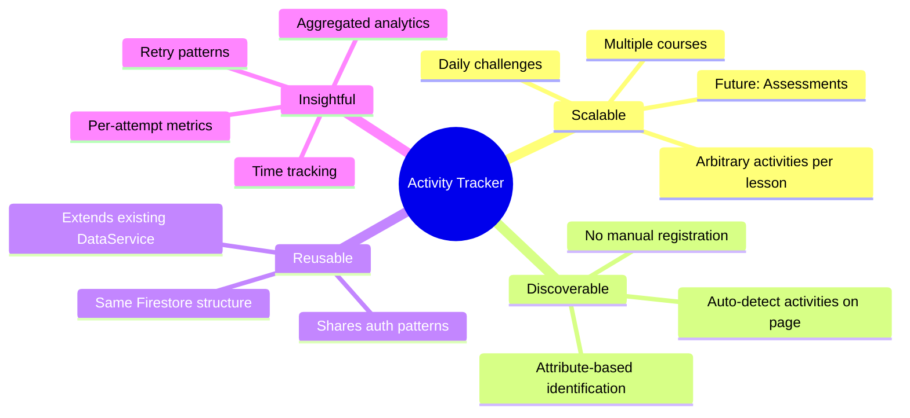

### The Story: Building for Scale

Imagine it's 6 months from now. AutoNateAI has:

- 4 courses (Apprentice, Undergrad, Junior, Senior)
- 7 chapters per course (28 total chapters)
- ~5 activities per chapter (140+ activities)
- Daily challenges (365 per year!)
- 1,000 active students

The Activity Tracker needs to handle:

- **Discovery**: "Find all activities on this page without me listing them"
- **Flexibility**: "A quiz has different data than a code challenge"
- **Aggregation**: "Show me this student's overall quiz performance"
- **Speed**: "Don't make 100 Firestore calls to load the dashboard"

---

## Proposed Architecture

```mermaid
flowchart TB
    subgraph Client["🖥️ Client Side"]
        subgraph LessonPage["Lesson Page (HTML)"]
            Act1["🧠 Quiz Activity
            data-activity='quiz-variables'
            data-type='quiz'"]
            Act2["🎯 Drag & Drop
            data-activity='match-concepts'
            data-type='dragdrop'"]
            Act3["💻 Code Challenge
            data-activity='write-function'
            data-type='code'"]
        end

        AT[ActivityTracker.js]
        DS[DataService.js]

        LessonPage --> AT
        AT --> DS
    end

    subgraph Firestore["☁️ Firestore"]
        subgraph UserData["users/{uid}"]
            AR["activityAttempts/
            {attemptId}"]

            subgraph CP["courseProgress/{courseId}"]
                AS["activityStats: {
                  totalAttempts: 47,
                  correctFirst: 32,
                  avgTimePerActivity: 45s
                }"]
            end
        end

        subgraph Global["(Optional) Global"]
            AD["activities/{activityId}
            metadata, correct answers"]
        end
    end

    DS --> AR
    DS --> AS

    style AT fill:#7986cb,stroke:#3949ab,color:#fff
    style AR fill:#51cf66,stroke:#2f9e44,color:#fff
    style AS fill:#51cf66,stroke:#2f9e44,color:#fff
```

### The Story: Three Layers of Data

Think of the Activity Tracker like a sports statistics system:

**Layer 1: The Play-by-Play** (`activityAttempts/{attemptId}`)
Every single attempt at every activity. Like recording every pitch in baseball:

- Who? (userId)
- What? (activityId, activityType)
- When? (timestamp)
- Result? (correct/incorrect, score, timeSpent)
- Context? (courseId, lessonId, attemptNumber)

**Layer 2: The Season Stats** (`courseProgress/{courseId}/activityStats`)
Aggregated metrics per course. Like a player's batting average:

- Total attempts across all activities
- First-try success rate
- Average time per activity
- Weak areas (activities with low scores)

**Layer 3: The Record Book** (`activities/{activityId}`) — _Optional_
Global activity definitions. Like the rules of the game:

- Activity metadata (title, type, difficulty)
- Correct answers (for validation)
- Point values
- Hints/explanations

---

## Data Models

### Activity Attempt (Per-Attempt Record)

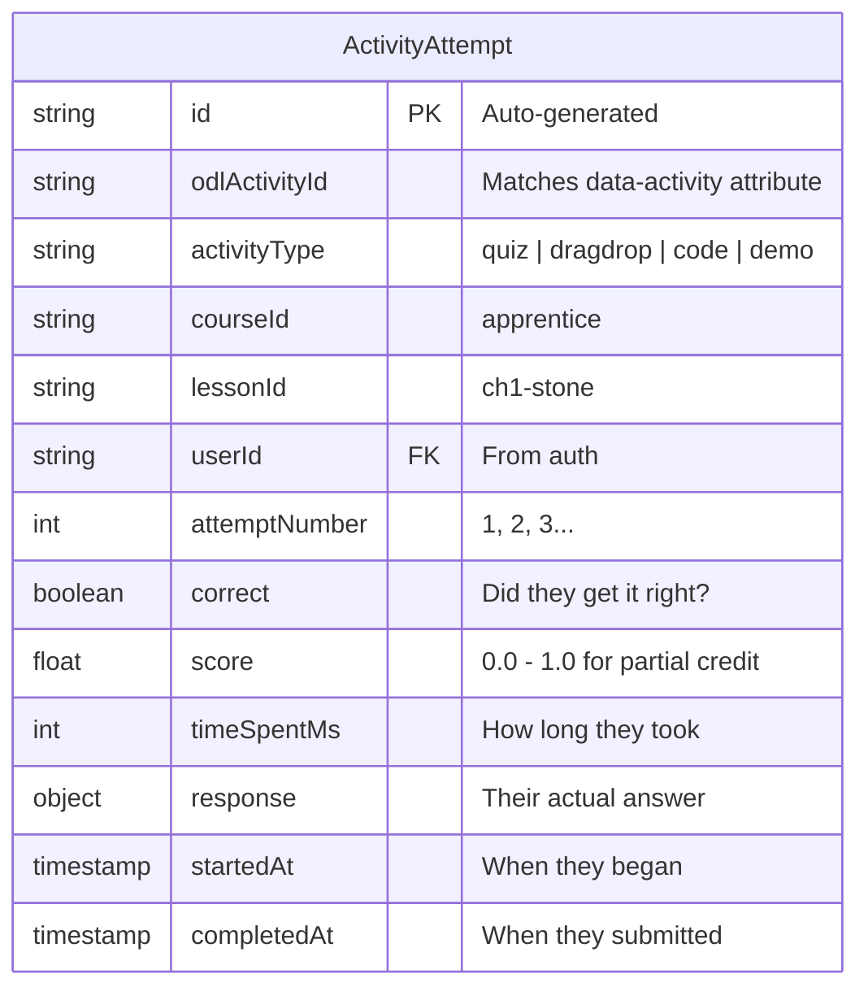

### The Story: What We Capture

When a student attempts a quiz question, we capture:

```javascript
// Example: Student answers a quiz about variables
{
  id: "auto-generated-uuid",
  activityId: "quiz-variables-q1",
  activityType: "quiz",
  courseId: "apprentice",
  lessonId: "ch1-stone",
  userId: "user-123",
  attemptNumber: 2,              // This is their 2nd try
  correct: true,                 // They got it right!
  score: 1.0,                    // Full credit
  timeSpentMs: 12400,            // Took 12.4 seconds
  response: {
    selected: "b",               // They picked option B
    question: "What does a variable store?",
    options: ["Code", "Data", "Functions", "Loops"]
  },
  startedAt: Timestamp,
  completedAt: Timestamp
}
```

### Activity Stats (Aggregated Per-Course)

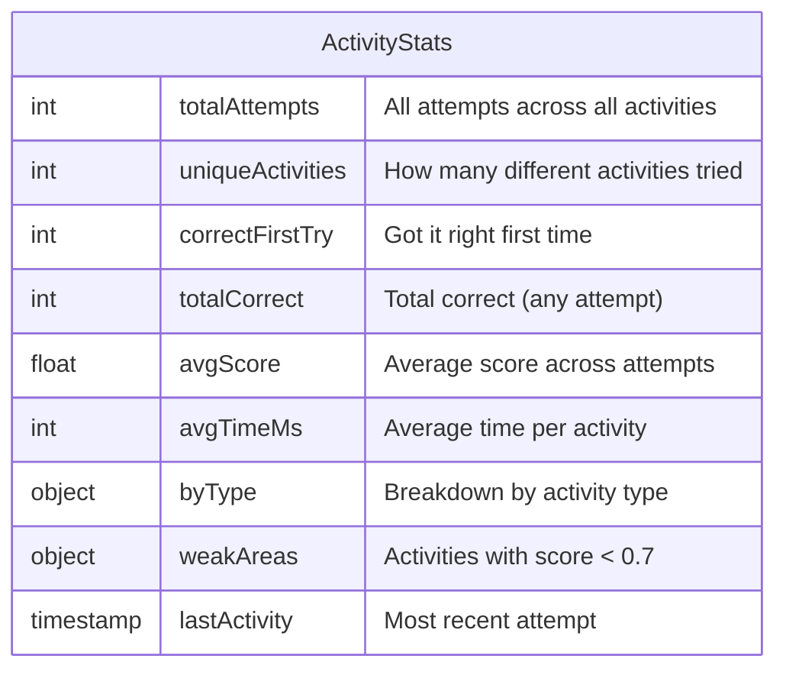

### The Story: The Report Card

At the course level, we maintain a "report card":

```javascript
// Stored at: users/{uid}/courseProgress/apprentice
{
  // ... existing fields (completedLessons, progressPercent, etc.)

  activityStats: {
    totalAttempts: 47,
    uniqueActivities: 23,
    correctFirstTry: 18,
    totalCorrect: 41,
    avgScore: 0.87,
    avgTimeMs: 34000,
    byType: {
      quiz: { attempts: 28, avgScore: 0.92 },
      dragdrop: { attempts: 12, avgScore: 0.83 },
      code: { attempts: 7, avgScore: 0.71 }
    },
    weakAreas: [
      { activityId: "quiz-loops-q3", attempts: 4, lastScore: 0.5 },
      { activityId: "code-function-1", attempts: 3, lastScore: 0.6 }
    ],
    lastActivity: Timestamp
  }
}
```

---

## Activity Discovery

```mermaid
sequenceDiagram
    participant Page as 📄 Lesson Page
    participant AT as 🎯 ActivityTracker
    participant DOM as 🌳 DOM

    Note over Page: Page loads

    Page->>AT: ActivityTracker.init(courseId, lessonId)
    AT->>DOM: querySelectorAll('[data-activity]')
    DOM-->>AT: NodeList of activity elements

    loop For each activity element
        AT->>AT: Extract data attributes
        AT->>AT: Determine activity type
        AT->>AT: Attach event listeners
    end

    AT->>AT: Register activities array
    Note over AT: Ready to track!
```

### The Story: No Manual Registration

Instead of maintaining a list of activities somewhere, we use **HTML data attributes**:

```html
<!-- In the lesson HTML -->
<div
  class="quiz-container"
  data-activity="quiz-variables-q1"
  data-type="quiz"
  data-points="10"
>
  <h3>What does a variable store?</h3>
  <!-- quiz content -->
</div>

<div
  class="dragdrop-container"
  data-activity="match-dataflow"
  data-type="dragdrop"
  data-points="20"
>
  <!-- drag and drop content -->
</div>
```

When `ActivityTracker.init()` runs, it:

1. Scans the page for `[data-activity]` elements
2. Extracts metadata from data attributes
3. Attaches completion listeners
4. Knows exactly what activities exist — automatically!

**Benefits:**

- Add a new activity? Just add the HTML with data attributes
- Remove an activity? Just delete the HTML
- No config files to maintain
- No registration calls to make

---

## Activity Completion Flow

```mermaid
sequenceDiagram
    participant U as 👤 User
    participant Act as 🧠 Quiz Component
    participant AT as 🎯 ActivityTracker
    participant DS as 🔧 DataService
    participant FS as ☁️ Firestore

    U->>Act: Clicks answer "B"
    Act->>Act: Validate answer
    Act->>AT: completeActivity(activityId, result)

    Note over AT: Build attempt record
    AT->>AT: attemptNumber = getAttemptCount() + 1
    AT->>AT: timeSpent = now - startTime

    AT->>DS: saveActivityAttempt(attemptData)

    par Save attempt record
        DS->>FS: activityAttempts/{attemptId}.set(data)
    and Update course stats
        DS->>DS: recalculateActivityStats()
        DS->>FS: courseProgress/{courseId}.update(activityStats)
    end

    FS-->>DS: ✅ Saved
    DS-->>AT: { success: true, attemptId }
    AT-->>Act: Attempt recorded
    Act->>U: Show feedback (✅ Correct!)
```

### The Story: The Journey of a Quiz Answer

1. **Student clicks "B"** — The quiz component handles the click
2. **Quiz validates** — Checks if "B" is correct
3. **Quiz notifies tracker** — `ActivityTracker.completeActivity('quiz-variables-q1', { correct: true, selected: 'b' })`
4. **Tracker builds record** — Adds timing, attempt number, context
5. **DataService saves** — Two parallel writes:
   - Individual attempt → `activityAttempts/{id}`
   - Updated stats → `courseProgress/apprentice/activityStats`
6. **Student sees feedback** — "✅ Correct!"

---

## Integration with Existing Services

```mermaid
flowchart TB
    subgraph Existing["✅ Existing (Reuse)"]
        Auth[AuthService]
        DS[DataService]
        Firebase[FirebaseApp]

        subgraph ExistingMethods["DataService Methods"]
            GEC[getEnrolledCourses]
            GCP[getCourseProgress]
            SLP[saveLessonProgress]
        end
    end

    subgraph New["🆕 New (Add)"]
        AT[ActivityTracker]

        subgraph NewMethods["New DataService Methods"]
            SAA[saveActivityAttempt]
            GAA[getActivityAttempts]
            GAS[getActivityStats]
            RAS[recalculateActivityStats]
        end
    end

    AT --> Auth
    AT --> NewMethods
    NewMethods --> Firebase

    style AT fill:#7986cb,stroke:#3949ab,color:#fff
    style NewMethods fill:#7986cb,stroke:#3949ab,color:#fff
```

### The Story: Building on What Works

We don't reinvent the wheel. The Activity Tracker extends the existing architecture:

**Reuses:**

- `AuthService` — Same user authentication
- `FirebaseApp` — Same Firestore connection
- `DataService` patterns — Same error handling, same structure
- Firestore paths — Lives under `users/{uid}/` like everything else

**Adds to DataService:**

```javascript
// New methods in courses/shared/js/data-service.js

saveActivityAttempt(attemptData); // Save individual attempt
getActivityAttempts(filters); // Query attempts (by course, lesson, type)
getActivityStats(courseId); // Get aggregated stats
recalculateActivityStats(courseId); // Recompute after new attempt
```

**New Component:**

```javascript
// New file: courses/shared/js/activity-tracker.js

ActivityTracker = {
  init(courseId, lessonId),           // Discover activities on page
  startActivity(activityId),          // Begin timing
  completeActivity(activityId, result), // Record completion
  getAttemptCount(activityId),        // How many tries so far?
  // ...
}
```

---

## Firestore Structure

```mermaid
flowchart TB
    subgraph Firestore["☁️ Firestore"]
        subgraph Users["users/{uid}"]
            subgraph AA["activityAttempts (collection)"]
                A1["📄 {attemptId}
                activityId: quiz-vars-q1
                correct: true
                timeSpentMs: 12400"]
                A2["📄 {attemptId}
                activityId: dragdrop-flow
                score: 0.8
                timeSpentMs: 45000"]
            end

            subgraph CP["courseProgress/{courseId}"]
                CPD["📄 Document
                completedLessons: 2
                progressPercent: 28
                activityStats: {...}
                lessons: {...}"]

                subgraph LP["lessonProgress/{lessonId}"]
                    LPD["📄 Document
                    sections: [...]
                    viewedSections: 8"]
                end
            end
        end
    end

    style AA fill:#7986cb,stroke:#3949ab,color:#fff
    style CPD fill:#fcc419,stroke:#f59f00
```

### The Story: Where Everything Lives

**New Collection: `activityAttempts`**

- Lives at `users/{uid}/activityAttempts/{attemptId}`
- Each document is ONE attempt at ONE activity
- Queryable by: `courseId`, `lessonId`, `activityType`, `timestamp`
- Enables: "Show me all quiz attempts from last week"

**Extended Document: `courseProgress/{courseId}`**

- Adds `activityStats` field to existing course progress document
- Contains aggregated metrics
- Updated after each attempt via `recalculateActivityStats()`

**Unchanged: `lessonProgress/{lessonId}`**

- Still tracks section viewing
- Activity Tracker is separate concern

---

## Daily Challenges Extension

```mermaid
flowchart TB
    subgraph DailyChallenge["🌅 Daily Challenge System"]
        DC[Daily Challenge Page]
        DC --> AT[ActivityTracker]
        AT --> DS[DataService]
    end

    subgraph Data["📊 Data Storage"]
        DS --> AA["activityAttempts
        courseId: 'daily'
        lessonId: '2024-01-15'"]

        DS --> DCS["users/{uid}/dailyStats
        currentStreak: 7
        longestStreak: 14
        totalCompleted: 45"]
    end

    style DC fill:#fcc419,stroke:#f59f00
    style DCS fill:#fcc419,stroke:#f59f00
```

### The Story: Same Tracker, Different Context

Daily challenges use the SAME ActivityTracker with different context:

```javascript
// On a daily challenge page
ActivityTracker.init("daily", "2024-01-15"); // courseId = 'daily', lessonId = date
```

This means:

- Same `activityAttempts` collection, filtered by `courseId: 'daily'`
- Separate `dailyStats` document for streak tracking
- Can query: "Show all daily challenges from January"
- Gamification: Streaks, badges, leaderboards

---

## Method Summary

### ActivityTracker (New Component)

| Method                          | Purpose                          | When Called           |
| ------------------------------- | -------------------------------- | --------------------- |
| `init(courseId, lessonId)`      | Discover activities, set context | Page load             |
| `discoverActivities()`          | Scan DOM for `[data-activity]`   | Called by init        |
| `startActivity(activityId)`     | Begin timing, increment attempt  | User starts activity  |
| `completeActivity(id, result)`  | Save attempt, update stats       | User submits answer   |
| `getAttemptCount(activityId)`   | How many tries?                  | Before showing hints  |
| `getActivityResult(activityId)` | Previous result                  | Show "you answered X" |

### DataService (Extended)

| Method                               | Purpose                 | Firestore Path             |
| ------------------------------------ | ----------------------- | -------------------------- |
| `saveActivityAttempt(data)`          | Save individual attempt | `activityAttempts/{id}`    |
| `getActivityAttempts(filters)`       | Query attempts          | `activityAttempts` (query) |
| `getActivityStats(courseId)`         | Get aggregated stats    | `courseProgress/{id}`      |
| `recalculateActivityStats(courseId)` | Recompute after attempt | `courseProgress/{id}`      |
| `getDailyStats()`                    | Get streak, badges      | `users/{uid}/dailyStats`   |

---

## Implementation Phases

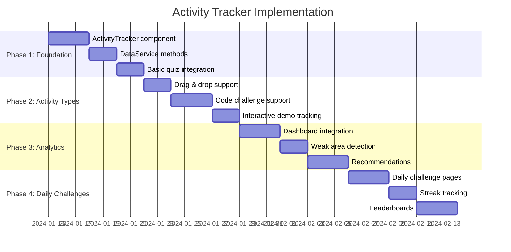

### The Story: Building in Layers

**Phase 1: Foundation** (1 week)

- Create `ActivityTracker.js` with discovery and basic tracking
- Add `saveActivityAttempt()` to DataService
- Integrate with ONE quiz in Apprentice course
- Verify data flows correctly

**Phase 2: Activity Types** (1 week)

- Add support for drag & drop result structure
- Add support for code challenge evaluation
- Handle interactive demos (engagement time)
- Test across multiple lessons

**Phase 3: Analytics** (1 week)

- Show activity stats on dashboard
- Identify weak areas from low scores
- "Recommended practice" suggestions
- Instructor view (if needed)

**Phase 4: Daily Challenges** (1 week)

- Create daily challenge page template
- Implement streak tracking
- Add leaderboards (optional)
- Celebrate achievements

---

## File Structure

```
courses/
├── shared/
│   └── js/
│       ├── activity-tracker.js      🆕 NEW
│       ├── data-service.js          📝 EXTENDED
│       ├── progress-tracker.js      ✅ UNCHANGED
│       ├── auth.js                  ✅ UNCHANGED
│       └── firebase-config.js       ✅ UNCHANGED
├── apprentice/
│   ├── ch1-stone/
│   │   └── index.html               📝 ADD data-activity attributes
│   └── ...
└── daily/                           🆕 NEW (Phase 4)
    └── index.html
```

---

## Design Decisions ✅

| Decision | Choice | Rationale |
| --- | --- | --- |
| **Answer Storage** | Firestore | Secure, can't be cheated by inspecting HTML |
| **Retry Limits** | Unlimited | Learning > Testing, let them practice |
| **Partial Credit** | Yes (0.0 - 1.0) | 4/5 correct = 0.8 score, encourages progress |
| **Time Limits** | Daily challenges only | Regular lessons = no pressure, dailies = gamification |
| **Offline Support** | Cache + sync | Try to save immediately, queue if offline |

---

## Answer Validation Flow

```mermaid
sequenceDiagram
    participant U as 👤 User
    participant Act as 🧠 Activity
    participant AT as 🎯 ActivityTracker
    participant DS as 🔧 DataService
    participant FS as ☁️ Firestore

    U->>Act: Submits answer "B"
    Act->>AT: completeActivity(id, { selected: "B" })
    
    Note over AT: Check if we have correct answer cached
    
    alt Answer cached locally
        AT->>AT: Validate against cache
    else Need to fetch
        AT->>DS: getCorrectAnswer(activityId)
        DS->>FS: activities/{activityId}.get()
        FS-->>DS: { correctAnswer: "B", points: 10 }
        DS-->>AT: correctAnswer = "B"
        AT->>AT: Cache for future attempts
    end
    
    AT->>AT: Calculate score (1.0 = correct)
    AT->>DS: saveActivityAttempt(attemptData)
    DS-->>AT: ✅ Saved
    AT-->>Act: { correct: true, score: 1.0 }
    Act->>U: Show "✅ Correct!"
```

### The Story: Secure Validation

Correct answers live in Firestore, not in the HTML. Here's why:

**If answers were in HTML:**
```html
<!-- BAD: Student can right-click → Inspect → See answer! -->
<div data-activity="quiz-1" data-correct="B">
```

**With Firestore validation:**
```javascript
// Firestore: activities/quiz-variables-q1
{
  activityId: "quiz-variables-q1",
  type: "quiz",
  correctAnswer: "B",           // Secure!
  points: 10,
  explanation: "Variables store data in memory..."
}
```

The `ActivityTracker` fetches the correct answer from Firestore, validates locally, then saves the attempt. We cache correct answers after first fetch to avoid repeated reads.

---

## Partial Credit Scoring

```mermaid
flowchart LR
    subgraph Quiz["🧠 Quiz (Binary)"]
        Q1[Correct] --> S1[Score: 1.0]
        Q2[Wrong] --> S2[Score: 0.0]
    end
    
    subgraph DragDrop["🎯 Drag & Drop (Partial)"]
        D1[5/5 correct] --> SD1[Score: 1.0]
        D2[4/5 correct] --> SD2[Score: 0.8]
        D3[3/5 correct] --> SD3[Score: 0.6]
        D4[0/5 correct] --> SD4[Score: 0.0]
    end
    
    subgraph Code["💻 Code Challenge (Partial)"]
        C1[All tests pass] --> SC1[Score: 1.0]
        C2[3/4 tests pass] --> SC2[Score: 0.75]
        C3[Syntax error] --> SC3[Score: 0.0]
    end
```

### Scoring Logic

```javascript
// In ActivityTracker

calculateScore(activityType, response, correctAnswer) {
  switch (activityType) {
    case 'quiz':
      // Binary: right or wrong
      return response.selected === correctAnswer ? 1.0 : 0.0;
      
    case 'dragdrop':
      // Partial: count correct placements
      const correct = response.placements.filter(
        (p, i) => p === correctAnswer.placements[i]
      ).length;
      return correct / correctAnswer.placements.length;
      
    case 'code':
      // Partial: percentage of tests passed
      return response.testsPassed / response.totalTests;
      
    case 'demo':
      // Engagement-based: did they interact?
      return response.interacted ? 1.0 : 0.5;
  }
}
```

---

## Time Limits (Daily Challenges Only)

```mermaid
flowchart TB
    subgraph Regular["📚 Regular Lessons"]
        R1[No time limit]
        R2[Learn at your pace]
        R3[Retry forever]
    end
    
    subgraph Daily["🌅 Daily Challenges"]
        D1[Time limit: 60-300s]
        D2[Countdown visible]
        D3[Auto-submit on expire]
        D4[Bonus points for speed]
    end
    
    style Regular fill:#51cf66,stroke:#2f9e44
    style Daily fill:#fcc419,stroke:#f59f00
```

### Daily Challenge Timer

```javascript
// Only for daily challenges
if (courseId === 'daily') {
  const timeLimit = activity.dataset.timeLimit || 120; // seconds
  
  ActivityTracker.startTimer(activityId, timeLimit, {
    onTick: (remaining) => updateTimerUI(remaining),
    onExpire: () => {
      // Auto-submit with current state
      ActivityTracker.completeActivity(activityId, {
        ...currentResponse,
        timedOut: true
      });
    }
  });
}
```

---

## Offline Caching Strategy

```mermaid
flowchart TB
    subgraph Online["🌐 Online Flow"]
        O1[User submits answer]
        O2[Save to Firestore]
        O3[Update local cache]
        O4[Show confirmation]
        
        O1 --> O2 --> O3 --> O4
    end
    
    subgraph Offline["📴 Offline Flow"]
        F1[User submits answer]
        F2{Online?}
        F3[Save to localStorage queue]
        F4[Show "Saved offline" toast]
        F5[Background sync when online]
        F6[Clear queue after sync]
        
        F1 --> F2
        F2 -->|No| F3 --> F4
        F2 -->|Yes| O2
        F3 -.->|Later| F5 --> F6
    end
    
    style F3 fill:#7986cb,stroke:#3949ab,color:#fff
    style F5 fill:#7986cb,stroke:#3949ab,color:#fff
```

### The Story: Never Lose Progress

Imagine a student on a train going through a tunnel. They just aced a quiz, but there's no internet. Without offline support, their progress is lost. Frustrating!

**The Solution: localStorage Queue**

```javascript
// In ActivityTracker

async saveAttemptWithCache(attemptData) {
  // Always save to localStorage first (instant)
  this.cacheAttempt(attemptData);
  
  try {
    // Try to save to Firestore
    await DataService.saveActivityAttempt(attemptData);
    
    // Success! Remove from cache
    this.removeCachedAttempt(attemptData.localId);
    
  } catch (error) {
    if (this.isOfflineError(error)) {
      // Queue for later sync
      this.queueForSync(attemptData);
      this.showToast("📴 Saved offline - will sync when connected");
    } else {
      throw error;
    }
  }
}

// Listen for online status
window.addEventListener('online', () => {
  this.syncQueuedAttempts();
});
```

### localStorage Structure

```javascript
// Key: 'activityTracker_queue'
[
  {
    localId: "local-1704312000000",
    attemptData: {
      activityId: "quiz-vars-q1",
      courseId: "apprentice",
      lessonId: "ch1-stone",
      correct: true,
      score: 1.0,
      // ... full attempt data
    },
    queuedAt: "2024-01-03T18:00:00Z"
  },
  // ... more queued attempts
]
```

### Sync Process

```javascript
async syncQueuedAttempts() {
  const queue = this.getQueue();
  if (queue.length === 0) return;
  
  console.log(`📊 Syncing ${queue.length} queued attempts...`);
  
  for (const item of queue) {
    try {
      await DataService.saveActivityAttempt(item.attemptData);
      this.removeFromQueue(item.localId);
      console.log(`✅ Synced: ${item.attemptData.activityId}`);
    } catch (error) {
      console.error(`❌ Failed to sync: ${item.localId}`, error);
      // Keep in queue, try again later
    }
  }
  
  // Recalculate stats after batch sync
  const courseIds = [...new Set(queue.map(q => q.attemptData.courseId))];
  for (const courseId of courseIds) {
    await DataService.recalculateActivityStats(courseId);
  }
  
  this.showToast("✅ All progress synced!");
}
```

---

## Activity Types Summary

| Type | Scoring | Time Limit | Offline | Use Case |
| --- | --- | --- | --- | --- |
| 🧠 **Quiz** | Binary (0/1) | Daily only | ✅ Cached | Knowledge check |
| 🎯 **Drag & Drop** | Partial (0.0-1.0) | Daily only | ✅ Cached | Concept matching |
| 💻 **Code Challenge** | Test-based (0.0-1.0) | Daily only | ✅ Cached | Practical skills |
| 🔄 **Interactive Demo** | Engagement (0.5/1.0) | Never | ✅ Cached | Exploration |
| ⏱️ **Timed Challenge** | Binary + bonus | Always | ✅ Cached | Daily gamification |

---

## Next Steps

1. **Create `ActivityTracker.js`** — Client-side component with offline support
2. **Create `activities` collection** — Firestore structure for correct answers
3. **Extend `DataService`** — Add the new methods
4. **Add Firestore indexes** — For querying attempts by course/lesson/type
5. **Pilot in one lesson** — Add data attributes to Apprentice ch1-stone
6. **Test offline flow** — Verify localStorage queue works
7. **Build dashboard widget** — Show activity stats on student dashboard
