# Analytics & Community Engagement Architecture

## Vision

Transform learning data into actionable insights and meaningful connections. Build a system that serves:

1. **Administrators** - District-wide performance metrics, cohort analysis, intervention alerts
2. **Teachers** - Class performance, individual student progress, curriculum effectiveness
3. **Students** - Personal growth tracking, skill gaps, recommended learning paths, peer connections
4. **Community** - Leaderboards, peer matching, collaborative challenges, Discord integration

---

## System Architecture Overview

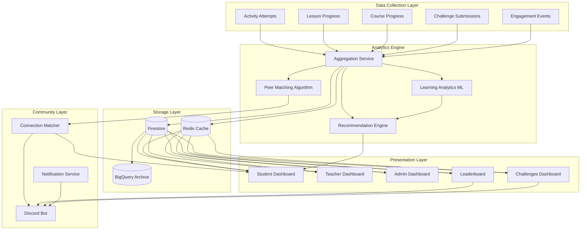

**The Story:** Imagine a student named Maya completing a drag-and-drop activity about loops. The moment she submits, her attempt flows into the **Data Collection Layer** alongside her lesson progress and engagement signals. These raw events funnel into the **Analytics Engine**, where the Aggregation Service crunches numbers while the ML models detect patterns in Maya's learning style. Meanwhile, the Peer Matching Algorithm notices she struggles with recursion but excels at functions—just like another student, James.

All this intelligence lands in **Firestore** for persistence and **Redis** for lightning-fast dashboard loads. When Maya opens her Student Dashboard, she sees her skill radar, recommended next lessons, and a suggestion: "James might be a great study buddy." On the community side, the Discord bot posts the daily leaderboard update, and Maya sees she climbed 3 spots. The system transformed her single activity submission into personalized insights, peer connections, and community engagement—all flowing through interconnected layers.

---

## Data Model Architecture

### Core Collections (Firestore)

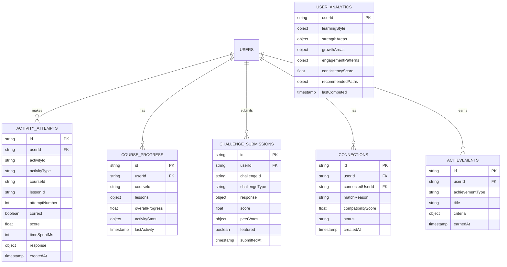

**The Story:** This is our data foundation—the truth about every learner's journey. When Maya completes that loops activity, an **ACTIVITY_ATTEMPTS** record captures everything: what she answered, how long she took, whether she got it right, and which attempt this was. Over time, her **COURSE_PROGRESS** document accumulates a map of every lesson she's touched, her overall percentage, and stats by activity type.

But we're not just tracking—we're understanding. The **USER_ANALYTICS** document is where Maya transforms from "a student who did some activities" into "a visual learner who excels at functions but needs recursion help, studies best on Tuesday evenings, and has a 78% consistency score." The **CONNECTIONS** collection tracks who she's linked with (and why), while **ACHIEVEMENTS** celebrates her milestones. This isn't just a database—it's a living profile of growth.

### Aggregated Analytics Collections

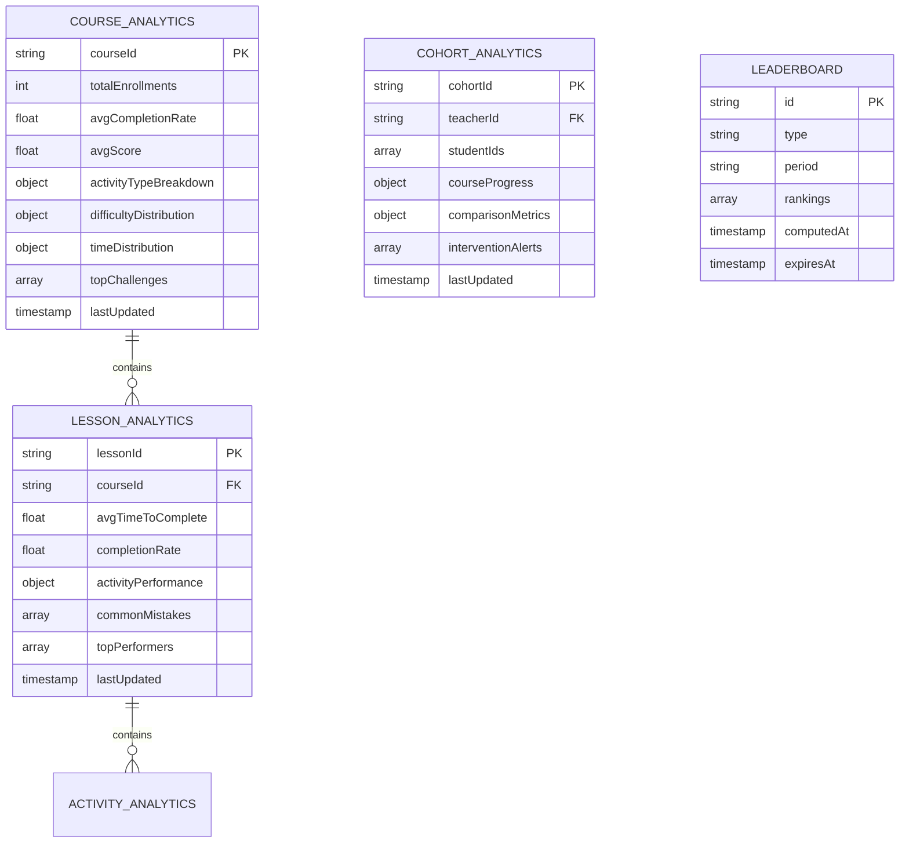

**The Story:** While the core collections track individuals, these aggregated collections zoom out to see the big picture. **COURSE_ANALYTICS** answers questions like "How is the JavaScript course performing?" with enrollment counts, average scores, and which activities trip people up most. Teachers can see their **COHORT_ANALYTICS**—is Ms. Johnson's 3rd period class keeping pace with the district average?

The **LEADERBOARD** collection is pre-computed rankings that expire and refresh. Instead of calculating "Who's #1 this week?" on every page load (expensive!), we compute it once at 2 AM and serve it instantly all day. This is the architect's secret: aggregate what's expensive, cache what's frequent, and only hit the database when you must.

---

## Analytics Computation Flows

### Real-time Activity Processing

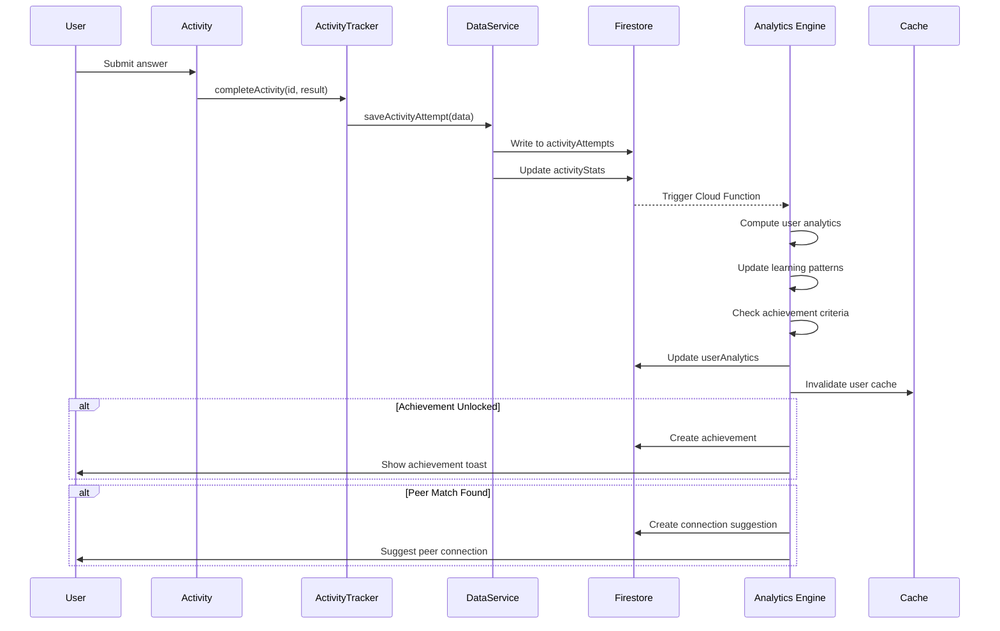

**The Story:** Let's follow Maya's click in real-time. She drags "initialize variable" into position and hits Submit. The **Activity** component calls `ActivityTracker.completeActivity()`, which bundles her response with timing data and hands it to **DataService**. Within milliseconds, Firestore has a new document in `activityAttempts` and her `activityStats` counter increments.

But here's where the magic happens: that Firestore write **triggers a Cloud Function**. The Analytics Engine wakes up, pulls Maya's recent activity, and recalculates her learning patterns. "She's getting faster at comprehension activities... and she just hit 50 activities completed!" The engine checks achievement criteria—boom, she unlocked the "Half Century" badge. It creates the achievement, invalidates her cached profile, and fires a toast notification to her screen.

Meanwhile, the Peer Matching subroutine noticed her recursion struggles align with James's strengths. A connection suggestion materializes in her dashboard. One click, one answer, and the system orchestrated insights, achievements, and human connections—all before Maya even reads the "Correct!" message.

### Batch Analytics Processing (Cloud Functions)

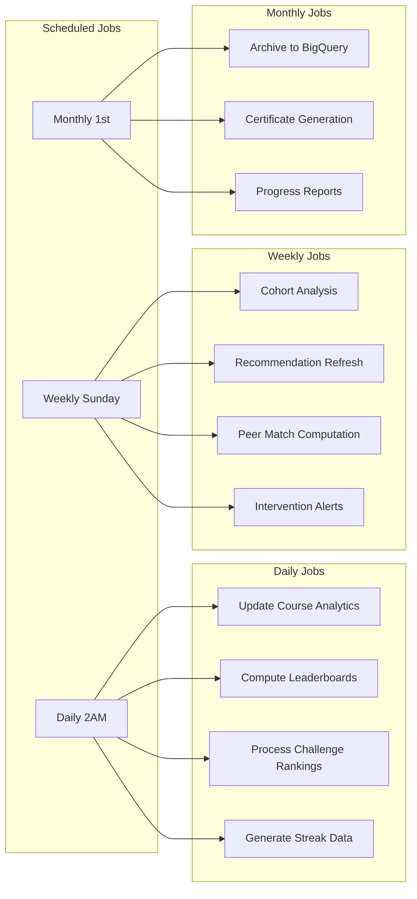

**The Story:** Not everything can happen in real-time—some analytics need to marinate. Every night at 2 AM, while students sleep, the **Daily Jobs** kick off. Course analytics aggregate yesterday's thousands of activity attempts into clean summaries. Leaderboards recompute with fresh rankings. Challenge winners get crowned. Streak data updates so morning dashboards show accurate counts.

Every Sunday, the **Weekly Jobs** go deeper. Cohort analysis compares Ms. Johnson's class to the district. The recommendation engine retrains on a week's worth of learning patterns. The peer matching algorithm recalculates compatibility scores—maybe Maya and James are now 0.85 compatible instead of 0.72. Intervention alerts flag students who've gone quiet.

On the 1st of each month, the **Monthly Jobs** handle the heavy lifting: archiving historical data to BigQuery for long-term analysis, generating certificates for course completers, and compiling progress reports teachers can send home. It's a symphony of scheduled intelligence, working while everyone rests.

---

## Dashboard Architecture

### Reusable Analytics Components

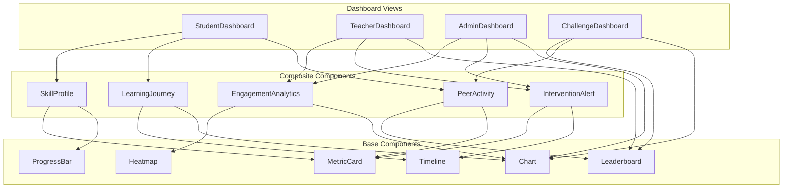

**The Story:** This is our component architecture—building blocks that compose into dashboards. At the foundation are **Base Components**: a MetricCard that can display any number with a label, a Chart that renders data visually, a ProgressBar for completion tracking, and so on. These are dumb, reusable, and beautiful.

The magic happens in **Composite Components**. A SkillProfile isn't just one thing—it's a MetricCard showing overall score plus ProgressBars for each skill area. LearningJourney combines a Timeline of milestones with Charts showing score trends. These composites encode *meaning* while reusing *presentation*.

Finally, **Dashboard Views** assemble composites for specific audiences. StudentDashboard needs SkillProfile, LearningJourney, and PeerActivity. TeacherDashboard needs EngagementAnalytics, InterventionAlerts, and Leaderboards. Same building blocks, different assemblies. When we improve MetricCard, every dashboard gets better. That's the power of composition.

### Student Dashboard

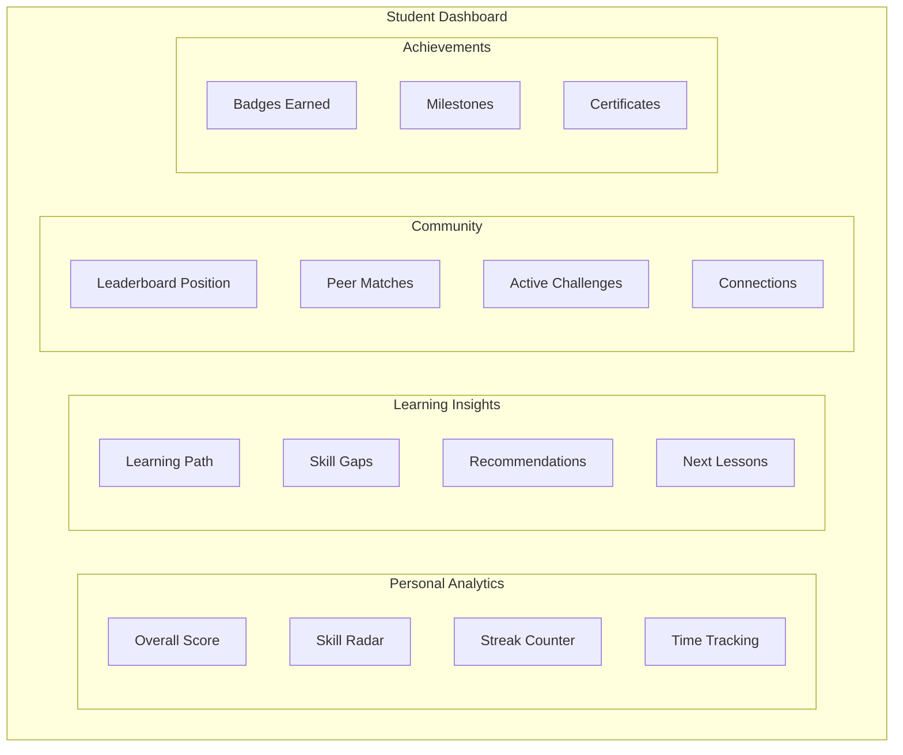

**The Story:** Maya logs into her dashboard and sees her world. The **Personal Analytics** quadrant shows her at a glance: overall score of 847, a radar chart revealing strong "Variables" and "Loops" skills but a gap in "Recursion", a 5-day streak with a flame icon, and 34 hours invested this semester.

Below that, **Learning Insights** tells her what to do next. "Your recursion skills need attention—try Chapter 3: Magnetism" sits alongside "You're ready to advance to Data Structures." The recommendations aren't random; they're computed from her actual performance patterns.

The **Community** section keeps her connected. She's #47 on the weekly leaderboard (up 3 spots!). Two peer matches await her review. The daily challenge has 4 hours left. And she has 3 active connections—people she can message for help.

Finally, **Achievements** celebrates her progress: badges for streaks, course milestones, and challenge wins. Maya doesn't just see data—she sees her story of growth.

### Teacher Dashboard

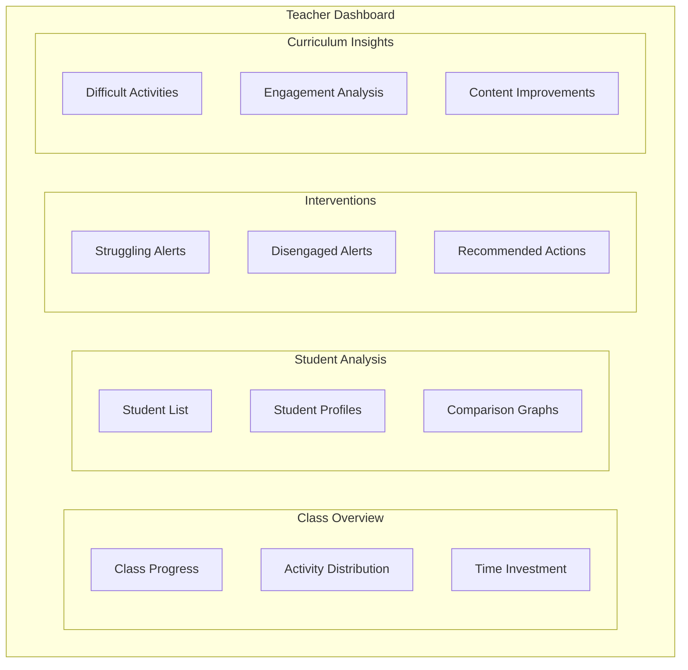

**The Story:** Ms. Johnson opens her teacher dashboard Monday morning. The **Class Overview** immediately answers her burning question: "How did my students do last week?" A progress bar shows her class at 67% course completion, with a heatmap revealing which activities got the most engagement and a breakdown of time invested by student.

The **Student Analysis** section lets her drill down. She sees all 28 students ranked by progress, can click into any profile to see their learning style and struggles, and comparison graphs show how individuals stack against class averages.

But the most valuable section is **Interventions**. Three red alerts catch her eye: "Marcus hasn't logged in for 5 days", "Aaliyah has attempted the recursion activity 7 times with no success", "Group B's average score dropped 15% this week." Each alert includes recommended actions—message the student, schedule a 1:1, assign remediation content.

Finally, **Curriculum Insights** shows her which of *her own* activities are working. "The drag-drop matching activity has 94% engagement but only 62% success—consider adding hints." Ms. Johnson isn't just monitoring; she's improving her teaching with data.

### Admin/Superintendent Dashboard

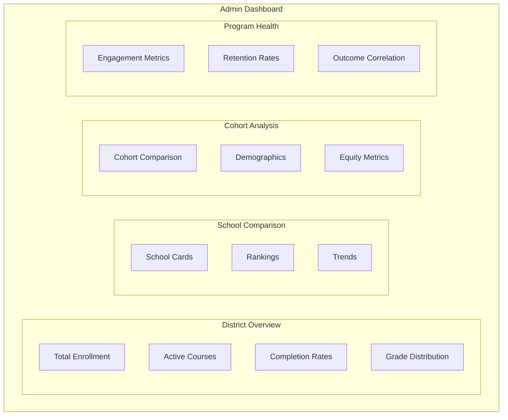

**The Story:** Superintendent Williams needs to report to the school board next week. She opens the Admin Dashboard and sees the **District Overview**: 2,847 students enrolled across 5 courses, 73% average completion rate, and grade distributions trending upward.

The **School Comparison** section answers her equity questions. Lincoln High is outperforming district average by 12%, but Roosevelt Middle is 8% below. She clicks into Roosevelt and sees their engagement metrics dropped after winter break—an intervention point.

**Cohort Analysis** lets her compare demographics. Are low-income students keeping pace? Is there a gender gap in advanced courses? The data doesn't lie, and it guides resource allocation decisions.

Finally, **Program Health** shows the SWE Hackers investment is paying off: 89% retention rate, strong correlation between course completion and CS course enrollment, and positive NPS scores from student surveys. When the board asks "Is this working?", Superintendent Williams has the receipts.

---

## Psychoanalytic Learning Insights

### Learning Pattern Detection

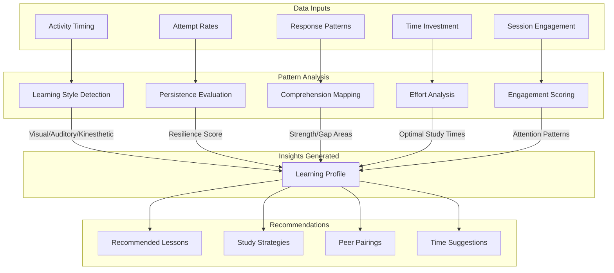

**The Story:** This is where data becomes *understanding*. We collect raw signals: when Maya studies (Activity Timing), how many tries she needs (Attempt Rates), what answers she gives (Response Patterns), how long she spends (Time Investment), and how focused she stays (Session Engagement).

The **Pattern Analysis** layer transforms signals into insights. Activity Timing reveals she's a night owl—performance peaks between 6-8 PM. Attempt Rates show high persistence—she retries failed activities 91% of the time. Response Patterns reveal visual learning preferences—she aces diagram activities but struggles with text-heavy ones.

These analyses converge into a **Learning Profile**: Maya is a visual learner with strong persistence, excels at functions and loops, needs help with recursion, studies best on Tuesday evenings, and maintains 78% consistency.

The profile powers **Recommendations** that actually *fit* Maya. "Try the recursion lesson with the visual flowchart." "Your optimal study window is 6-8 PM—want a reminder?" "James is a kinesthetic learner who crushes recursion—you two would balance each other." The system doesn't just track; it *knows*.

### Student Profile Metrics

```javascript
// UserAnalytics document structure
{
  userId: "user123",
  
  // Learning Style (computed from activity patterns)
  learningStyle: {
    primary: "visual",           // visual | auditory | kinesthetic
    secondary: "kinesthetic",
    confidence: 0.82,
    dataPoints: 156
  },
  
  // Strength Areas (based on activity performance)
  strengthAreas: [
    { topic: "variables", score: 0.94, attempts: 23 },
    { topic: "loops", score: 0.88, attempts: 18 },
    { topic: "functions", score: 0.85, attempts: 31 }
  ],
  
  // Growth Areas (areas needing improvement)
  growthAreas: [
    { topic: "recursion", score: 0.52, suggestedResources: [...] },
    { topic: "async", score: 0.61, suggestedResources: [...] }
  ],
  
  // Engagement Patterns
  engagementPatterns: {
    preferredTimes: ["18:00-20:00", "09:00-11:00"],
    avgSessionLength: 34,        // minutes
    peakPerformanceDay: "Tuesday",
    consistencyScore: 0.78,      // 0-1, how regular
    streakRecord: 14,
    currentStreak: 5
  },
  
  // Persistence Metrics
  persistenceMetrics: {
    avgAttemptsBeforeSuccess: 2.3,
    giveUpRate: 0.08,            // How often they abandon
    retryAfterFailure: 0.91,     // How often they retry
    improvementRate: 0.15        // Score improvement per attempt
  },
  
  // Recommended Learning Path
  recommendedPaths: [
    {
      type: "remediation",
      topic: "recursion",
      lessons: ["ch3-magnetism", "ch4-architect"],
      priority: "high"
    },
    {
      type: "advancement",
      topic: "data-structures",
      lessons: ["ch5-capstone1"],
      priority: "medium"
    }
  ],
  
  lastComputed: Timestamp
}
```

---

## Peer Matching Algorithm

### Matching Criteria

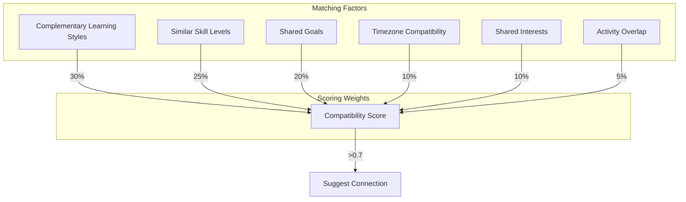

**The Story:** Peer matching isn't random—it's algorithmic matchmaking for learning. We evaluate six factors, each weighted by importance.

**Complementary Learning Styles (30%)** is the biggest factor. If Maya is visual and James is kinesthetic, they'll explain concepts differently to each other, covering blind spots. **Similar Skill Levels (25%)** ensures neither feels like they're dragging the other. **Shared Goals (20%)** checks if both are aiming for the same course completion or career path.

The remaining factors fine-tune: **Timezone Compatibility (10%)** ensures they can actually meet, **Shared Interests (10%)** gives them something to bond over, and **Activity Overlap (5%)** means they're working on similar content.

Each factor scores 0-1, weights are applied, and the final **Compatibility Score** emerges. Maya and James score 0.82—above the 0.7 threshold. The system suggests they connect, explaining *why*: "James excels at recursion where you need help, and you're both evening studiers in the same timezone."

### Connection Types

```javascript
// Connection recommendation types
const connectionTypes = {
  STUDY_BUDDY: {
    criteria: "similar_level + complementary_styles",
    description: "Great for collaborative learning"
  },
  MENTOR: {
    criteria: "higher_level + teaching_inclination",
    description: "Can help guide your learning"
  },
  MENTEE: {
    criteria: "lower_level + similar_path",
    description: "You can help them grow"
  },
  CHALLENGE_PARTNER: {
    criteria: "competitive_level + similar_interests",
    description: "Perfect for challenges"
  },
  ACCOUNTABILITY: {
    criteria: "similar_goals + similar_engagement",
    description: "Keep each other on track"
  }
};
```

---

## Leaderboard System

### Leaderboard Types

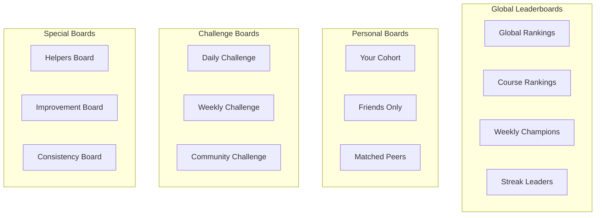

**The Story:** Leaderboards drive engagement through healthy competition, but one-size-fits-all doesn't work. We offer four categories designed for different motivations.

**Global Leaderboards** are the big stage: who's #1 overall, who's crushing the JavaScript course, who dominated this week, who has the longest streak. These appeal to competitive students who want to be the best.

**Personal Boards** make competition feel achievable. "Your Cohort" shows how Maya ranks against her actual classmates—not against thousands of strangers. "Friends Only" lets her compete with people she knows. "Matched Peers" ranks her against algorithmically-selected students at her level. Suddenly #47 globally becomes #3 in her peer group.

**Challenge Boards** add urgency. Daily, weekly, and community challenges have their own rankings that reset, giving everyone fresh chances to shine.

**Special Boards** reward different virtues. "Helpers Board" ranks who gives the most useful answers to others. "Improvement Board" celebrates growth rate, not absolute score—perfect for late bloomers. "Consistency Board" rewards showing up every day. Every student can find a leaderboard where they can win.

### Leaderboard Data Structure

```javascript
// Leaderboard document
{
  id: "global-weekly-2026-03",
  type: "global",
  period: "weekly",
  startDate: Timestamp,
  endDate: Timestamp,
  
  rankings: [
    {
      rank: 1,
      userId: "user123",
      displayName: "CodeNinja",
      avatar: "url",
      score: 2450,
      metrics: {
        activitiesCompleted: 47,
        challengesWon: 3,
        streakDays: 7,
        helpfulVotes: 12
      },
      change: +2  // Position change from last period
    },
    // ... more rankings
  ],
  
  computedAt: Timestamp,
  expiresAt: Timestamp
}
```

---

## Challenges Dashboard

### Challenge System Architecture

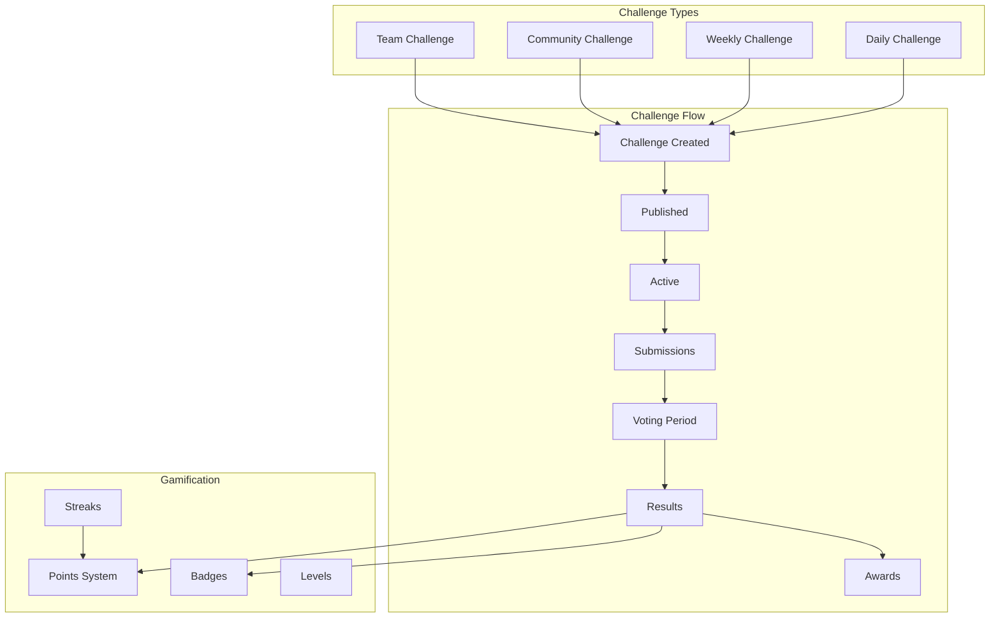

**The Story:** Challenges turn passive learning into active competition. We offer four flavors: **Daily Challenges** are quick 15-minute puzzles that reset every 24 hours—perfect for maintaining streaks. **Weekly Challenges** are meatier projects requiring deeper thinking. **Community Challenges** are special events where everyone works on the same problem. **Team Challenges** require collaboration—you can't win alone.

Every challenge follows the same **lifecycle**. It gets created, published to the community, becomes active for submissions, then enters a voting period where peers evaluate solutions. Results are computed, and awards are distributed.

The **Gamification** layer makes it sticky. Points accumulate from challenge participation. Badges reward specific achievements ("First Daily Win", "10-Challenge Streak", "Community Champion"). Streaks multiply your point earnings—miss a day and start over. Levels unlock as points accumulate, granting access to harder challenges and exclusive rewards.

The system creates a daily habit: check in, tackle the challenge, vote on others' solutions, watch your rank climb. Learning becomes a game you want to play.

### Challenge Dashboard Components

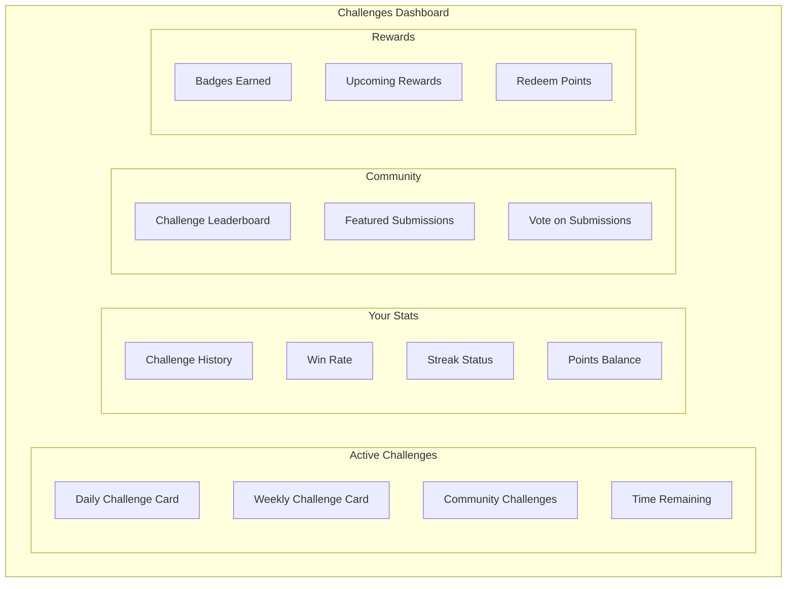

**The Story:** Maya opens the Challenges Dashboard at lunch. The **Active Challenges** section shows today's daily challenge: "Build a recursive function that calculates Fibonacci numbers—but you can only use 3 lines of code." A countdown timer shows 8 hours remaining. Below it, this week's challenge awaits, and a community challenge celebrating Black History Month runs all February.

**Your Stats** keeps Maya accountable. She's completed 47 challenges with a 34% win rate. Her current streak is 5 days—break it and she loses the 2x point multiplier. Her point balance sits at 2,340, inching toward the 2,500 needed for Level 8.

The **Community** section makes challenges social. The challenge leaderboard shows who's crushing it today. Featured submissions highlight creative solutions—even if they didn't win, they taught everyone something. Maya can vote on submissions, earning points for participating in the community.

Finally, **Rewards** shows what she's earned and what's coming. Three new badges glow from yesterday's wins. The Level 8 reward (custom avatar frame) is 160 points away. She can redeem current points for Discord role colors, exclusive challenge access, or even swag. The dashboard isn't just informative—it's motivating.

---

## Discord Integration

### Bot Commands & Features

```mermaid
flowchart TB
    subgraph "Discord Bot"
        subgraph "Commands"
            ST[/stats - Your analytics]
            LB[/leaderboard - View rankings]
            CH[/challenge - Daily challenge]
            CN[/connect - Find peers]
            AC[/achievements - Your badges]
        end
        
        subgraph "Automated Posts"
            DCS[Daily Challenge Announcement]
            LBU[Leaderboard Updates]
            ACA[Achievement Celebrations]
            MLS[Milestone Shoutouts]
        end
        
        subgraph "Notifications"
            NM[New Match Notification]
            CR[Challenge Results]
            ST2[Streak Reminders]
            IV[Intervention Nudges]
        end
    end
```

**The Story:** Discord transforms SWE Hackers from a learning platform into a *community*. The bot extends the web experience into the space where students already hang out.

**Commands** let students check their status without leaving Discord. `/stats` shows Maya her current score, streak, and rank. `/leaderboard` displays top performers. `/challenge` reveals today's puzzle right in chat. `/connect` suggests study buddies. `/achievements` flexes her badges.

**Automated Posts** keep the community buzzing without manual effort. Every morning at 8 AM, the Daily Challenge drops in #daily-challenge with an @everyone ping. Every evening, #daily-leaderboard updates with the day's rankings. When someone unlocks an achievement, #achievement-feed celebrates them publicly. Major milestones (course completions, 100-day streaks) get shoutouts in #milestone-celebrations.

**Notifications** maintain individual engagement. When Maya gets a new peer match, she gets a DM: "You've been matched with James—he's great at recursion!" Challenge results DM winners directly. Streak reminders ping students who haven't logged in today. If a student goes dark, gentle intervention nudges check in: "Hey, we miss you! You were 3 lessons away from finishing Chapter 3."

### Discord Channel Structure

```
📊 ANALYTICS
├── #daily-leaderboard     - Auto-posted daily rankings
├── #weekly-champions      - Weekly winners celebration
├── #achievement-feed      - Live achievement notifications
└── #milestone-celebrations - Big milestone shoutouts

🏆 CHALLENGES
├── #daily-challenge       - Daily challenge posts
├── #challenge-submissions - Student submissions
├── #challenge-discussion  - Strategy talk
└── #hall-of-fame         - Featured winners

🤝 CONNECTIONS
├── #find-a-buddy         - Peer matching suggestions
├── #study-groups         - Form study groups
├── #mentor-matching      - Mentor/mentee connections
└── #accountability-pairs - Accountability partners

📈 PROGRESS
├── #streak-check-in      - Daily streak posts
├── #progress-share       - Share your progress
└── #help-wanted          - Ask for help
```

---

## Reusable Service Architecture

### Analytics Service Layer

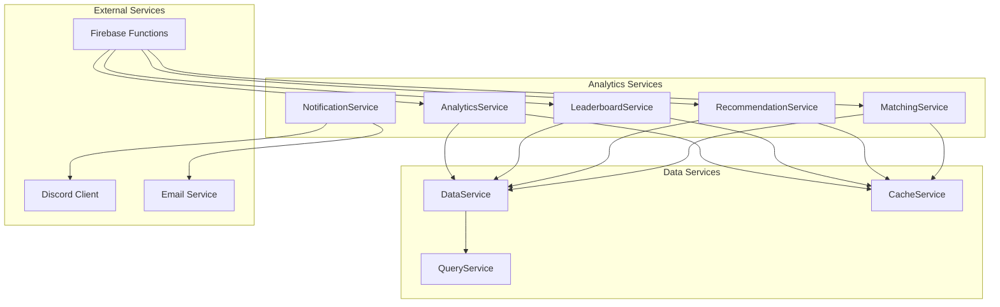

**The Story:** This is our service layer architecture—the brains behind the dashboards. Each service has a focused responsibility and clean interfaces.

**Analytics Services** compute the intelligence. `AnalyticsService` handles user profiles and course metrics. `LeaderboardService` manages rankings. `RecommendationService` generates personalized suggestions. `MatchingService` finds peer connections. `NotificationService` pushes updates to users.

All these services depend on **Data Services** for storage. `DataService` wraps Firestore operations. `CacheService` manages Redis for fast reads. `QueryService` optimizes complex queries with batching and pagination.

**External Services** connect to the outside world. `Firebase Functions` runs serverless computation (analytics jobs, achievement checks). `Discord Client` posts to channels and sends DMs. `Email Service` handles digest emails and progress reports.

The beauty is *separation*. `LeaderboardService` doesn't know about Firestore—it just calls `DataService`. `NotificationService` doesn't care if it's posting to Discord or sending email—the interface is the same. When we add Slack integration later, only `NotificationService` changes.

### Service Method Signatures

```javascript
// AnalyticsService.js
const AnalyticsService = {
  // User Analytics
  async getUserAnalytics(userId) {},
  async computeUserAnalytics(userId) {},
  async getLearningInsights(userId) {},
  async getRecommendations(userId) {},
  
  // Course Analytics
  async getCourseAnalytics(courseId) {},
  async getLessonAnalytics(courseId, lessonId) {},
  async getActivityAnalytics(activityId) {},
  
  // Cohort Analytics
  async getCohortAnalytics(cohortId) {},
  async getClassAnalytics(teacherId, classId) {},
  async getSchoolAnalytics(schoolId) {},
  async getDistrictAnalytics(districtId) {},
  
  // Comparison & Benchmarks
  async compareToAverage(userId, scope) {},
  async getPercentileRank(userId, metric, scope) {},
  async getBenchmarks(scope) {}
};

// LeaderboardService.js
const LeaderboardService = {
  // Leaderboard Retrieval
  async getLeaderboard(type, period, options) {},
  async getUserRank(userId, type, period) {},
  async getNearbyRanks(userId, type, count) {},
  
  // Leaderboard Computation
  async computeLeaderboard(type, period) {},
  async updateRankings(type) {},
  
  // Personal Boards
  async getCohortLeaderboard(userId) {},
  async getFriendsLeaderboard(userId) {},
  async getMatchedPeersBoard(userId) {}
};

// MatchingService.js
const MatchingService = {
  // Peer Matching
  async findMatches(userId, type, limit) {},
  async computeCompatibility(userId1, userId2) {},
  async getSuggestedConnections(userId) {},
  
  // Connection Management
  async createConnection(userId, targetId, type) {},
  async getConnections(userId, status) {},
  async updateConnectionStatus(connectionId, status) {}
};

// RecommendationService.js
const RecommendationService = {
  // Learning Recommendations
  async getNextLessons(userId) {},
  async getRemediationPath(userId, topic) {},
  async getAdvancementPath(userId) {},
  
  // Study Recommendations
  async getOptimalStudyTimes(userId) {},
  async getStudyStrategies(userId) {},
  async getResourceRecommendations(userId, topic) {}
};
```

---

## Database Operation Patterns

### Smart Queries with Caching

```javascript
// QueryService.js - Efficient data fetching with caching
const QueryService = {
  // Cache-first pattern
  async getWithCache(collection, docId, ttlSeconds = 300) {
    const cacheKey = `${collection}:${docId}`;
    
    // Check cache first
    const cached = await CacheService.get(cacheKey);
    if (cached) return cached;
    
    // Fetch from Firestore
    const doc = await db.collection(collection).doc(docId).get();
    const data = doc.data();
    
    // Cache for future
    await CacheService.set(cacheKey, data, ttlSeconds);
    return data;
  },
  
  // Batch fetching with deduplication
  async batchGet(collection, docIds) {
    const unique = [...new Set(docIds)];
    const refs = unique.map(id => db.collection(collection).doc(id));
    const snapshots = await db.getAll(...refs);
    
    return snapshots.reduce((acc, snap) => {
      if (snap.exists) acc[snap.id] = snap.data();
      return acc;
    }, {});
  },
  
  // Aggregation with pagination
  async aggregateWithPagination(query, pageSize = 100) {
    let lastDoc = null;
    const results = [];
    
    while (true) {
      let q = query.limit(pageSize);
      if (lastDoc) q = q.startAfter(lastDoc);
      
      const snapshot = await q.get();
      if (snapshot.empty) break;
      
      results.push(...snapshot.docs.map(d => d.data()));
      lastDoc = snapshot.docs[snapshot.docs.length - 1];
      
      if (snapshot.docs.length < pageSize) break;
    }
    
    return results;
  }
};
```

### Firestore Security Rules

```javascript
// firestore.rules additions for analytics
rules_version = '2';
service cloud.firestore {
  match /databases/{database}/documents {
    
    // User can read their own analytics
    match /userAnalytics/{userId} {
      allow read: if request.auth.uid == userId;
      allow write: if false; // Only cloud functions write
    }
    
    // Leaderboards are public read
    match /leaderboards/{leaderboardId} {
      allow read: if request.auth != null;
      allow write: if false; // Only cloud functions write
    }
    
    // Connections require mutual consent
    match /connections/{connectionId} {
      allow read: if request.auth.uid in resource.data.participants;
      allow create: if request.auth.uid == request.resource.data.initiatorId;
      allow update: if request.auth.uid in resource.data.participants;
    }
    
    // Teachers can read their students' analytics
    match /cohortAnalytics/{cohortId} {
      allow read: if request.auth.uid == resource.data.teacherId
                  || request.auth.uid in resource.data.adminIds;
    }
  }
}
```

---

## Implementation Phases

### Phase 1: Core Analytics (Foundation)

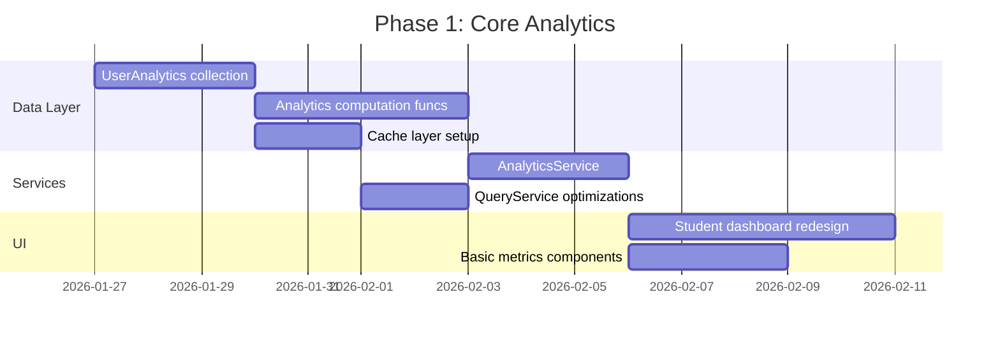

**The Story:** Phase 1 lays the foundation. We start with the **Data Layer**—creating the `userAnalytics` collection in Firestore and building Cloud Functions that compute learning patterns from raw activity data. The cache layer ensures dashboards load instantly.

Once data flows, we build the **Services**. `AnalyticsService` becomes the single source of truth for "tell me about this student." Query optimizations ensure we're not hammering Firestore.

Finally, the **UI** comes alive. The student dashboard gets a complete redesign: skill radar showing strengths/gaps, progress timelines, and personalized recommendations. This phase transforms "we collect data" into "students see their growth."

**Deliverables:**
- [ ] UserAnalytics Firestore collection
- [ ] Cloud Function for analytics computation
- [ ] AnalyticsService with core methods
- [ ] Student dashboard with personal metrics
- [ ] Skill radar chart component
- [ ] Learning path recommendations

### Phase 2: Leaderboards & Gamification

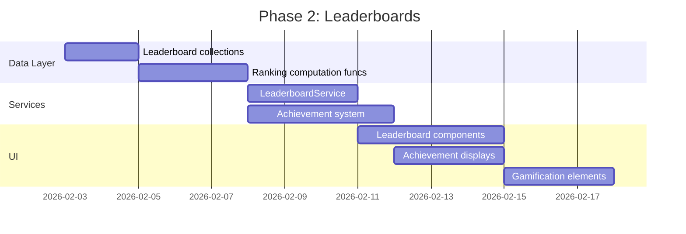

**The Story:** Phase 2 adds the competitive edge. The **Data Layer** creates leaderboard collections and ranking computation functions that run nightly.

The **Services** layer builds `LeaderboardService` (rankings, nearby ranks, personal boards) and the achievement system (criteria checking, badge awarding, unlock notifications).

The **UI** brings competition to life. Leaderboard tables show global and cohort rankings with position changes. Achievement displays celebrate unlocked badges. Gamification elements—points, levels, streak counters with fire icons—make progress feel rewarding. Students log in not just to learn, but to *compete*.

**Deliverables:**
- [ ] Global, course, and personal leaderboards
- [ ] Weekly/monthly ranking computation
- [ ] Achievement/badge system
- [ ] Streak tracking and display
- [ ] Points and levels system

### Phase 3: Community & Matching

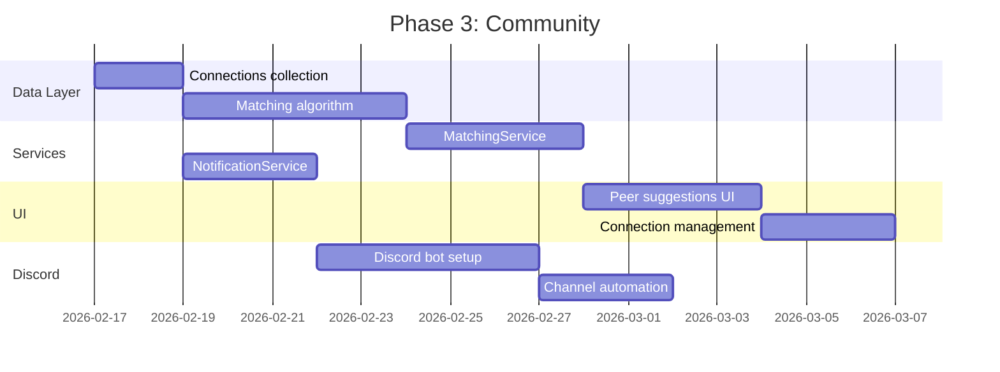

**The Story:** Phase 3 transforms individuals into a community. The **Data Layer** creates the connections collection and implements the weighted matching algorithm that finds compatible peers.

**Services** bring intelligence. `MatchingService` computes compatibility scores and suggests connections. `NotificationService` handles both web push and Discord DMs.

The **UI** makes connection easy. Peer suggestion cards show why matches work ("You both struggle with recursion, but James knows functions!"). Connection management lets students accept, decline, or message matches.

**Discord** integration is the multiplier. The bot goes live with core commands. Automated posts celebrate achievements and update leaderboards. Suddenly SWE Hackers isn't just a website—it's a 24/7 community hub.

**Deliverables:**
- [ ] Peer matching algorithm
- [ ] Connection suggestions UI
- [ ] Discord bot with core commands
- [ ] Automated Discord posts
- [ ] Study buddy finder

### Phase 4: Challenges Dashboard

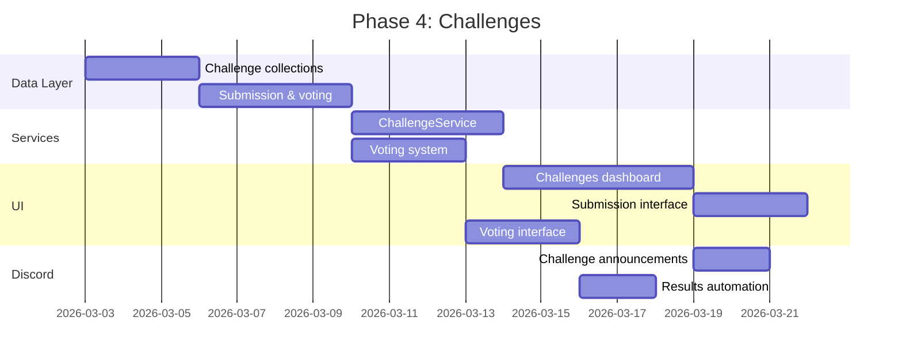

**The Story:** Phase 4 adds daily engagement hooks. The **Data Layer** creates challenge collections and implements submission/voting workflows.

**Services** handle the lifecycle. `ChallengeService` creates challenges (daily at midnight), accepts submissions, manages voting periods, and computes results. The voting system tracks peer evaluations and prevents gaming.

The **UI** builds the Challenges Dashboard—a dedicated space for competition. Challenge cards show active puzzles with countdowns. Submission interfaces handle code and explanations. Voting interfaces let students evaluate peers' work. Featured submissions highlight creative solutions.

**Discord** ties it together. Daily challenges post automatically to #daily-challenge. Results post to #daily-leaderboard. Winners get celebrated. The challenges dashboard becomes the daily destination that keeps students coming back.

**Deliverables:**
- [ ] Daily/weekly challenge system
- [ ] Submission and voting workflow
- [ ] Challenge leaderboards
- [ ] Featured submissions gallery
- [ ] Discord challenge integration

### Phase 5: Teacher & Admin Dashboards

```mermaid
gantt
    title Phase 5: Educator Tools
    dateFormat  YYYY-MM-DD
    section Data Layer
    Cohort analytics            :a1, 2026-03-17, 3d
    School/district rollups     :a2, after a1, 4d
    section Services
    CohortAnalyticsService      :b1, after a2, 4d
    InterventionService         :b2, after a1, 3d
    section UI
    Teacher dashboard           :c1, after b1, 5d
    Admin dashboard             :c2, after c1, 5d
    Intervention alerts         :c3, after b2, 3d
    Reports & exports           :c4, after c2, 3d
```

**The Story:** Phase 5 empowers educators. The **Data Layer** creates cohort analytics (class-level aggregations) and school/district rollups that enable administrative oversight.

**Services** add institutional intelligence. `CohortAnalyticsService` computes class comparisons, identifies struggling students, and flags intervention opportunities. `InterventionService` generates alerts when students go dark or repeatedly fail.

The **UI** serves two audiences. The **Teacher Dashboard** shows class progress, individual student profiles, comparison graphs, and intervention alerts—everything needed to support 30 students effectively. The **Admin Dashboard** zooms out to district-wide metrics, school comparisons, and program health indicators.

Finally, **Reports & Exports** complete the picture. Progress reports can be generated for parent conferences. Data exports feed into district reporting systems. Certificates generate automatically for course completers. The platform becomes not just a learning tool, but an institutional asset.

**Deliverables:**
- [ ] Teacher class view dashboard
- [ ] Student comparison tools
- [ ] Intervention alert system
- [ ] Admin district overview
- [ ] Progress reports generation
- [ ] Data export capabilities

---

## File Structure

```
courses/
├── shared/
│   ├── js/
│   │   ├── services/
│   │   │   ├── analytics-service.js      # User & course analytics
│   │   │   ├── leaderboard-service.js    # Ranking computations
│   │   │   ├── matching-service.js       # Peer matching
│   │   │   ├── recommendation-service.js # Learning recommendations
│   │   │   ├── challenge-service.js      # Challenge management
│   │   │   ├── notification-service.js   # Push & Discord notifications
│   │   │   └── cache-service.js          # Client-side caching
│   │   └── components/
│   │       ├── analytics/
│   │       │   ├── metric-card.js
│   │       │   ├── skill-radar.js
│   │       │   ├── progress-timeline.js
│   │       │   ├── engagement-heatmap.js
│   │       │   └── comparison-chart.js
│   │       ├── leaderboard/
│   │       │   ├── leaderboard-table.js
│   │       │   ├── rank-card.js
│   │       │   └── position-change.js
│   │       ├── community/
│   │       │   ├── peer-suggestion.js
│   │       │   ├── connection-card.js
│   │       │   └── study-group.js
│   │       └── challenges/
│   │           ├── challenge-card.js
│   │           ├── submission-form.js
│   │           └── voting-interface.js
│   └── css/
│       ├── analytics.css
│       ├── leaderboard.css
│       └── challenges.css
├── dashboard/
│   └── index.html                        # Student dashboard
├── teacher-dashboard/
│   └── index.html                        # Teacher view
├── admin-dashboard/
│   └── index.html                        # Admin view
└── challenges/
    └── index.html                        # Challenges dashboard

firebase-functions/
├── analytics/
│   ├── computeUserAnalytics.js
│   ├── computeCourseAnalytics.js
│   └── computeCohortAnalytics.js
├── leaderboards/
│   ├── computeLeaderboards.js
│   └── updateRankings.js
├── matching/
│   ├── computeMatches.js
│   └── suggestConnections.js
├── challenges/
│   ├── createDailyChallenge.js
│   └── computeResults.js
└── notifications/
    ├── sendAchievement.js
    └── discordWebhook.js

discord-bot/
├── commands/
│   ├── stats.js
│   ├── leaderboard.js
│   ├── challenge.js
│   └── connect.js
├── automations/
│   ├── dailyChallenge.js
│   ├── leaderboardPost.js
│   └── achievementCelebration.js
└── index.js
```

---

## Success Metrics

### Student Engagement
- Daily/weekly active users
- Average session duration increase
- Activity completion rates
- Streak maintenance rates

### Learning Outcomes
- Score improvement over time
- Time to proficiency reduction
- Skill gap closure rates
- Course completion rates

### Community Health
- Connection acceptance rates
- Study group formation
- Challenge participation
- Discord engagement metrics

### Platform Growth
- New user signups
- Retention rates
- Referral rates
- NPS scores

---

## Next Steps

1. **Review this architecture** with team
2. **Prioritize phases** based on impact vs effort
3. **Create GitHub issues** for Phase 1 tasks
4. **Begin UserAnalytics** collection design
5. **Prototype student dashboard** redesign
