# Analytics Dashboard Architecture

## The Vision

```mermaid
flowchart LR
    subgraph Current["📊 Current Dashboard"]
        C1[Course Card] --> C2[Click]
        C2 --> C3[Jump directly into lesson]
        C3 --> C4[No analytics visible]
    end

    subgraph Future["🚀 Enhanced Dashboard"]
        F1[Main Dashboard] --> F2[Aggregated Analytics]
        F2 --> F3[Cognitive Progress Metrics]
        F1 --> F4[Click Course]
        F4 --> F5[Course Dashboard]
        F5 --> F6[Lecture Navigator + Analytics]
    end

    style C4 fill:#ff6b6b,stroke:#c92a2a,color:#fff
    style F3 fill:#51cf66,stroke:#2f9e44,color:#fff
    style F6 fill:#51cf66,stroke:#2f9e44,color:#fff
```



### The Story: From Invisible to Insightful

Imagine Maria, a student using AutoNateAI. She's been working through the Apprentice course for two weeks, completing quizzes, playing with drag-and-drop activities, and writing code challenges.

**Today's Experience:**
Maria opens her dashboard and sees "3/7 Chapters Complete" and a "Continue" button. That's it. She clicks continue and jumps right into Chapter 4.

But Maria has questions:

- "Am I actually understanding this stuff, or just clicking through?"
- "Which topics are my weakest?"
- "How much time have I invested?"
- "Am I making cognitive progress?"

**Tomorrow's Experience:**
Maria opens her dashboard and immediately sees:

```
🧠 Learning Velocity: 2.3 lessons/week (↑ 15% from last week)
⚡ Quiz Mastery: 87% first-try accuracy
🔥 Streak: 5 days active
💪 Strongest: Variables & Data Types
📈 Growth Area: Loops & Iteration
```

When she clicks on "Apprentice Course", instead of jumping into a lesson, she lands on a **Course Dashboard** with:

- All 7 chapters laid out with completion status
- Analytics per chapter (time spent, quiz scores, activities completed)
- Quick access to flashcards and notes
- Visual progress timeline

THIS is the feature we're building.

---

## User Flow

```mermaid
flowchart TB
    subgraph MainDashboard["📊 Main Dashboard (dashboard/index.html)"]
        AGG[Aggregated Analytics Panel]
        AGG --> LV[Learning Velocity]
        AGG --> QM[Quiz Mastery %]
        AGG --> SK[Streak Counter]
        AGG --> TA[Time Analytics]
        AGG --> CP[Cognitive Progress]

        COURSES[My Courses Grid]
        COURSES --> CARD1[Course Card 1]
        COURSES --> CARD2[Course Card 2]
    end

    CARD1 --> COURSE_DASH[Course Dashboard]

    subgraph CourseDashboard["📚 Course Dashboard (NEW)"]
        subgraph Tabs["Tab Navigation"]
            T1[📖 Overview]
            T2[📝 Chapters]
            T3[📊 Analytics]
            T4[🗃️ Flashcards]
            T5[📓 Notes]
        end

        T2 --> CH_LIST[Chapter List with Stats]
        T3 --> CH_ANALYTICS[Per-Chapter Analytics]
        T4 --> FLASH[Flashcard Deck]
        T5 --> NOTES[User Notes]
    end

    CH_LIST --> LESSON[Enter Lesson]

    style AGG fill:#1a1a2e,stroke:#7986cb
    style CourseDashboard fill:#12121a,stroke:#4db6ac
```



### The Story: Maria's New Journey

**Step 1: Main Dashboard**

Maria logs in and sees her main dashboard. At the top, a new **Analytics Panel** shows her aggregated progress across ALL courses:

| Metric            | Value            | Meaning                        |
| ----------------- | ---------------- | ------------------------------ |
| Learning Velocity | 2.3 lessons/week | How fast she's progressing     |
| Quiz Mastery      | 87%              | First-try accuracy on quizzes  |
| Active Streak     | 5 days           | Consecutive days with activity |
| Time Invested     | 4.5 hours        | Total time in lessons          |
| Cognitive Score   | 78/100           | Composite learning strength    |

Below that, her enrolled courses appear as cards with progress bars.

**Step 2: Course Dashboard**

Maria clicks on "The Apprentice's Path". Instead of jumping into a lesson, she lands on a **Course Dashboard** — a new intermediate page.

This page has tabs:

- **Overview**: Course description, total progress, estimated completion
- **Chapters**: All 7 chapters with individual progress, time spent, quiz scores
- **Analytics**: Detailed charts showing performance over time
- **Flashcards**: Review key concepts
- **Notes**: Her personal notes for this course

**Step 3: Chapter Selection**

From the Chapters tab, Maria can see:

- ✅ Chapter 0: Origins (100% | 23 min | Quiz: ✓)
- ✅ Chapter 1: Stone (100% | 45 min | Quiz: 90%)
- 🔄 Chapter 2: Lightning (67% | 18 min | Quiz: —)
- ⬜ Chapter 3-6: Not started

She clicks on Chapter 2 to continue where she left off.

---

## Data Architecture


### The Story: Where the Data Lives

Think of the Firestore database like Maria's personal learning journal. It has several sections:

**📁 Course Progress** — One folder per course she's enrolled in

- Overall completion percentage
- Summary of all lesson progress
- Activity statistics (quiz accuracy, attempts, etc.)
- Time tracking

**📁 Lesson Progress** — Inside each course folder, detailed records for each lesson

- Which sections were viewed
- Time spent on this specific lesson
- Whether it's marked complete

**📁 Activity Attempts** — Every quiz answered, every drag-drop completed

- Individual attempt records with scores
- Time taken per activity
- Retry patterns

**📁 Daily Stats** — Aggregated daily metrics (NEW!)

- How many lessons completed today
- Daily quiz accuracy
- Time spent learning
- Used for streak calculation

### Technical Details: Firestore Paths

| Collection Path                                                   | Document    | Purpose                     |
| ----------------------------------------------------------------- | ----------- | --------------------------- |
| `users/{uid}`                                                     | User doc    | Profile, settings           |
| `users/{uid}/courseProgress/{courseId}`                           | Course doc  | Per-course summary          |
| `users/{uid}/courseProgress/{courseId}/lessonProgress/{lessonId}` | Lesson doc  | Per-lesson details          |
| `users/{uid}/activityAttempts/{attemptId}`                        | Attempt doc | Individual activity records |
| `users/{uid}/dailyStats/{date}`                                   | Stats doc   | Daily aggregations          |

---

## Analytics Calculations

```mermaid
flowchart TB
    subgraph RawData["📥 Raw Data Sources"]
        LP[lessonProgress/*]
        AA[activityAttempts/*]
        CP[courseProgress/*]
    end

    subgraph Calculations["🧮 Analytics Calculations"]
        subgraph Velocity["Learning Velocity"]
            LP --> LC[Count completed lessons]
            LC --> TIME[Divide by time period]
            TIME --> VEL[Lessons per week]
        end

        subgraph Mastery["Quiz Mastery"]
            AA --> QUIZ[Filter type='quiz']
            QUIZ --> FIRST[Filter attemptNumber=1]
            FIRST --> ACC[Calculate accuracy %]
        end

        subgraph Streak["Active Streak"]
            AA --> DATES[Extract unique dates]
            LP --> DATES
            DATES --> CONSEC[Count consecutive days]
        end

        subgraph Cognitive["Cognitive Progress"]
            ACC --> BLEND[Weighted blend]
            VEL --> BLEND
            CONSEC --> BLEND
            BLEND --> SCORE[Composite score 0-100]
        end
    end

    subgraph Display["📊 Display"]
        VEL --> DASH[Dashboard Analytics Panel]
        ACC --> DASH
        CONSEC --> DASH
        SCORE --> DASH
    end

    style SCORE fill:#4db6ac,stroke:#00897b,color:#fff
```



### The Story: Turning Data into Insights

Raw data is meaningless without interpretation. Here's how we transform Maria's data into actionable insights:

**🚀 Learning Velocity** — "How fast am I learning?"

```
Formula: completedLessons / weeksSinceEnrollment

Maria's Data:
- Completed: 2 lessons
- Enrolled: 7 days ago
- Velocity: 2.0 lessons/week

Interpretation: "You're on track to finish in 3-4 weeks!"
```

**⚡ Quiz Mastery** — "Am I actually understanding this?"

```
Formula: (firstTryCorrect / totalFirstTries) * 100

Maria's Data:
- First-try quizzes: 6
- Correct on first try: 5
- Mastery: 83%

Interpretation: "Strong understanding! Keep it up 🔥"
```

**🔥 Active Streak** — "Am I staying consistent?"

```
Formula: Count consecutive days with ANY activity (lesson view OR activity completion)

Maria's Data:
- Jan 1: ✅ Completed ch0 quiz
- Jan 2: ✅ Viewed ch1 sections
- Jan 3: ✅ Completed ch1 quiz
- Jan 4: (today)
- Streak: 3 days

Interpretation: "3-day streak! Don't break the chain!"
```

**🧠 Cognitive Progress Score** — "How's my brain doing?"

```
Formula: (QuizMastery * 0.4) + (VelocityNormalized * 0.3) + (StreakNormalized * 0.2) + (CompletionRate * 0.1)

Maria's Score:
- Quiz Mastery: 83% * 0.4 = 33.2
- Velocity (2.0/3.0 target): 67% * 0.3 = 20.1
- Streak (3/7 max): 43% * 0.2 = 8.6
- Completion (2/7): 29% * 0.1 = 2.9
- Total: 64.8/100

Interpretation: "Good progress! Focus on consistency for higher scores."
```

---

## Component Architecture

```mermaid
flowchart TB
    subgraph Pages["📄 Pages"]
        P1[dashboard/index.html<br/>Main Dashboard]
        P2[dashboard/course.html<br/>Course Dashboard - NEW]
        P3[dashboard/courses.html<br/>Course Library]
        P4[dashboard/progress.html<br/>My Progress]
    end

    subgraph Components["🧩 Shared Components"]
        C1[AnalyticsPanel.js - NEW]
        C2[ChapterList.js - NEW]
        C3[CourseStats.js - NEW]
        C4[FlashcardViewer.js]
        C5[NotesManager.js]
    end

    subgraph Services["⚙️ Services"]
        S1[data-service.js<br/>Firestore CRUD]
        S2[analytics-service.js - NEW<br/>Calculations]
        S3[auth.js<br/>Authentication]
    end

    P1 --> C1
    P2 --> C1
    P2 --> C2
    P2 --> C3
    P2 --> C4
    P2 --> C5

    C1 --> S2
    C2 --> S1
    C3 --> S2
    S2 --> S1

    style C1 fill:#ffd54f,stroke:#f9a825,color:#1a1a2e
    style C2 fill:#ffd54f,stroke:#f9a825,color:#1a1a2e
    style C3 fill:#ffd54f,stroke:#f9a825,color:#1a1a2e
    style S2 fill:#ffd54f,stroke:#f9a825,color:#1a1a2e
    style P2 fill:#ffd54f,stroke:#f9a825,color:#1a1a2e
```



### The Story: Building Blocks

To build this feature, we need new building blocks (components and services) that work with our existing code.

**New Page: Course Dashboard** (`dashboard/course.html`)

This is the intermediate page between the main dashboard and lesson content. It loads when a user clicks on a course card.

URL pattern: `dashboard/course.html?id=apprentice`

**New Service: Analytics Service** (`shared/js/analytics-service.js`)

This service contains all the calculation logic:

| Method                                    | Purpose                 | Inputs                           |
| ----------------------------------------- | ----------------------- | -------------------------------- |
| `calculateLearningVelocity(userId)`       | Lessons per week        | lessonProgress data              |
| `calculateQuizMastery(userId, courseId?)` | First-try accuracy      | activityAttempts                 |
| `calculateStreak(userId)`                 | Consecutive active days | activityAttempts, lessonProgress |
| `calculateCognitiveScore(userId)`         | Composite score         | All above                        |
| `getChapterAnalytics(courseId, lessonId)` | Per-chapter stats       | lessonProgress, activityAttempts |

**New Components:**

| Component        | Location                         | Purpose                       |
| ---------------- | -------------------------------- | ----------------------------- |
| `AnalyticsPanel` | Main dashboard, Course dashboard | Displays aggregated metrics   |
| `ChapterList`    | Course dashboard                 | Shows all chapters with stats |
| `CourseStats`    | Course dashboard                 | Course-level analytics        |

**Reusing Existing Code:**

| Existing          | Reuse For                       |
| ----------------- | ------------------------------- |
| `data-service.js` | All Firestore reads             |
| `FlashcardViewer` | Course dashboard flashcards tab |
| `NotesManager`    | Course dashboard notes tab      |
| `auth.js`         | Authentication checks           |

---

## Course Dashboard Layout


### The Story: What Maria Sees

When Maria clicks on "The Apprentice's Path", she lands on a dedicated **Course Dashboard**.

**The Header:**

```
┌─────────────────────────────────────────────────────────────┐
│ 🌟 The Apprentice's Path                                    │
│ ████████████░░░░░░░░░░░░░░░░░ 43% Complete                  │
│                                        [▶ Resume Learning]   │
└─────────────────────────────────────────────────────────────┘
```

**The Tabs:**

```
┌──────────┬──────────┬───────────┬────────────┬────────┐
│ Overview │ Chapters │ Analytics │ Flashcards │ Notes  │
└──────────┴──────────┴───────────┴────────────┴────────┘
```

**Overview Tab:**

- Course description and learning objectives
- Quick stats: "3 chapters done • 2h 15m invested • 87% quiz score"
- Timeline showing when each chapter was completed

**Chapters Tab:**
| Chapter | Status | Time | Quiz | Action |
|---------|--------|------|------|--------|
| 0: Origins | ✅ 100% | 23m | ✓ | Review |
| 1: Stone | ✅ 100% | 45m | 90% | Review |
| 2: Lightning | 🔄 67% | 18m | — | Continue |
| 3: Magnetism | ⬜ 0% | — | — | Start |
| ... | | | | |

**Analytics Tab:**

- Bar chart: Time spent per chapter
- Line chart: Quiz scores over time
- Activity feed: "Jan 3: Completed Chapter 1 Quiz (90%)"

---

## Data Flow: Loading the Course Dashboard


### The Story: Behind the Scenes

When Maria clicks on "The Apprentice's Path", here's what happens in the background:

**Step 1: Load Course Summary** (50ms)

```javascript
// File: dashboard/course.html
const courseId = new URLSearchParams(window.location.search).get("id");
const courseData = await DataService.getCourseProgress(courseId);
// Returns: { completedLessons: 2, progressPercent: 29, ... }
```

**Step 2: Load All Lessons** (100ms)

```javascript
// File: dashboard/course.html
const lessons = await DataService.getAllLessonsProgress(courseId);
// Returns: [
//   { id: 'ch0-origins', completed: true, progressPercent: 100, timeSpent: 1380000 },
//   { id: 'ch1-stone', completed: true, progressPercent: 100, timeSpent: 2700000 },
//   { id: 'ch2-lightning', completed: false, progressPercent: 67, timeSpent: 1080000 },
//   ...
// ]
```

**Step 3: Calculate Analytics** (150ms)

```javascript
// File: shared/js/analytics-service.js
const analytics = await AnalyticsService.getChapterAnalytics(courseId);
// Returns: {
//   totalTimeMs: 5160000,
//   avgQuizScore: 0.95,
//   activitiesCompleted: 4,
//   quizzesPassed: 2,
//   strongestTopic: 'Variables',
//   weakestTopic: 'Loops'
// }
```

**Step 4: Render** (50ms)

The page renders with all data:

- Header shows overall progress
- Chapters tab shows lesson list
- Analytics tab shows charts

**Total load time: ~350ms** — Fast enough to feel instant.

---

## Implementation Plan


### Phase Breakdown

**Phase 1: Analytics Service** (3-4 days)

Create `shared/js/analytics-service.js` with calculation methods:

- `calculateLearningVelocity()`
- `calculateQuizMastery()`
- `calculateStreak()`
- `calculateCognitiveScore()`
- `getChapterAnalytics()`

**Phase 2: Main Dashboard Enhancement** (2-3 days)

Add the aggregated analytics panel to `dashboard/index.html`:

- Show Learning Velocity
- Show Quiz Mastery percentage
- Show Streak counter
- Show Cognitive Progress score

**Phase 3: Course Dashboard** (5-6 days)

Create new page `dashboard/course.html` with:

- Course header with progress
- Tab navigation (Overview, Chapters, Analytics, Flashcards, Notes)
- Chapter list with per-chapter stats
- Analytics visualizations
- Integration with existing flashcard and notes features

**Phase 4: Polish** (2-3 days)

- Add anime.js animations for loading states
- Make fully responsive for mobile
- Test all data flows
- Handle edge cases (no data, new users, etc.)

---

## File Checklist

### New Files

| File                              | Purpose                     | Priority |
| --------------------------------- | --------------------------- | -------- |
| `shared/js/analytics-service.js`  | Analytics calculations      | P0       |
| `dashboard/course.html`           | Course dashboard page       | P0       |
| `shared/css/course-dashboard.css` | Course dashboard styles     | P1       |
| `shared/js/chapter-list.js`       | Chapter list component      | P1       |
| `shared/js/analytics-panel.js`    | Analytics display component | P1       |

### Modified Files

| File                   | Changes                                          | Priority |
| ---------------------- | ------------------------------------------------ | -------- |
| `dashboard/index.html` | Add analytics panel                              | P0       |
| `data-service.js`      | Add `getAllLessonsProgress()`, `getDailyStats()` | P0       |
| `dashboard.css`        | Styles for analytics panel                       | P1       |
| Course detail pages    | Link to course dashboard instead of lesson       | P2       |

### Existing Files to Reuse

| File              | Reuse                   |
| ----------------- | ----------------------- |
| `progress.html`   | Flashcard viewer code   |
| `progress.html`   | Notes manager code      |
| `auth.js`         | Authentication patterns |
| `data-service.js` | Base Firestore patterns |

---

## Open Questions

Before building, we should decide:

1. **Streak Definition**: Does viewing a lesson count as activity, or only completing activities?

   - Option A: Any page view = activity
   - Option B: Only quiz/activity completion
   - Option C: Either (hybrid)

2. **Cognitive Score Weights**: Are these weights good?

   - Quiz Mastery: 40%
   - Learning Velocity: 30%
   - Streak: 20%
   - Completion Rate: 10%

3. **Historical Data**: Should we calculate velocity since enrollment or only last 30 days?

4. **Course Dashboard URL**:

   - Option A: `dashboard/course.html?id=apprentice`
   - Option B: `course/apprentice/dashboard.html`
   - Option C: `dashboard/apprentice/` (folder-based)

5. **Charts Library**: For the analytics visualizations:
   - Option A: Chart.js (feature-rich, 50kb)
   - Option B: anime.js custom (already included, lightweight)
   - Option C: CSS-only charts (simplest)

---

## Summary

This architecture enables Maria (and all students) to:

✅ See aggregated learning metrics on the main dashboard
✅ Understand their cognitive progress with meaningful scores
✅ Navigate to a course-specific dashboard before entering lessons
✅ View all chapters with individual progress and stats
✅ Access flashcards and notes per course
✅ Make informed decisions about where to focus study time

The implementation builds on existing patterns:

- Reuses `data-service.js` for Firestore access
- Extends rather than replaces current dashboard
- Uses same auth and component patterns
- Leverages already-collected progress and activity data

**Estimated Total Effort: 12-16 days**

Ready to build? Let's start with Phase 1: The Analytics Service! 🚀
