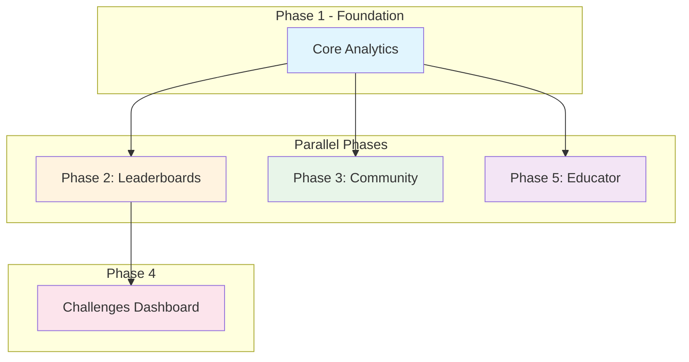

# Analytics & Community Implementation Plans

This folder contains detailed implementation plans for building the Analytics & Community Engagement system described in [`analytics-community-architecture.md`](../analytics-community-architecture.md).

## Phase Overview

| Phase | Focus | Agents | Dependencies |
|-------|-------|--------|--------------|
| [Phase 1](./phase-1-core-analytics.md) | Core Analytics Foundation | 4 | None (start here) |
| [Phase 2](./phase-2-leaderboards-gamification.md) | Leaderboards & Gamification | 4 | Phase 1 complete |
| [Phase 3](./phase-3-community-matching.md) | Community & Peer Matching | 4 | Phase 1 complete |
| [Phase 4](./phase-4-challenges-dashboard.md) | Challenges Dashboard | 4 | Phase 2 complete |
| [Phase 5](./phase-5-educator-dashboards.md) | Teacher & Admin Dashboards | 4 | Phase 1 complete |

## Execution Strategy



**The Strategy:** Phase 1 is the foundation—everything depends on it. Once complete, Phases 2, 3, and 5 can run **in parallel** (different teams, no conflicts). Phase 4 (Challenges) depends on Phase 2's gamification system, so it runs after.

## How to Use These Plans

1. **Read the main architecture doc first**: [`analytics-community-architecture.md`](../analytics-community-architecture.md)
2. **Execute phases in order** (respect dependencies)
3. **Within each phase**, launch parallel agents as indicated
4. **Copy-paste prompts** directly into new Cursor agent sessions
5. **Report completion** before moving to next phase

## Agent Prompt Format

Each prompt includes:
- **Context reference** to the main architecture doc
- **Mermaid diagram** showing what's being built
- **Specific deliverables** with file paths
- **Testing instructions** to verify completion
- **Integration points** with other agents' work

## Progress Tracking

Use GitHub issues to track each agent's work:

```bash
# Create issues for a phase (example for Phase 1)
gh issue create --title "P1-A1: UserAnalytics Collection & Cloud Functions" --body "Agent 1 work for Phase 1"
gh issue create --title "P1-A2: AnalyticsService & QueryService" --body "Agent 2 work for Phase 1"
gh issue create --title "P1-A3: CacheService & Data Layer" --body "Agent 3 work for Phase 1"
gh issue create --title "P1-A4: Student Dashboard Redesign" --body "Agent 4 work for Phase 1"
```
