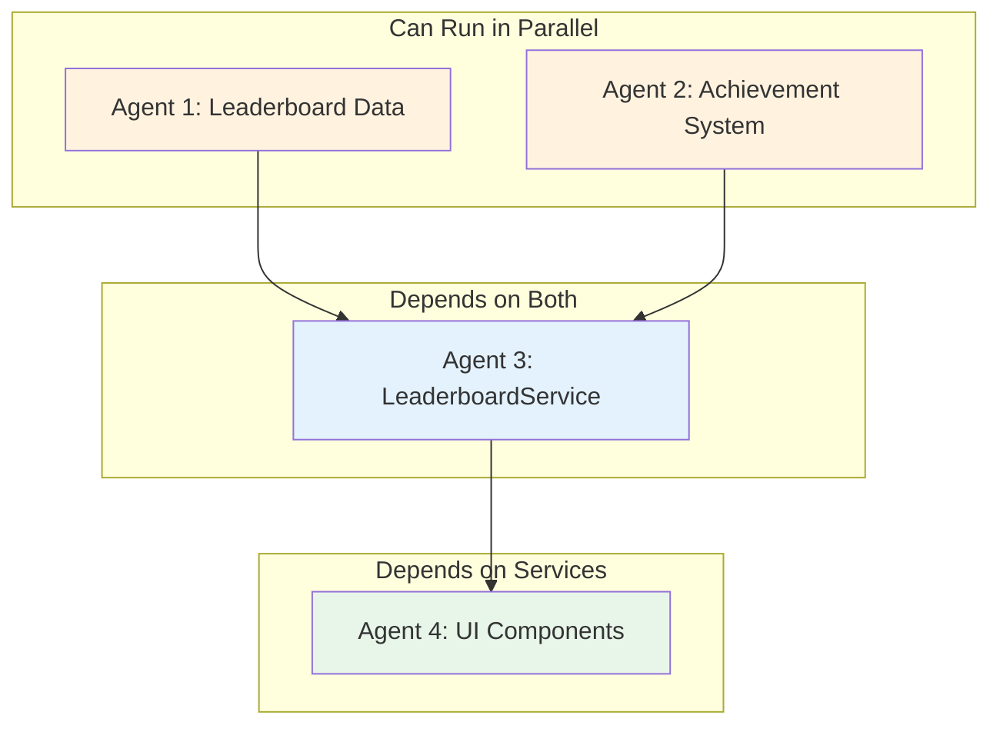
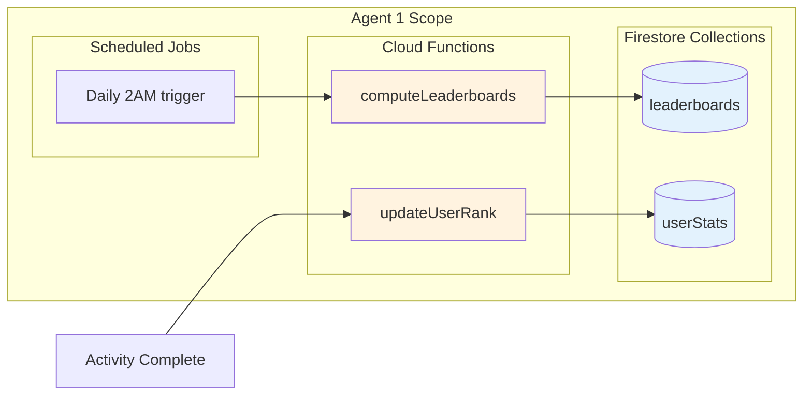
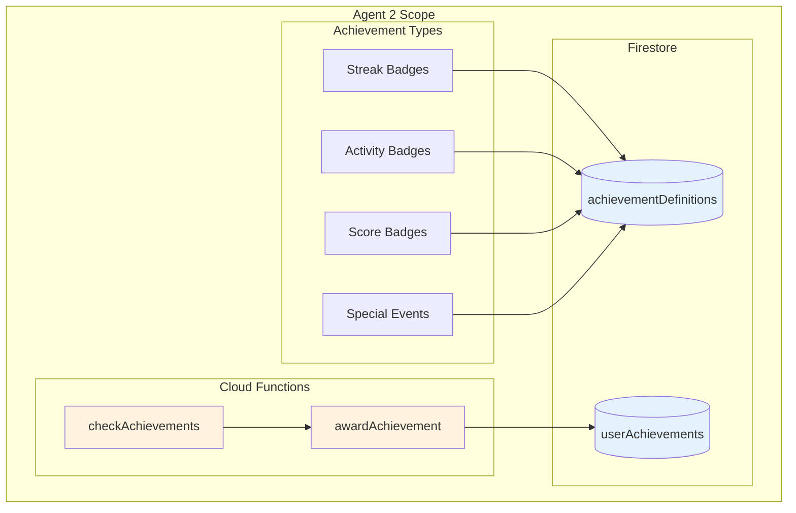
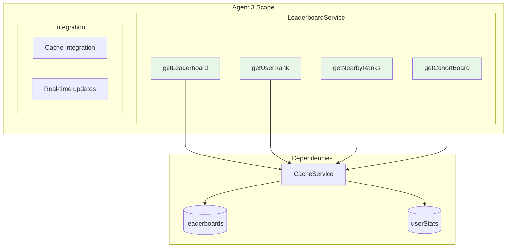

# Phase 2: Leaderboards & Gamification

## Overview

Phase 2 adds competitive elements that drive engagement: leaderboards (global, course, personal), achievements/badges, streak tracking, and a points/levels system. This phase depends on Phase 1's analytics foundation.

## Prerequisites

- [ ] Phase 1 complete (AnalyticsService, CacheService, QueryService available)
- [ ] Student dashboard has Analytics section

## Dependency Diagram



## Execution Order

| Step | Agents | What They Build | Duration |
|------|--------|-----------------|----------|
| 1 | Agent 1 + Agent 2 | Leaderboard Data + Achievement System (parallel) | ~2 hours |
| 2 | Agent 3 | LeaderboardService + Integration | ~2 hours |
| 3 | Agent 4 | UI Components + Dashboard Integration | ~3 hours |

---

## Agent 1: Leaderboard Data Layer

### What You're Building



### Prompt for Agent 1

```
You are building the Leaderboard Data Layer for the SWE Hackers Analytics system.

## Context
Read @swe-hackers/diagrams_and_docs/analytics-community-architecture.md to understand the full system. Focus on the "Leaderboard System" section, particularly the "Leaderboard Data Structure" and "Leaderboard Types" diagrams.

## Your Deliverables

### 1. Firestore Collection: leaderboards
Document schema at `firebase-scripts/collections/leaderboards-schema.md`:

```javascript
// Collection: leaderboards
// Document ID format: {type}-{period}-{identifier}
// Examples: "global-weekly-2026-03", "course-alltime-javascript"

{
  id: "global-weekly-2026-03",
  type: "global",           // global | course | cohort | challenge
  period: "weekly",         // daily | weekly | monthly | alltime
  startDate: Timestamp,
  endDate: Timestamp,
  
  rankings: [
    {
      rank: 1,
      userId: "user123",
      displayName: "CodeNinja",
      avatar: "url",
      score: 2450,
      metrics: {
        activitiesCompleted: 47,
        streakDays: 7,
        avgScore: 0.89
      },
      change: +2  // Position change from last period
    }
  ],
  
  computedAt: Timestamp,
  expiresAt: Timestamp
}
```

### 2. Firestore Collection: userStats
For quick lookups of individual user rankings:

```javascript
// Collection: userStats
// Document ID: {userId}

{
  userId: "user123",
  
  // Pre-computed ranks for fast lookup
  ranks: {
    global: { weekly: 47, monthly: 123, alltime: 567 },
    courses: {
      "javascript": { weekly: 12, alltime: 34 }
    }
  },
  
  // Gamification stats
  totalPoints: 12450,
  level: 7,
  currentStreak: 5,
  longestStreak: 14,
  
  // Activity counts
  activitiesCompleted: 156,
  challengesWon: 3,
  
  lastUpdated: Timestamp
}
```

### 3. Cloud Function: computeLeaderboards
File: `firebase-functions/leaderboards/computeLeaderboards.js`

Scheduled function (runs daily at 2 AM):
1. Query all activityAttempts from the period
2. Aggregate scores by user
3. Sort and assign ranks
4. Compute position changes from previous period
5. Write to leaderboards collection
6. Update userStats with new ranks

Compute these leaderboards:
- global-daily, global-weekly, global-monthly
- course-weekly, course-alltime (for each course)

### 4. Cloud Function: updateUserStats
File: `firebase-functions/leaderboards/updateUserStats.js`

Firestore trigger on activityAttempts:
1. Increment user's activity count
2. Update total points
3. Check/update streak
4. Recalculate level

### 5. Scoring Formula
Document at `firebase-scripts/scoring-formula.md`:
- Base points per activity: 10
- Bonus for correct: +5
- Bonus for first attempt correct: +10
- Streak multiplier: 1 + (streak_days * 0.05), max 2x

## Testing
Create `firebase-scripts/test-leaderboard-computation.js`:
1. Insert mock activity data for 10 users
2. Run computeLeaderboards
3. Verify rankings are correct
4. Verify userStats updated

## When Done
Report completion with:
- Files created
- Scoring formula explanation
- Test output
```

---

## Agent 2: Achievement System

### What You're Building



### Prompt for Agent 2

```
You are building the Achievement System for the SWE Hackers Analytics system.

## Context
Read @swe-hackers/diagrams_and_docs/analytics-community-architecture.md to understand the full system. Focus on the "ACHIEVEMENTS" entity in the data model and the gamification elements.

## Your Deliverables

### 1. Achievement Definitions
File: `firebase-scripts/data/achievement-definitions.json`

Define 20+ achievements across categories:

**Streak Achievements:**
- first-flame: 3-day streak
- week-warrior: 7-day streak
- fortnight-fighter: 14-day streak
- month-master: 30-day streak

**Activity Achievements:**
- first-steps: Complete 1 activity
- getting-started: Complete 10 activities
- half-century: Complete 50 activities
- centurion: Complete 100 activities
- committed: Complete 500 activities

**Score Achievements:**
- perfect-score: 100% on any activity
- perfect-lesson: 100% on all activities in a lesson
- honor-roll: Average score above 90%

**Course Achievements:**
- course-complete-{courseId}: Finish a course
- speed-runner: Complete a course in under 2 weeks

**Social Achievements:**
- helper: Answer marked helpful 5 times
- mentor: Help 10 different students
- team-player: Complete a team challenge

Each achievement:
```javascript
{
  id: "week-warrior",
  title: "Week Warrior",
  description: "Maintain a 7-day learning streak",
  icon: "🔥",
  category: "streak",
  points: 100,
  criteria: {
    type: "streak",
    threshold: 7
  },
  rarity: "common"  // common | uncommon | rare | epic | legendary
}
```

### 2. Firestore Collection: userAchievements
```javascript
// Collection: userAchievements
// Document ID: {odín

{
  odín: "user123",
  
  earned: [
    {
      achievementId: "week-warrior",
      earnedAt: Timestamp,
      notified: true
    }
  ],
  
  // Progress toward unearned achievements
  progress: {
    "centurion": { current: 87, target: 100 },
    "month-master": { current: 12, target: 30 }
  },
  
  totalPoints: 450,
  displayBadges: ["week-warrior", "half-century", "honor-roll"]  // Chosen display
}
```

### 3. Cloud Function: checkAchievements
File: `firebase-functions/achievements/checkAchievements.js`

Called after activity completion:
1. Load user's current stats (streak, activity count, scores)
2. Load achievement definitions
3. Check each unearned achievement's criteria
4. If criteria met, call awardAchievement

### 4. Cloud Function: awardAchievement
File: `firebase-functions/achievements/awardAchievement.js`

When achievement earned:
1. Add to user's earned array
2. Add points to user's total
3. Update progress tracking
4. Return achievement data for UI notification

### 5. Client-side Achievement Checker
File: `courses/shared/js/services/achievement-service.js`

```javascript
const AchievementService = {
  async getDefinitions() {},           // Fetch all definitions (cached)
  async getUserAchievements(userId) {},  // Fetch user's achievements
  async getProgress(userId) {},        // Get progress toward unearned
  async setDisplayBadges(userId, badgeIds) {},  // Choose display badges
  
  // Listen for new achievements (for toast notifications)
  onAchievementEarned(callback) {}
};
```

## Testing
Create `firebase-scripts/test-achievements.js`:
1. Award mock activities to a user
2. Trigger checkAchievements
3. Verify correct achievements unlocked
4. Test edge cases (exactly at threshold)

## When Done
Report completion with:
- Files created
- List of all achievements defined
- Test output
```

---

## Agent 3: LeaderboardService

### What You're Building



### Prompt for Agent 3

```
You are building LeaderboardService for the SWE Hackers Analytics system.

## Context
Read @swe-hackers/diagrams_and_docs/analytics-community-architecture.md to understand the full system. Focus on the "Leaderboard System" section and the service method signatures.

**Dependencies**: 
- Agent 1 built the Firestore collections (leaderboards, userStats)
- Agent 2 built AchievementService
- Phase 1's CacheService and QueryService are available

## Your Deliverables

### 1. LeaderboardService
File: `courses/shared/js/services/leaderboard-service.js`

```javascript
const LeaderboardService = {
  // Leaderboard retrieval
  async getLeaderboard(type, period, options = {}) {
    // type: 'global' | 'course' | 'cohort' | 'challenge'
    // period: 'daily' | 'weekly' | 'monthly' | 'alltime'
    // options: { courseId, limit, offset }
    // Returns: { rankings: [...], computedAt, period }
  },
  
  async getUserRank(userId, type, period) {
    // Returns: { rank, score, change, percentile }
  },
  
  async getNearbyRanks(userId, type, count = 5) {
    // Returns users ranked around the given user
    // Useful for "You're #47, here's #45-49"
  },
  
  // Personal boards
  async getCohortLeaderboard(userId) {
    // Get leaderboard for user's class/cohort
  },
  
  async getFriendsLeaderboard(userId) {
    // Get leaderboard for user's connections
  },
  
  // Gamification stats
  async getUserStats(userId) {
    // Returns full userStats document
  },
  
  async getStreakInfo(userId) {
    // Returns: { current, longest, lastActivity, atRisk }
  },
  
  async getLevelInfo(userId) {
    // Returns: { level, points, pointsToNext, progress }
  }
};
```

### 2. Level System
Define levels in the service:
```javascript
const LEVELS = [
  { level: 1, name: 'Newcomer', minPoints: 0 },
  { level: 2, name: 'Learner', minPoints: 100 },
  { level: 3, name: 'Student', minPoints: 300 },
  { level: 4, name: 'Practitioner', minPoints: 600 },
  { level: 5, name: 'Developer', minPoints: 1000 },
  { level: 6, name: 'Engineer', minPoints: 1500 },
  { level: 7, name: 'Architect', minPoints: 2500 },
  { level: 8, name: 'Expert', minPoints: 4000 },
  { level: 9, name: 'Master', minPoints: 6000 },
  { level: 10, name: 'Legend', minPoints: 10000 }
];
```

### 3. Caching Strategy
- Cache leaderboards for 5 minutes (they update daily)
- Cache userStats for 1 minute (updates on activity)
- Use CacheService.PREFIXES.LEADERBOARD

### 4. Integration with Existing Data
- Import from `courses/shared/js/firebase-config.js`
- Use QueryService for efficient fetching
- Follow existing service patterns

## Testing
Add test methods:
```javascript
LeaderboardService.runTests = async function() {
  const userId = 'current-user-id';
  console.log('🏆 Testing LeaderboardService...');
  console.log('Global weekly:', await this.getLeaderboard('global', 'weekly'));
  console.log('User rank:', await this.getUserRank(userId, 'global', 'weekly'));
  console.log('Nearby:', await this.getNearbyRanks(userId, 'global'));
  console.log('Stats:', await this.getUserStats(userId));
};
```

## When Done
Report completion with:
- Files created
- All methods implemented
- Caching strategy used
```

---

## Agent 4: UI Components

### What You're Building

```mermaid
flowchart TB
    subgraph "Agent 4 Scope"
        subgraph "Components"
            LT[LeaderboardTable]
            RC[RankCard]
            PC[PositionChange]
            SK[StreakDisplay]
            LV[LevelProgress]
            AB[AchievementBadge]
            AT[AchievementToast]
        end
        
        subgraph "Dashboard Updates"
            DU[Add Leaderboard Section]
            DA[Add Achievements Section]
        end
        
        subgraph "CSS"
            CSS[leaderboard.css]
        end
    end
    
    LT & RC & PC & SK & LV & AB & AT --> CSS
    DU --> LT & RC & SK & LV
    DA --> AB & AT
    
    style LT fill:#e8f5e9
    style RC fill:#e8f5e9
    style AB fill:#e8f5e9
```

### Prompt for Agent 4

```
You are building Leaderboard & Gamification UI Components for the SWE Hackers Analytics system.

## Context
Read @swe-hackers/diagrams_and_docs/analytics-community-architecture.md to understand the full system. Focus on the dashboard sections showing leaderboards and achievements.

**Dependencies**:
- Agent 3 built LeaderboardService
- Agent 2 built AchievementService
- Phase 1's dashboard components are available

## Your Deliverables

### 1. Leaderboard Components
Location: `courses/shared/js/components/leaderboard/`

#### LeaderboardTable (`leaderboard-table.js`)
```javascript
class LeaderboardTable {
  constructor(container, options) {
    // options: { type, period, limit, highlightUserId }
  }
  
  async load() {}      // Fetch and render
  render(data) {}      // Render rankings
  highlightUser() {}   // Scroll to and highlight current user
}
```

Features:
- Rank column with medals for top 3 (🥇🥈🥉)
- Avatar + name column
- Score column
- Position change indicator (↑2 green, ↓1 red, — gray)
- Click row to view profile
- Pagination or infinite scroll

#### RankCard (`rank-card.js`)
Compact card showing user's current rank:
```javascript
class RankCard {
  constructor(container, options) {
    // Shows: "#47 of 1,234" with change indicator
  }
}
```

#### PositionChange (`position-change.js`)
Reusable component for showing rank changes:
- Green up arrow for improvements
- Red down arrow for drops
- Gray dash for no change
- Animated on update

### 2. Gamification Components
Location: `courses/shared/js/components/leaderboard/`

#### StreakDisplay (`streak-display.js`)
```javascript
class StreakDisplay {
  constructor(container) {}
  // Shows: 🔥 5 day streak
  // Fire animation when active
  // Warning state when streak at risk
}
```

#### LevelProgress (`level-progress.js`)
```javascript
class LevelProgress {
  constructor(container) {}
  // Shows: Level 7 "Architect"
  // Progress bar to next level
  // Points: 2,500 / 4,000
}
```

#### AchievementBadge (`achievement-badge.js`)
```javascript
class AchievementBadge {
  constructor(container, achievement) {}
  // Circular badge with icon
  // Tooltip with name/description
  // Grayscale if locked, color if earned
}
```

#### AchievementToast (`achievement-toast.js`)
```javascript
class AchievementToast {
  static show(achievement) {}
  // Animated toast notification
  // "🎉 Achievement Unlocked: Week Warrior"
  // Auto-dismiss after 5 seconds
}
```

### 3. CSS Styling
File: `courses/shared/css/leaderboard.css`

- Leaderboard table styling (striped rows, hover states)
- Medal colors (gold, silver, bronze)
- Position change colors (green/red/gray)
- Streak fire animation
- Level progress bar with gradient
- Achievement badge styling (locked vs earned)
- Toast animation (slide in from top)

### 4. Dashboard Integration
Update `courses/dashboard/index.html`:

Add new sections:
```html
<!-- Leaderboard Section -->
<section class="dashboard-section leaderboard-section">
  <h2>🏆 Leaderboard</h2>
  <div class="leaderboard-tabs">
    <button data-period="weekly" class="active">This Week</button>
    <button data-period="monthly">This Month</button>
    <button data-period="alltime">All Time</button>
  </div>
  <div id="rank-card-container"></div>
  <div id="leaderboard-table-container"></div>
</section>

<!-- Gamification Section -->
<section class="dashboard-section gamification-section">
  <h2>🎮 Your Progress</h2>
  <div class="gamification-row">
    <div id="streak-container"></div>
    <div id="level-container"></div>
  </div>
  <h3>Achievements</h3>
  <div id="achievements-container"></div>
</section>
```

Wire up the components to LeaderboardService and AchievementService.

### 5. Achievement Notification Integration
Listen for new achievements and show toast:
```javascript
AchievementService.onAchievementEarned((achievement) => {
  AchievementToast.show(achievement);
});
```

## Mock Data
Until services are ready:
```javascript
const mockLeaderboard = {
  rankings: [
    { rank: 1, displayName: 'CodeMaster', score: 3200, change: 0 },
    { rank: 2, displayName: 'ByteNinja', score: 2890, change: +1 },
    // ...
  ]
};

const mockUserStats = {
  rank: 47,
  change: +3,
  streak: 5,
  level: 7,
  levelName: 'Architect',
  points: 2500,
  pointsToNext: 1500
};
```

## When Done
Report completion with:
- Files created
- Screenshot/description of new dashboard sections
- Any animations added
```

---

## Verification Checklist

After all agents complete, verify:

- [ ] `firebase-functions/leaderboards/computeLeaderboards.js` exists
- [ ] `firebase-functions/leaderboards/updateUserStats.js` exists
- [ ] `firebase-functions/achievements/checkAchievements.js` exists
- [ ] `firebase-functions/achievements/awardAchievement.js` exists
- [ ] `firebase-scripts/data/achievement-definitions.json` has 20+ achievements
- [ ] `courses/shared/js/services/leaderboard-service.js` exists with all methods
- [ ] `courses/shared/js/services/achievement-service.js` exists with all methods
- [ ] `courses/shared/js/components/leaderboard/` has 7 component files
- [ ] `courses/shared/css/leaderboard.css` exists
- [ ] Dashboard has Leaderboard and Gamification sections
- [ ] Achievement toast shows on unlock

## Next Phase

Once verified, proceed to **Phase 4: Challenges Dashboard** (depends on this phase's gamification system).

Note: Phase 3 and Phase 5 can run in parallel with Phase 2 if desired.
