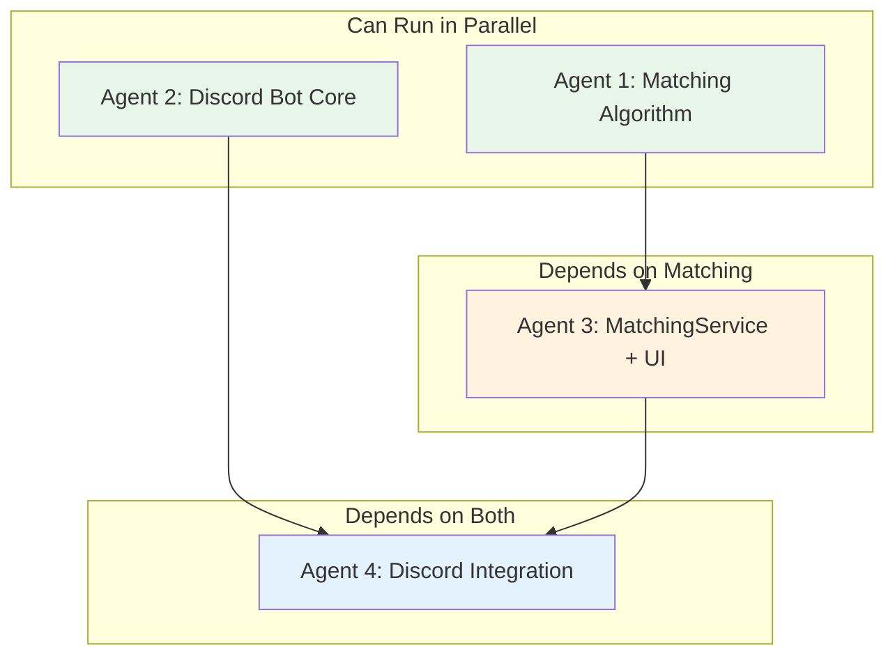
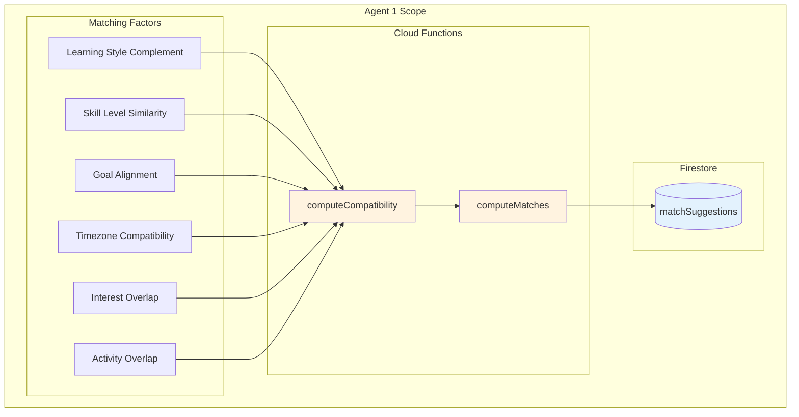
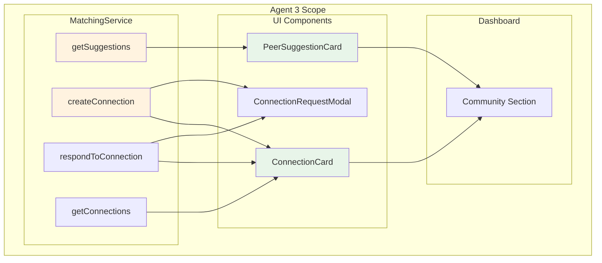

# Phase 3: Community & Peer Matching

## Overview

Phase 3 transforms SWE Hackers from a solo learning platform into a connected community. We build the peer matching algorithm, connection management, and Discord integration that helps students find study buddies, mentors, and accountability partners.

## Prerequisites

- [ ] Phase 1 complete (AnalyticsService, UserAnalytics available)
- [ ] Discord bot token configured

## Dependency Diagram



## Execution Order

| Step | Agents | What They Build | Duration |
|------|--------|-----------------|----------|
| 1 | Agent 1 + Agent 2 | Matching Algorithm + Discord Bot (parallel) | ~2 hours |
| 2 | Agent 3 | MatchingService + Connection UI | ~2 hours |
| 3 | Agent 4 | Discord Commands + Automated Posts | ~2 hours |

---

## Agent 1: Peer Matching Algorithm

### What You're Building



### Prompt for Agent 1

```
You are building the Peer Matching Algorithm for the SWE Hackers Analytics system.

## Context
Read @swe-hackers/diagrams_and_docs/analytics-community-architecture.md to understand the full system. Focus on the "Peer Matching Algorithm" section, particularly the matching criteria and connection types.

## Your Deliverables

### 1. Compatibility Scoring Algorithm
File: `firebase-functions/matching/computeCompatibility.js`

Implement the weighted scoring:
```javascript
// Weights (must sum to 1.0)
const WEIGHTS = {
  learningStyleComplement: 0.30,  // Different styles learn from each other
  skillLevelSimilarity: 0.25,     // Close enough to collaborate
  goalAlignment: 0.20,            // Working toward same objectives
  timezoneCompatibility: 0.10,   // Can actually meet
  interestOverlap: 0.10,          // Have things in common
  activityOverlap: 0.05           // Working on same content
};

async function computeCompatibility(user1Id, user2Id) {
  // Load both users' analytics
  // Score each factor 0-1
  // Return weighted sum and breakdown
  return {
    score: 0.82,
    breakdown: {
      learningStyleComplement: 0.9,
      skillLevelSimilarity: 0.75,
      // ...
    },
    matchType: 'STUDY_BUDDY'  // or MENTOR, MENTEE, etc.
  };
}
```

### 2. Factor Scoring Functions
Implement each factor:

**Learning Style Complement:**
- If both visual: 0.5 (same style, less to learn from each other)
- If visual + kinesthetic: 0.9 (complementary)
- If unknown: 0.5 (neutral)

**Skill Level Similarity:**
- Same level (±10%): 1.0
- Close (±20%): 0.7
- Different (>30%): 0.3

**Goal Alignment:**
- Same active course: 1.0
- Same track (e.g., both frontend): 0.7
- Different tracks: 0.3

**Timezone Compatibility:**
- Same timezone: 1.0
- ±3 hours: 0.7
- ±6 hours: 0.4
- >6 hours: 0.2

**Interest Overlap:**
- Compare tags/interests in profiles
- Jaccard similarity

**Activity Overlap:**
- Both active in last 7 days: 1.0
- One inactive: 0.5
- Both inactive: 0.2

### 3. Match Type Classification
Based on scores, classify the match:
```javascript
function classifyMatch(user1, user2, compatibility) {
  const levelDiff = user1.level - user2.level;
  
  if (Math.abs(levelDiff) <= 1) return 'STUDY_BUDDY';
  if (levelDiff > 2) return 'MENTEE';  // user1 can mentor user2
  if (levelDiff < -2) return 'MENTOR';  // user2 can mentor user1
  
  // Check engagement patterns for accountability
  if (similarEngagement(user1, user2)) return 'ACCOUNTABILITY';
  
  return 'CHALLENGE_PARTNER';
}
```

### 4. Batch Match Computation
File: `firebase-functions/matching/computeMatches.js`

Scheduled weekly function:
1. Get all active users (activity in last 14 days)
2. For each user, compute compatibility with all others
3. Keep top 10 matches per user
4. Store in matchSuggestions collection

Optimization:
- Skip pairs with score < 0.5
- Use batch writes
- Process in chunks of 100 users

### 5. Firestore Collection: matchSuggestions
```javascript
// Document: {userId}
{
  userId: "user123",
  suggestions: [
    {
      targetUserId: "user456",
      displayName: "CodeNinja",
      avatar: "url",
      score: 0.85,
      matchType: "STUDY_BUDDY",
      reason: "You both excel at loops but need recursion help",
      computedAt: Timestamp
    }
  ],
  lastComputed: Timestamp
}
```

### 6. Firestore Collection: connections
```javascript
// Document: auto-generated ID
{
  participants: ["user123", "user456"],
  initiatorId: "user123",
  matchType: "STUDY_BUDDY",
  status: "pending",  // pending | accepted | declined
  score: 0.85,
  reason: "You both excel at loops...",
  createdAt: Timestamp,
  respondedAt: Timestamp | null
}
```

## Testing
Create `firebase-scripts/test-matching.js`:
1. Create 5 mock users with different profiles
2. Run computeCompatibility for each pair
3. Verify scores are reasonable
4. Run computeMatches
5. Verify suggestions generated

## When Done
Report completion with:
- Files created
- Scoring algorithm explanation
- Sample compatibility scores from test
```

---

## Agent 2: Discord Bot Core

### What You're Building

```mermaid
flowchart TB
    subgraph "Agent 2 Scope"
        subgraph "Bot Setup"
            BS1[Bot initialization]
            BS2[Command registration]
            BS3[Event handlers]
        end
        
        subgraph "Core Commands"
            CMD1[/stats]
            CMD2[/leaderboard]
            CMD3[/achievements]
        end
        
        subgraph "Utilities"
            UT1[User lookup]
            UT2[Embed builders]
            UT3[Error handling]
        end
    end
    
    BS1 --> BS2 --> BS3
    BS3 --> CMD1 & CMD2 & CMD3
    CMD1 & CMD2 & CMD3 --> UT1 & UT2 & UT3
    
    style CMD1 fill:#e8f5e9
    style CMD2 fill:#e8f5e9
    style CMD3 fill:#e8f5e9
```

### Prompt for Agent 2

```
You are building the Discord Bot Core for the SWE Hackers Analytics system.

## Context
Read @swe-hackers/diagrams_and_docs/analytics-community-architecture.md to understand the full system. Focus on the "Discord Integration" section, particularly the bot commands and channel structure.

**Note**: The existing Discord CLI tools are at `~/bin/discord-send`. This bot is a separate, always-on bot with slash commands.

## Your Deliverables

### 1. Bot Setup
Location: `discord-bot/`

#### Package Configuration (`package.json`)
```json
{
  "name": "swe-hackers-bot",
  "version": "1.0.0",
  "main": "index.js",
  "type": "module",
  "dependencies": {
    "discord.js": "^14.14.1",
    "firebase-admin": "^12.0.0"
  }
}
```

#### Main Entry (`index.js`)
```javascript
import { Client, GatewayIntentBits, Collection } from 'discord.js';
import { initializeApp } from 'firebase-admin/app';
import { getFirestore } from 'firebase-admin/firestore';

// Initialize Firebase Admin
initializeApp();
const db = getFirestore();

// Create Discord client
const client = new Client({
  intents: [
    GatewayIntentBits.Guilds,
    GatewayIntentBits.GuildMessages
  ]
});

// Load commands
client.commands = new Collection();
// ... load command files

// Ready event
client.on('ready', () => {
  console.log(`🤖 Bot ready as ${client.user.tag}`);
});

// Interaction handler
client.on('interactionCreate', async (interaction) => {
  if (!interaction.isChatInputCommand()) return;
  // ... handle commands
});

client.login(process.env.DISCORD_BOT_TOKEN);
```

### 2. Command: /stats
File: `discord-bot/commands/stats.js`

```javascript
export default {
  data: {
    name: 'stats',
    description: 'View your learning statistics'
  },
  
  async execute(interaction) {
    // 1. Look up user by Discord ID
    // 2. Fetch their analytics from Firestore
    // 3. Build embed with stats
    // 4. Reply with embed
  }
};
```

Embed should show:
- Overall score
- Current streak
- Level and progress
- Top 3 skills
- Recent achievements

### 3. Command: /leaderboard
File: `discord-bot/commands/leaderboard.js`

Options:
- `period`: weekly (default), monthly, alltime
- `type`: global (default), course

Embed should show:
- Top 10 with medals for top 3
- User's rank if not in top 10
- Period indicator

### 4. Command: /achievements
File: `discord-bot/commands/achievements.js`

Options:
- `user`: Optional, view someone else's achievements

Embed should show:
- Earned achievements (icons + names)
- Total achievement points
- Rarest achievement earned

### 5. User Lookup Service
File: `discord-bot/services/user-lookup.js`

```javascript
export async function findUserByDiscordId(discordId) {
  // Query users collection where discordId == discordId
  // Return user document or null
}

export async function linkDiscordAccount(discordId, siteUserId) {
  // Update user document to add discordId
}
```

### 6. Embed Builders
File: `discord-bot/utils/embeds.js`

```javascript
export function buildStatsEmbed(user, analytics) {
  return {
    color: 0x6366f1,  // SWE Hackers purple
    title: `📊 Stats for ${user.displayName}`,
    thumbnail: { url: user.avatar },
    fields: [
      { name: '🔥 Streak', value: `${analytics.streak} days`, inline: true },
      // ...
    ],
    footer: { text: 'SWE Hackers' }
  };
}

export function buildLeaderboardEmbed(leaderboard, period) {
  // ...
}

export function buildAchievementsEmbed(user, achievements) {
  // ...
}
```

### 7. Deploy Commands Script
File: `discord-bot/deploy-commands.js`

```javascript
import { REST, Routes } from 'discord.js';

const commands = [
  // ... command data
];

const rest = new REST().setToken(process.env.DISCORD_BOT_TOKEN);

await rest.put(
  Routes.applicationCommands(process.env.DISCORD_CLIENT_ID),
  { body: commands }
);
```

## Environment Setup
Document required env vars in `discord-bot/.env.example`:
```
DISCORD_BOT_TOKEN=
DISCORD_CLIENT_ID=
GOOGLE_APPLICATION_CREDENTIALS=path/to/serviceAccount.json
```

## Testing
1. Run bot locally: `node index.js`
2. Test /stats command
3. Test /leaderboard command
4. Test /achievements command
5. Verify Firebase queries work

## When Done
Report completion with:
- Files created
- Commands registered
- Sample embed screenshots
```

---

## Agent 3: MatchingService & Connection UI

### What You're Building



### Prompt for Agent 3

```
You are building MatchingService and Connection UI for the SWE Hackers Analytics system.

## Context
Read @swe-hackers/diagrams_and_docs/analytics-community-architecture.md to understand the full system. Focus on the "Peer Matching Algorithm" section for service methods and the "Student Dashboard" section for UI placement.

**Dependencies**:
- Agent 1 built the matching algorithm and Firestore collections
- Phase 1's services and components are available

## Your Deliverables

### 1. MatchingService
File: `courses/shared/js/services/matching-service.js`

```javascript
const MatchingService = {
  // Get peer suggestions for current user
  async getSuggestions(userId, limit = 5) {
    // Fetch from matchSuggestions/{userId}
    // Return array of suggestions with user details
  },
  
  // Create a connection request
  async createConnection(userId, targetId, matchType, reason) {
    // Create document in connections collection
    // Status: 'pending'
    // Notify target user (via NotificationService)
  },
  
  // Respond to a connection request
  async respondToConnection(connectionId, accept) {
    // Update status to 'accepted' or 'declined'
    // If accepted, notify initiator
  },
  
  // Get user's connections
  async getConnections(userId, status = 'accepted') {
    // Query connections where participant includes userId
    // Filter by status
    // Return with user details populated
  },
  
  // Get pending requests (both sent and received)
  async getPendingRequests(userId) {
    // Sent: where initiatorId == userId, status == pending
    // Received: where participants includes userId, initiatorId != userId, status == pending
  },
  
  // Remove a connection
  async removeConnection(connectionId) {
    // Delete the connection document
  }
};
```

### 2. NotificationService (basic version)
File: `courses/shared/js/services/notification-service.js`

```javascript
const NotificationService = {
  // In-app notifications (stored in Firestore)
  async createNotification(userId, type, data) {
    // type: 'connection_request', 'connection_accepted', 'achievement', etc.
    // Store in notifications/{userId}/items
  },
  
  async getNotifications(userId, unreadOnly = false) {
    // Fetch user's notifications
  },
  
  async markRead(userId, notificationId) {
    // Update notification as read
  },
  
  // Get unread count
  async getUnreadCount(userId) {}
};
```

### 3. UI Components
Location: `courses/shared/js/components/community/`

#### PeerSuggestionCard (`peer-suggestion.js`)
```javascript
class PeerSuggestionCard {
  constructor(container, suggestion) {
    // suggestion: { targetUserId, displayName, avatar, score, matchType, reason }
  }
  
  render() {
    // Avatar
    // Name
    // Match type badge (Study Buddy, Mentor, etc.)
    // Match reason
    // Compatibility score (as percentage or stars)
    // Connect button
  }
  
  onConnect() {
    // Show ConnectionRequestModal
  }
}
```

#### ConnectionCard (`connection-card.js`)
```javascript
class ConnectionCard {
  constructor(container, connection) {
    // For accepted connections
  }
  
  render() {
    // Avatar
    // Name
    // Match type
    // Connected since
    // Message button (link to Discord DM or in-app chat)
    // Remove button
  }
}
```

#### ConnectionRequestModal (`connection-request-modal.js`)
```javascript
class ConnectionRequestModal {
  static show(suggestion) {
    // Modal with:
    // - Target user info
    // - Why you're a match
    // - Optional message field
    // - Send Request / Cancel buttons
  }
  
  static showIncoming(request) {
    // Modal for responding to request
    // - Requester info
    // - Match reason
    // - Accept / Decline buttons
  }
}
```

### 4. CSS Styling
File: `courses/shared/css/community.css`

- Card styling consistent with other dashboard cards
- Match type badges (color-coded)
- Compatibility score visualization
- Modal styling
- Connection status indicators

### 5. Dashboard Integration
Update `courses/dashboard/index.html`:

```html
<!-- Community Section -->
<section class="dashboard-section community-section">
  <h2>🤝 Community</h2>
  
  <!-- Pending Requests Alert -->
  <div id="pending-requests-alert" class="hidden">
    <span>You have <span id="pending-count">0</span> pending connection requests</span>
    <button onclick="showPendingRequests()">View</button>
  </div>
  
  <!-- Suggested Peers -->
  <h3>Suggested Study Partners</h3>
  <div id="peer-suggestions-container" class="card-grid"></div>
  
  <!-- Your Connections -->
  <h3>Your Connections</h3>
  <div id="connections-container" class="card-grid"></div>
</section>
```

Wire up to MatchingService on page load.

## Testing
- Create mock suggestion data
- Test connection request flow
- Test accept/decline flow
- Verify notifications created

## When Done
Report completion with:
- Files created
- UI component descriptions
- Connection flow walkthrough
```

---

## Agent 4: Discord Integration

### What You're Building

```mermaid
flowchart TB
    subgraph "Agent 4 Scope"
        subgraph "Commands"
            CMD1[/connect]
            CMD2[/challenge]
        end
        
        subgraph "Automations"
            AU1[Daily Leaderboard Post]
            AU2[Achievement Celebrations]
            AU3[Streak Reminders]
        end
        
        subgraph "Notifications"
            NT1[Connection Request DM]
            NT2[Match Suggestion DM]
        end
    end
    
    CMD1 --> NT1 & NT2
    CMD2 --> AU1
    
    style CMD1 fill:#e8f5e9
    style AU1 fill:#fff3e0
    style AU2 fill:#fff3e0
    style NT1 fill:#e3f2fd
```

### Prompt for Agent 4

```
You are building Discord Integration features for the SWE Hackers Analytics system.

## Context
Read @swe-hackers/diagrams_and_docs/analytics-community-architecture.md to understand the full system. Focus on the "Discord Integration" section, particularly automated posts and notifications.

**Dependencies**:
- Agent 2 built the Discord bot core
- Agent 3 built MatchingService
- Agent 1 built the matching algorithm

## Your Deliverables

### 1. Command: /connect
File: `discord-bot/commands/connect.js`

```javascript
export default {
  data: {
    name: 'connect',
    description: 'Find study partners matched to your learning style',
    options: [
      {
        name: 'type',
        description: 'Type of connection',
        type: 3, // STRING
        choices: [
          { name: 'Study Buddy', value: 'STUDY_BUDDY' },
          { name: 'Mentor', value: 'MENTOR' },
          { name: 'Accountability Partner', value: 'ACCOUNTABILITY' }
        ]
      }
    ]
  },
  
  async execute(interaction) {
    // 1. Look up user
    // 2. Fetch their match suggestions (filtered by type if specified)
    // 3. Build embed with top 3 suggestions
    // 4. Add buttons: "Connect with [Name]" for each
  }
};
```

Button handler:
- When clicked, create connection request
- DM the target user about the request
- Confirm to the requester

### 2. Command: /challenge
File: `discord-bot/commands/challenge.js`

```javascript
export default {
  data: {
    name: 'challenge',
    description: 'View or join the daily challenge'
  },
  
  async execute(interaction) {
    // 1. Fetch today's challenge from Firestore
    // 2. Build embed with challenge details
    // 3. Show participation count
    // 4. Add "Start Challenge" button (links to web)
  }
};
```

### 3. Automated Posts
File: `discord-bot/automations/scheduledPosts.js`

#### Daily Leaderboard (8 PM)
```javascript
async function postDailyLeaderboard(client) {
  const channel = client.channels.cache.get(LEADERBOARD_CHANNEL_ID);
  const leaderboard = await fetchLeaderboard('global', 'daily');
  
  const embed = {
    title: '🏆 Daily Leaderboard',
    description: formatLeaderboard(leaderboard.rankings.slice(0, 10)),
    footer: { text: `Updated ${new Date().toLocaleDateString()}` }
  };
  
  await channel.send({ embeds: [embed] });
}
```

#### Achievement Celebrations
```javascript
async function celebrateAchievement(client, userId, achievement) {
  const channel = client.channels.cache.get(ACHIEVEMENT_CHANNEL_ID);
  const user = await fetchUser(userId);
  
  const embed = {
    title: '🎉 Achievement Unlocked!',
    description: `**${user.displayName}** earned **${achievement.title}**!`,
    thumbnail: { url: achievement.icon },
    color: getRarityColor(achievement.rarity)
  };
  
  await channel.send({ embeds: [embed] });
}
```

#### Streak Reminders (6 PM)
```javascript
async function sendStreakReminders(client) {
  // Find users who haven't done activity today but have active streaks
  const atRiskUsers = await findAtRiskStreaks();
  
  for (const user of atRiskUsers) {
    if (user.discordId) {
      const dmChannel = await client.users.fetch(user.discordId);
      await dmChannel.send(
        `🔥 Hey! Your ${user.streak}-day streak is at risk! ` +
        `Complete one activity before midnight to keep it alive: https://swehackers.com/dashboard`
      );
    }
  }
}
```

### 4. Notification DMs
File: `discord-bot/notifications/index.js`

```javascript
export async function notifyConnectionRequest(client, targetUser, requester) {
  if (!targetUser.discordId) return;
  
  const dmChannel = await client.users.fetch(targetUser.discordId);
  
  const embed = {
    title: '🤝 New Connection Request',
    description: `**${requester.displayName}** wants to connect as your **${requester.matchType}**!`,
    fields: [
      { name: 'Why you match', value: requester.reason }
    ]
  };
  
  const row = {
    type: 1,
    components: [
      { type: 2, label: 'Accept', style: 3, customId: `accept_${requester.connectionId}` },
      { type: 2, label: 'Decline', style: 4, customId: `decline_${requester.connectionId}` }
    ]
  };
  
  await dmChannel.send({ embeds: [embed], components: [row] });
}

export async function notifyNewMatch(client, user, suggestion) {
  // DM user about a great new match
}

export async function notifyConnectionAccepted(client, requester, accepter) {
  // DM the requester that their request was accepted
}
```

### 5. Scheduler Setup
File: `discord-bot/scheduler.js`

```javascript
import cron from 'node-cron';

export function setupScheduler(client) {
  // Daily leaderboard at 8 PM
  cron.schedule('0 20 * * *', () => postDailyLeaderboard(client));
  
  // Streak reminders at 6 PM
  cron.schedule('0 18 * * *', () => sendStreakReminders(client));
  
  // Weekly match suggestions on Sunday at 10 AM
  cron.schedule('0 10 * * 0', () => sendWeeklyMatchSuggestions(client));
}
```

### 6. Button Interaction Handlers
Update `discord-bot/index.js` to handle button clicks:

```javascript
client.on('interactionCreate', async (interaction) => {
  if (interaction.isButton()) {
    const [action, id] = interaction.customId.split('_');
    
    if (action === 'accept') {
      await handleConnectionAccept(interaction, id);
    } else if (action === 'decline') {
      await handleConnectionDecline(interaction, id);
    }
  }
});
```

### 7. Channel ID Configuration
File: `discord-bot/config.js`

```javascript
export const CHANNELS = {
  LEADERBOARD: process.env.DISCORD_LEADERBOARD_CHANNEL,
  ACHIEVEMENTS: process.env.DISCORD_ACHIEVEMENT_CHANNEL,
  CHALLENGES: process.env.DISCORD_CHALLENGE_CHANNEL
};
```

## Testing
1. Test /connect command and button flow
2. Test /challenge command
3. Manually trigger automations
4. Test DM notifications
5. Verify button handlers work

## When Done
Report completion with:
- Files created
- Commands and automations listed
- Sample embed screenshots
```

---

## Verification Checklist

After all agents complete, verify:

- [ ] `firebase-functions/matching/computeCompatibility.js` exists
- [ ] `firebase-functions/matching/computeMatches.js` exists
- [ ] `courses/shared/js/services/matching-service.js` exists with all methods
- [ ] `courses/shared/js/services/notification-service.js` exists
- [ ] `courses/shared/js/components/community/` has 3 component files
- [ ] `courses/shared/css/community.css` exists
- [ ] Dashboard has Community section with suggestions and connections
- [ ] `discord-bot/` folder has complete bot implementation
- [ ] Discord commands registered: /stats, /leaderboard, /achievements, /connect, /challenge
- [ ] Automated posts scheduled
- [ ] DM notifications working

## Next Phase

Phase 3 can run in parallel with Phase 2 and Phase 5.

After Phase 2 completes, proceed to **Phase 4: Challenges Dashboard**.
