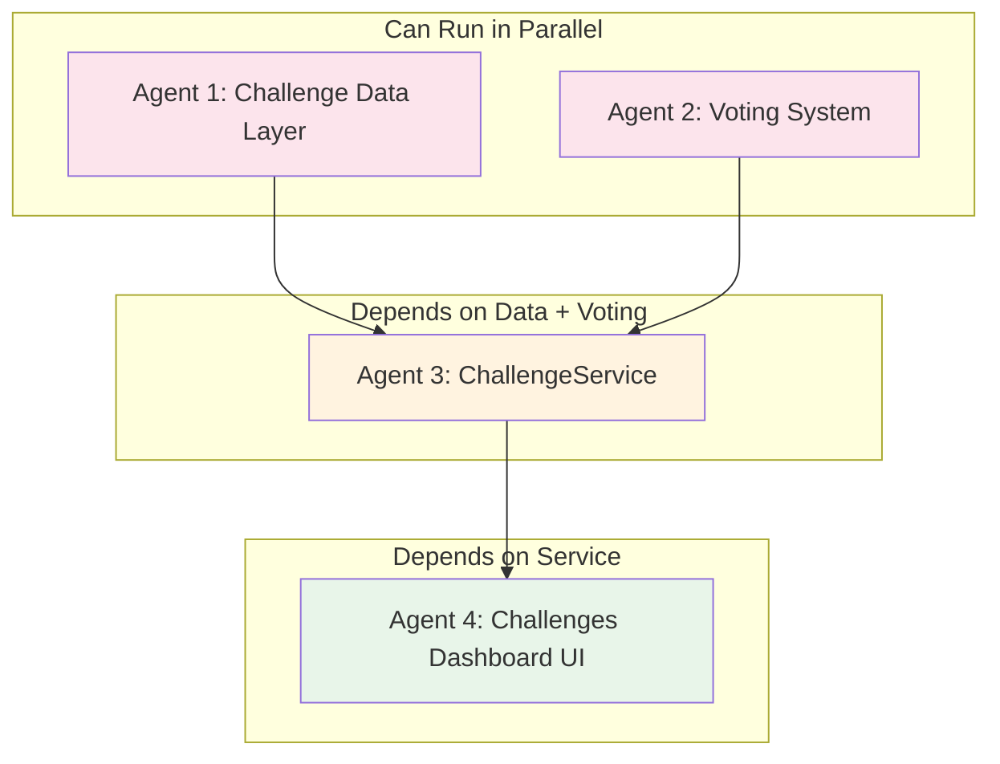
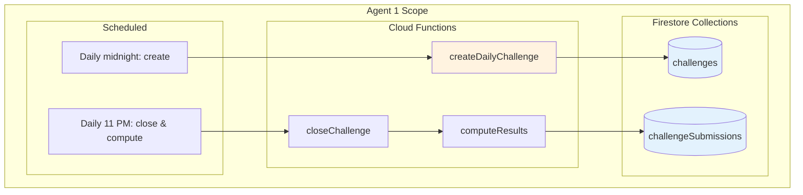
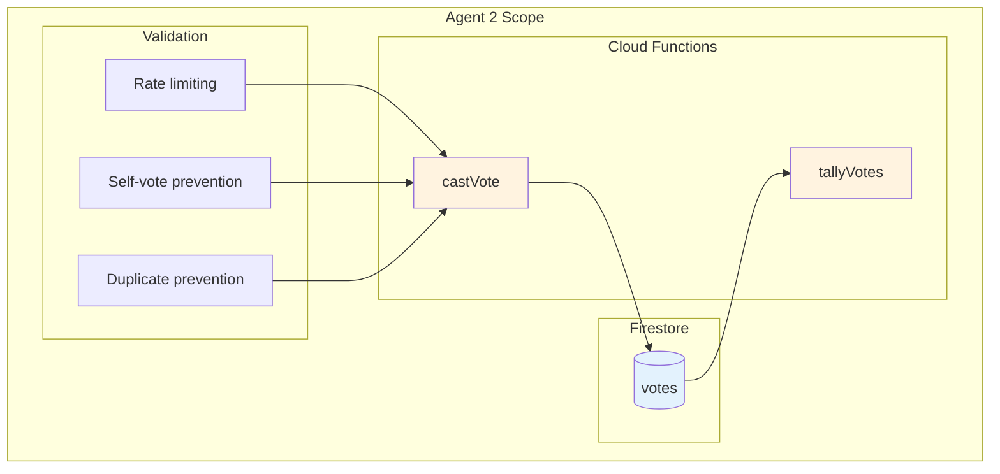
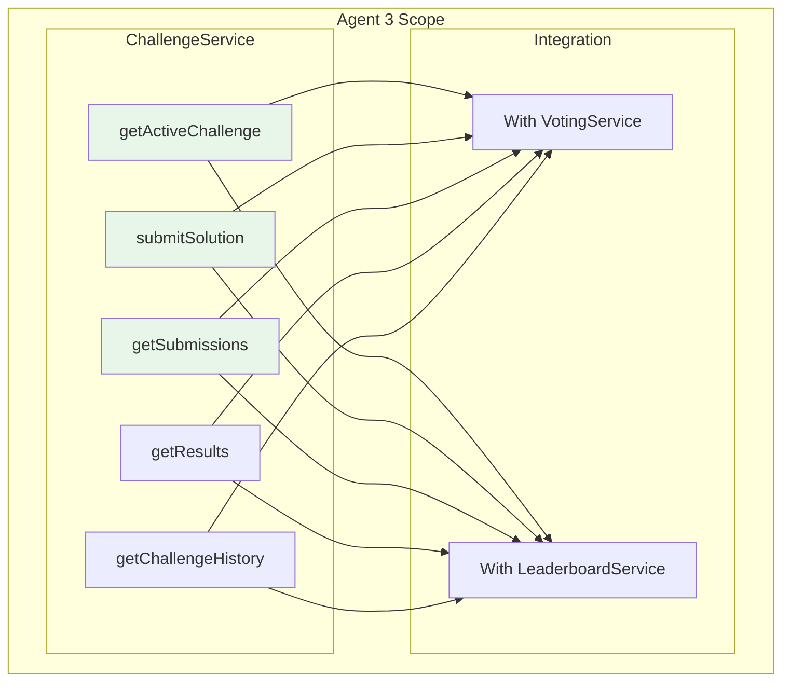

# Phase 4: Challenges Dashboard

## Overview

Phase 4 builds the daily engagement engine: a challenges system with daily/weekly puzzles, community voting, leaderboards, and rewards. This creates a daily habit loop that keeps students coming back.

## Prerequisites

- [ ] Phase 1 complete (AnalyticsService, core services)
- [ ] Phase 2 complete (Points/levels system, LeaderboardService)
- [ ] Discord bot running (from Phase 3)

## Dependency Diagram



## Execution Order

| Step | Agents | What They Build | Duration |
|------|--------|-----------------|----------|
| 1 | Agent 1 + Agent 2 | Challenge Data + Voting (parallel) | ~2 hours |
| 2 | Agent 3 | ChallengeService | ~2 hours |
| 3 | Agent 4 | Challenges Dashboard | ~3 hours |

---

## Agent 1: Challenge Data Layer

### What You're Building



### Prompt for Agent 1

```
You are building the Challenge Data Layer for the SWE Hackers Analytics system.

## Context
Read @swe-hackers/diagrams_and_docs/analytics-community-architecture.md to understand the full system. Focus on the "Challenges Dashboard" section and the "Challenge System Architecture" diagram.

## Your Deliverables

### 1. Firestore Collection: challenges
Document schema at `firebase-scripts/collections/challenges-schema.md`:

```javascript
// Collection: challenges
// Document ID: {type}-{date} e.g., "daily-2026-01-20"

{
  id: "daily-2026-01-20",
  type: "daily",           // daily | weekly | community | team
  status: "active",        // draft | active | voting | closed
  
  // Challenge content
  title: "Fibonacci in 3 Lines",
  description: "Write a recursive Fibonacci function using only 3 lines of code.",
  difficulty: "medium",    // easy | medium | hard | expert
  category: "recursion",
  
  // Timing
  startsAt: Timestamp,
  submissionsCloseAt: Timestamp,
  votingEndsAt: Timestamp,
  
  // Constraints (optional)
  constraints: {
    maxLines: 3,
    language: "javascript",
    timeLimit: 900  // seconds
  },
  
  // Test cases (for auto-grading)
  testCases: [
    { input: [0], expected: 0 },
    { input: [1], expected: 1 },
    { input: [10], expected: 55 }
  ],
  
  // Results (populated after close)
  results: {
    totalSubmissions: 0,
    uniqueParticipants: 0,
    winnerId: null,
    topSubmissions: []
  },
  
  // Points awarded
  points: {
    participation: 10,
    completion: 20,
    top10: 50,
    winner: 100
  },
  
  createdAt: Timestamp,
  createdBy: "system"  // or admin userId
}
```

### 2. Firestore Collection: challengeSubmissions
```javascript
// Collection: challengeSubmissions
// Document ID: auto-generated

{
  challengeId: "daily-2026-01-20",
  odín: "user123",
  
  // Submission content
  code: "const fib = n => n <= 1 ? n : fib(n-1) + fib(n-2);",
  explanation: "Uses ternary operator for base case...",
  language: "javascript",
  
  // Auto-grading results
  testResults: {
    passed: 5,
    total: 5,
    allPassed: true
  },
  
  // Timing
  submittedAt: Timestamp,
  timeSpentSeconds: 342,
  
  // Voting (populated during voting period)
  votes: {
    upvotes: 12,
    downvotes: 2,
    score: 10  // upvotes - downvotes
  },
  
  // Final status
  rank: null,  // Populated after results
  featured: false,
  pointsAwarded: 0
}
```

### 3. Challenge Templates
File: `firebase-scripts/data/challenge-templates.json`

Create 30+ challenge templates across categories:

**Recursion:**
- Fibonacci variants
- Tree traversal
- Factorial with constraints

**Arrays:**
- Find duplicates
- Rotate array
- Merge sorted arrays

**Strings:**
- Palindrome checker
- Anagram detection
- String compression

**Logic:**
- FizzBuzz variants
- Prime number challenges
- Pattern generation

Each template:
```javascript
{
  id: "fib-3-lines",
  title: "Fibonacci in 3 Lines",
  description: "...",
  difficulty: "medium",
  category: "recursion",
  constraints: { maxLines: 3, language: "javascript" },
  testCases: [...],
  points: { participation: 10, completion: 20, top10: 50, winner: 100 }
}
```

### 4. Cloud Function: createDailyChallenge
File: `firebase-functions/challenges/createDailyChallenge.js`

Scheduled daily at midnight:
1. Select a random template (weighted by recency - don't repeat recent)
2. Create challenge document with today's date
3. Set status to "active"
4. Post to Discord via webhook

### 5. Cloud Function: closeChallenge
File: `firebase-functions/challenges/closeChallenge.js`

Scheduled daily at 11 PM:
1. Set challenge status to "voting"
2. Submissions can no longer be accepted
3. Start voting period (or skip if auto-graded only)

### 6. Cloud Function: computeResults
File: `firebase-functions/challenges/computeResults.js`

Scheduled daily at midnight (after new challenge):
1. For yesterday's challenge, tally votes
2. Rank submissions by: (test_score * 0.6) + (vote_score * 0.4)
3. Identify winner and top 10
4. Award points to participants
5. Update challenge document with results
6. Post results to Discord

### 7. Simple Code Runner (for test cases)
File: `firebase-functions/challenges/codeRunner.js`

```javascript
async function runTests(code, testCases, language) {
  // Use a sandboxed environment or external service
  // For MVP: just validate syntax and structure
  // For production: use AWS Lambda or similar
  
  return {
    passed: 5,
    total: 5,
    allPassed: true,
    details: [...]
  };
}
```

## Testing
Create `firebase-scripts/test-challenges.js`:
1. Manually create a challenge
2. Create mock submissions
3. Run computeResults
4. Verify rankings correct

## When Done
Report completion with:
- Files created
- Number of challenge templates
- Scheduled functions list
```

---

## Agent 2: Voting System

### What You're Building



### Prompt for Agent 2

```
You are building the Voting System for the SWE Hackers Challenges.

## Context
Read @swe-hackers/diagrams_and_docs/analytics-community-architecture.md to understand the full system. Focus on the Challenge System and how voting contributes to rankings.

## Your Deliverables

### 1. Firestore Collection: votes
```javascript
// Collection: votes
// Document ID: {odín}_{submissionId}

{
  odín: "user123",
  submissionId: "sub456",
  challengeId: "daily-2026-01-20",
  
  voteType: "up",  // up | down
  
  votedAt: Timestamp
}
```

### 2. Cloud Function: castVote (callable)
File: `firebase-functions/challenges/castVote.js`

```javascript
exports.castVote = functions.https.onCall(async (data, context) => {
  const { submissionId, voteType } = data;
  const odín = context.auth.uid;
  
  // Validations:
  // 1. User is authenticated
  // 2. Challenge is in voting period
  // 3. User hasn't voted on this submission
  // 4. User isn't voting on their own submission
  // 5. Rate limit: max 20 votes per challenge
  
  // Create vote document
  // Update submission's vote counts (use transaction)
  
  return { success: true, newScore: submission.votes.score };
});
```

### 3. Vote Validation Functions
File: `firebase-functions/challenges/voteValidation.js`

```javascript
async function canVote(odín, submissionId, challengeId) {
  // Check all validation rules
  return { allowed: true } or { allowed: false, reason: "..." };
}

async function checkRateLimit(odín, challengeId) {
  // Count user's votes for this challenge
  // Return true if under limit
}

async function isOwnSubmission(odín, submissionId) {
  // Check if user owns the submission
}
```

### 4. Client-side Voting Service
File: `courses/shared/js/services/voting-service.js`

```javascript
const VotingService = {
  // Cast a vote
  async vote(submissionId, voteType) {
    // Call castVote cloud function
    // Handle errors gracefully
  },
  
  // Check if user has voted on submission
  async hasVoted(submissionId) {
    // Query votes collection
  },
  
  // Get user's votes for a challenge
  async getMyVotes(challengeId) {
    // Returns array of { submissionId, voteType }
  },
  
  // Get remaining votes
  async getRemainingVotes(challengeId) {
    const myVotes = await this.getMyVotes(challengeId);
    return 20 - myVotes.length;
  }
};
```

### 5. Tally Votes Function
File: `firebase-functions/challenges/tallyVotes.js`

```javascript
async function tallyVotes(challengeId) {
  // Get all submissions for challenge
  // For each submission, count up/down votes
  // Update submission.votes with totals
  // Return sorted by score
}
```

### 6. Anti-Gaming Measures
Document at `firebase-scripts/voting-rules.md`:

- One vote per user per submission
- Cannot vote on own submission
- Max 20 votes per challenge (encourages thoughtful voting)
- Voting only during voting period
- Admin can void suspicious votes

### 7. Firestore Security Rules
Update rules for votes collection:

```javascript
match /votes/{voteId} {
  // Only authenticated users can create
  allow create: if request.auth != null 
    && request.resource.data.odín == request.auth.uid;
  
  // No updates allowed (vote is final)
  allow update: if false;
  
  // Users can read their own votes
  allow read: if request.auth.uid == resource.data.odín;
}
```

## Testing
Create `firebase-scripts/test-voting.js`:
1. Create mock challenge and submissions
2. Cast votes from multiple users
3. Verify vote counts update
4. Test validation (self-vote, rate limit)
5. Run tally and verify scores

## When Done
Report completion with:
- Files created
- Validation rules implemented
- Test output
```

---

## Agent 3: ChallengeService

### What You're Building



### Prompt for Agent 3

```
You are building ChallengeService for the SWE Hackers Analytics system.

## Context
Read @swe-hackers/diagrams_and_docs/analytics-community-architecture.md to understand the full system. Focus on the "Challenges Dashboard" section.

**Dependencies**:
- Agent 1 built challenge data layer
- Agent 2 built VotingService
- Phase 2's LeaderboardService is available

## Your Deliverables

### 1. ChallengeService
File: `courses/shared/js/services/challenge-service.js`

```javascript
const ChallengeService = {
  // Get today's active challenge
  async getActiveChallenge() {
    // Query challenges where status == 'active'
    // Should return only one (the current daily)
    return {
      id, title, description, difficulty, category,
      constraints, testCases,
      startsAt, submissionsCloseAt,
      participantCount, // Real-time count
      timeRemaining // Computed
    };
  },
  
  // Get challenge by ID
  async getChallenge(challengeId) {
    // Full challenge document
  },
  
  // Submit a solution
  async submitSolution(challengeId, code, explanation, language) {
    // Validate challenge is active
    // Create submission document
    // Run test cases (via cloud function)
    // Return submission result
  },
  
  // Get user's submission for a challenge
  async getMySubmission(challengeId) {
    // Query submissions where odín == current user
  },
  
  // Get all submissions (for voting period)
  async getSubmissions(challengeId, sortBy = 'votes') {
    // sortBy: 'votes' | 'time' | 'testScore'
    // Returns array with user details populated
    // Include hasVoted flag for current user
  },
  
  // Get featured submissions (top voted, interesting)
  async getFeaturedSubmissions(challengeId, limit = 5) {
    // Query top by vote score
    // Or manually featured by admin
  },
  
  // Get final results
  async getResults(challengeId) {
    // Returns:
    // - winner with submission
    // - top 10
    // - total participants
    // - user's rank (if participated)
  },
  
  // Get challenge history
  async getChallengeHistory(type = 'daily', limit = 7) {
    // Past challenges with basic stats
  },
  
  // Get user's challenge stats
  async getUserChallengeStats(odín) {
    return {
      challengesCompleted: 47,
      challengesWon: 3,
      winRate: 0.064,
      currentStreak: 5,
      favoriteCategory: 'recursion',
      avgRank: 23.5
    };
  },
  
  // Get challenge leaderboard
  async getChallengeLeaderboard(period = 'weekly') {
    // Who's won the most challenges this period
    // Uses LeaderboardService under the hood
  }
};
```

### 2. Challenge Status Helper
```javascript
function getChallengeStatus(challenge) {
  const now = new Date();
  
  if (now < challenge.startsAt) return 'upcoming';
  if (now < challenge.submissionsCloseAt) return 'active';
  if (now < challenge.votingEndsAt) return 'voting';
  return 'closed';
}

function getTimeRemaining(challenge) {
  const now = new Date();
  const target = challenge.status === 'active' 
    ? challenge.submissionsCloseAt 
    : challenge.votingEndsAt;
  
  const diff = target - now;
  return {
    hours: Math.floor(diff / 3600000),
    minutes: Math.floor((diff % 3600000) / 60000),
    formatted: `${hours}h ${minutes}m`
  };
}
```

### 3. Integration with Points System
When submission is created:
- Award participation points immediately
- Award completion points if all tests pass
- Award ranking points after results computed

```javascript
async function awardChallengePoints(odín, challenge, submission, rank) {
  let points = challenge.points.participation;
  
  if (submission.testResults.allPassed) {
    points += challenge.points.completion;
  }
  
  if (rank === 1) {
    points += challenge.points.winner;
  } else if (rank <= 10) {
    points += challenge.points.top10;
  }
  
  await LeaderboardService.addPoints(odín, points, 'challenge');
}
```

### 4. Caching Strategy
- Cache active challenge for 1 minute
- Cache submissions list for 30 seconds (during voting)
- Cache results indefinitely (they don't change)
- Invalidate on new submission

### 5. Error Handling
Handle these cases gracefully:
- No active challenge (between challenges)
- Already submitted (can only submit once)
- Challenge closed (too late)
- Validation errors (code too long, etc.)

## Testing
```javascript
ChallengeService.runTests = async function() {
  console.log('🎯 Testing ChallengeService...');
  console.log('Active:', await this.getActiveChallenge());
  console.log('History:', await this.getChallengeHistory());
  // etc.
};
```

## When Done
Report completion with:
- Files created
- All methods implemented
- Caching strategy used
```

---

## Agent 4: Challenges Dashboard UI

### What You're Building

```mermaid
flowchart TB
    subgraph "Agent 4 Scope"
        subgraph "Page"
            PG[challenges/index.html]
        end
        
        subgraph "Components"
            CC[ChallengeCard]
            SF[SubmissionForm]
            SL[SubmissionList]
            VI[VotingInterface]
            RB[ResultsBoard]
            CH[ChallengeHistory]
        end
        
        subgraph "CSS"
            CSS[challenges.css]
        end
    end
    
    PG --> CC & SF & SL & VI & RB & CH
    CC & SF & SL & VI & RB & CH --> CSS
    
    style CC fill:#e8f5e9
    style SF fill:#e8f5e9
    style SL fill:#e8f5e9
    style VI fill:#e8f5e9
```

### Prompt for Agent 4

```
You are building the Challenges Dashboard for the SWE Hackers Analytics system.

## Context
Read @swe-hackers/diagrams_and_docs/analytics-community-architecture.md to understand the full system. Focus on the "Challenge Dashboard Components" diagram and the user journey through challenges.

**Dependencies**:
- Agent 3 built ChallengeService
- Agent 2 built VotingService
- Phase 2's gamification components available

## Your Deliverables

### 1. Challenges Dashboard Page
File: `courses/challenges/index.html`

Layout:
```html
<!DOCTYPE html>
<html>
<head>
  <title>Daily Challenges | SWE Hackers</title>
  <!-- Styles -->
</head>
<body>
  <nav><!-- Same nav as dashboard --></nav>
  
  <main class="challenges-page">
    <!-- Hero: Active Challenge -->
    <section class="active-challenge-section">
      <div id="active-challenge-container"></div>
    </section>
    
    <!-- Two columns -->
    <div class="challenges-grid">
      <!-- Left: Your Stats -->
      <aside class="challenge-stats">
        <div id="challenge-streak"></div>
        <div id="challenge-history"></div>
        <div id="challenge-leaderboard"></div>
      </aside>
      
      <!-- Right: Submissions / Voting -->
      <section class="submissions-section">
        <div id="submission-form-container"></div>
        <div id="submissions-list-container"></div>
      </section>
    </div>
    
    <!-- Featured Submissions Gallery -->
    <section class="featured-section">
      <h2>🌟 Featured Solutions</h2>
      <div id="featured-container"></div>
    </section>
  </main>
  
  <!-- Scripts -->
</body>
</html>
```

### 2. Components
Location: `courses/shared/js/components/challenges/`

#### ChallengeCard (`challenge-card.js`)
```javascript
class ChallengeCard {
  constructor(container, challenge) {
    this.challenge = challenge;
  }
  
  render() {
    // Title + difficulty badge
    // Description
    // Constraints (if any)
    // Time remaining countdown
    // Participant count
    // "Start Challenge" button (shows submission form)
  }
  
  startCountdown() {
    // Live updating countdown timer
  }
}
```

#### SubmissionForm (`submission-form.js`)
```javascript
class SubmissionForm {
  constructor(container, challenge) {}
  
  render() {
    // Code editor (use Monaco or CodeMirror)
    // Or simple textarea with syntax highlighting
    // Language selector
    // Explanation textarea
    // Test cases display
    // "Run Tests" button
    // "Submit" button
    // Test results display
  }
  
  async runTests() {
    // Send code to test runner
    // Display results
  }
  
  async submit() {
    // Call ChallengeService.submitSolution
    // Show success/error
    // Transition to submissions view
  }
}
```

#### SubmissionList (`submission-list.js`)
```javascript
class SubmissionList {
  constructor(container, challengeId) {}
  
  async load() {
    const submissions = await ChallengeService.getSubmissions(this.challengeId);
    this.render(submissions);
  }
  
  render(submissions) {
    // List of submission cards
    // Each shows: user avatar/name, code preview, test results, vote controls
    // Sort options: by votes, by time
  }
}
```

#### VotingInterface (`voting-interface.js`)
```javascript
class VotingInterface {
  constructor(submission) {}
  
  render() {
    // Upvote button with count
    // Downvote button with count
    // Current score
    // "You voted" indicator if already voted
  }
  
  async vote(type) {
    // Call VotingService.vote
    // Update UI optimistically
    // Handle errors
  }
}
```

#### ResultsBoard (`results-board.js`)
```javascript
class ResultsBoard {
  constructor(container, challengeId) {}
  
  async load() {
    const results = await ChallengeService.getResults(this.challengeId);
    this.render(results);
  }
  
  render(results) {
    // Winner spotlight (large)
    // Top 10 list
    // Your rank (if participated)
    // Points awarded breakdown
  }
}
```

#### ChallengeHistory (`challenge-history.js`)
```javascript
class ChallengeHistory {
  constructor(container) {}
  
  async load() {
    const history = await ChallengeService.getChallengeHistory();
    this.render(history);
  }
  
  render(history) {
    // List of recent challenges
    // Each shows: title, date, difficulty, your rank (if participated)
    // Click to view results
  }
}
```

### 3. CSS Styling
File: `courses/shared/css/challenges.css`

- Challenge card with gradient header
- Difficulty badges (color-coded)
- Countdown timer styling
- Code editor styling
- Submission card styling
- Vote buttons (animated)
- Results board styling
- Responsive layout

### 4. Code Editor Integration
Either:
- **Simple**: `<textarea>` with Prism.js highlighting
- **Better**: Monaco Editor (used by VSCode)

For MVP, start with textarea:
```html
<div class="code-editor">
  <div class="editor-header">
    <select id="language">
      <option value="javascript">JavaScript</option>
      <option value="python">Python</option>
    </select>
  </div>
  <textarea id="code-input" placeholder="Write your solution..."></textarea>
</div>
```

### 5. Real-time Updates
- Countdown timer updates every second
- Participant count updates on new submission
- Vote counts update on vote
- Use polling (every 30s) or Firestore listeners

### 6. State Management
Handle these states:
- **Active**: Show challenge + submission form
- **Already Submitted**: Show your submission + others' submissions
- **Voting**: Show submissions with voting interface
- **Closed**: Show results board
- **No Active Challenge**: Show "Next challenge in X hours"

### 7. Navigation Integration
Add "Challenges" to main dashboard nav:
```javascript
// In dashboard nav
<a href="/challenges/" class="nav-item">🎯 Challenges</a>
```

## Mock Data
```javascript
const mockChallenge = {
  id: 'daily-2026-01-20',
  title: 'Fibonacci in 3 Lines',
  description: 'Write a recursive Fibonacci function...',
  difficulty: 'medium',
  category: 'recursion',
  constraints: { maxLines: 3 },
  startsAt: new Date(),
  submissionsCloseAt: new Date(Date.now() + 8 * 3600000),
  participantCount: 47
};

const mockSubmissions = [
  {
    id: 'sub1',
    userId: 'user1',
    displayName: 'CodeMaster',
    code: 'const fib = n => n <= 1 ? n : fib(n-1) + fib(n-2);',
    testResults: { passed: 5, total: 5, allPassed: true },
    votes: { upvotes: 15, downvotes: 2, score: 13 }
  }
];
```

## When Done
Report completion with:
- Files created
- Screenshot/description of dashboard states
- Any libraries added (code editor)
```

---

## Verification Checklist

After all agents complete, verify:

- [ ] `firebase-functions/challenges/createDailyChallenge.js` exists
- [ ] `firebase-functions/challenges/closeChallenge.js` exists
- [ ] `firebase-functions/challenges/computeResults.js` exists
- [ ] `firebase-functions/challenges/castVote.js` exists
- [ ] `firebase-scripts/data/challenge-templates.json` has 30+ templates
- [ ] `courses/shared/js/services/challenge-service.js` exists with all methods
- [ ] `courses/shared/js/services/voting-service.js` exists
- [ ] `courses/challenges/index.html` exists
- [ ] `courses/shared/js/components/challenges/` has 6 component files
- [ ] `courses/shared/css/challenges.css` exists
- [ ] Dashboard nav includes Challenges link
- [ ] Voting interface works
- [ ] Results display correctly

## Next Phase

After Phase 4, proceed to **Phase 5: Educator Dashboards** if not already running in parallel.

All core features are now complete. Phase 5 adds administrative and teaching tools.
