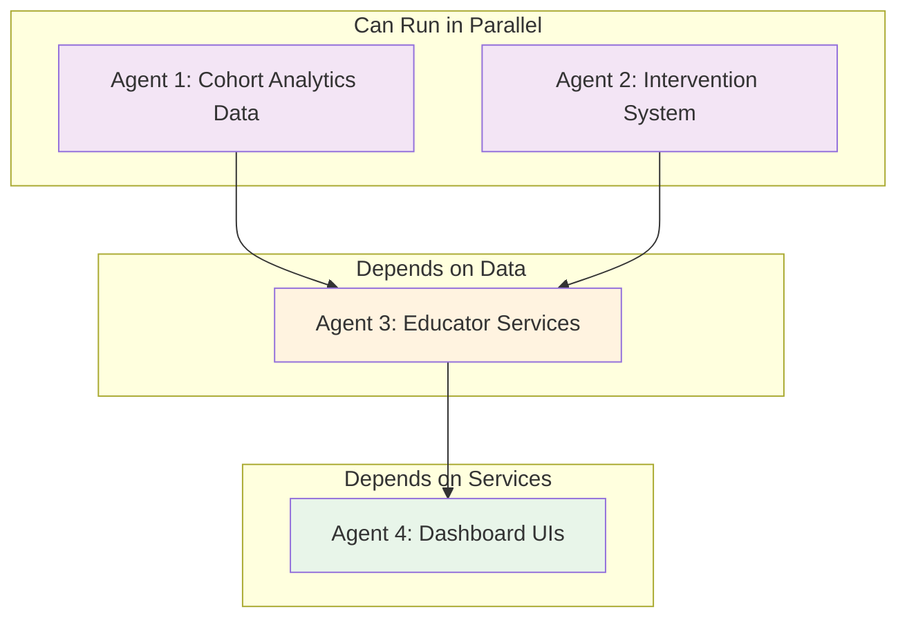
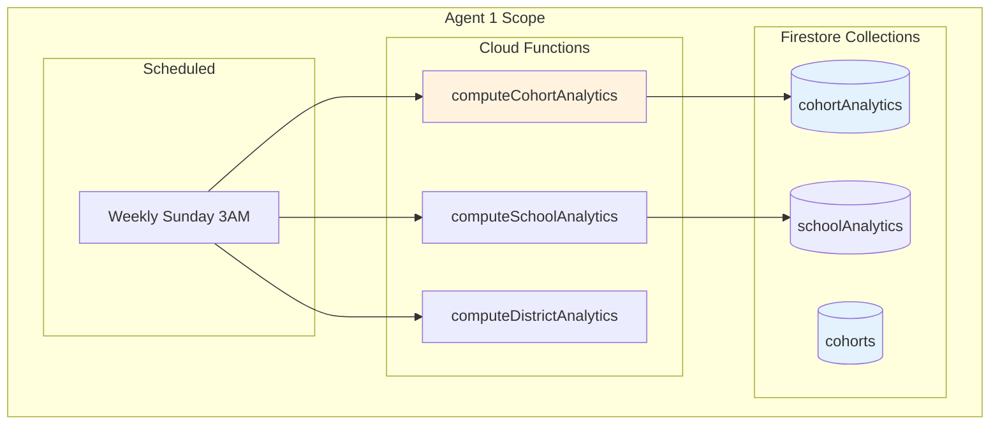
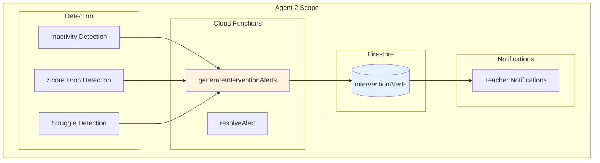
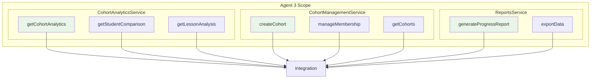
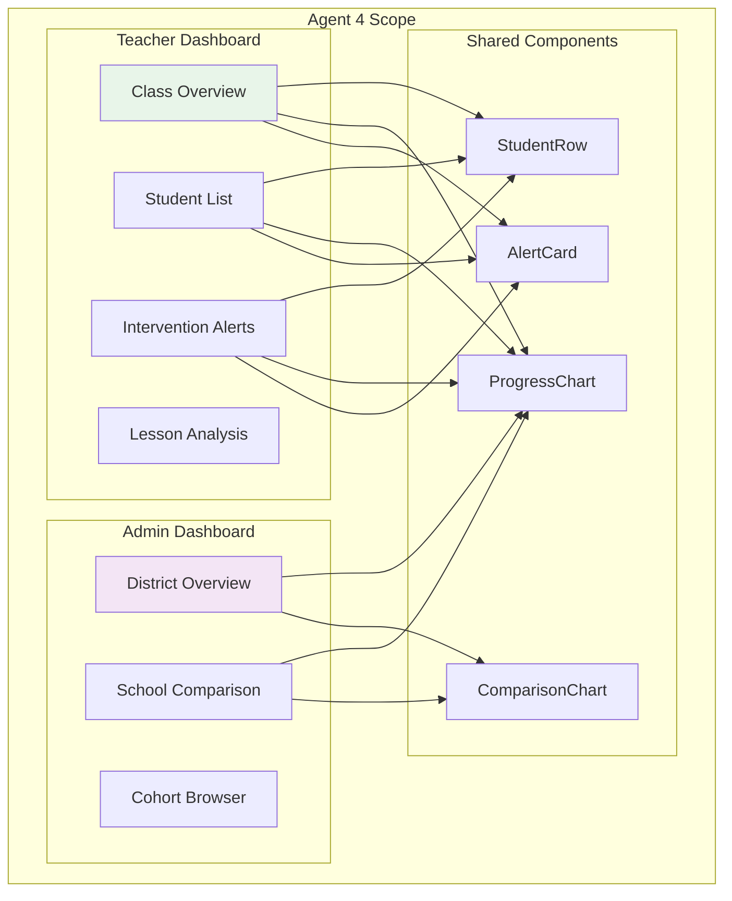

# Phase 5: Teacher & Admin Dashboards

## Overview

Phase 5 empowers educators with tools to monitor, analyze, and support their students. Teachers get class-level views with intervention alerts, while administrators get district-wide metrics and school comparisons.

## Prerequisites

- [ ] Phase 1 complete (AnalyticsService, UserAnalytics)
- [ ] User roles system exists (teacher, admin roles)

## Dependency Diagram



## Execution Order

| Step | Agents | What They Build | Duration |
|------|--------|-----------------|----------|
| 1 | Agent 1 + Agent 2 | Cohort Analytics + Interventions (parallel) | ~2 hours |
| 2 | Agent 3 | CohortAnalyticsService + Educator APIs | ~2 hours |
| 3 | Agent 4 | Teacher Dashboard + Admin Dashboard | ~4 hours |

---

## Agent 1: Cohort Analytics Data Layer

### What You're Building



### Prompt for Agent 1

```
You are building the Cohort Analytics Data Layer for the SWE Hackers Analytics system.

## Context
Read @swe-hackers/diagrams_and_docs/analytics-community-architecture.md to understand the full system. Focus on the "Admin/Superintendent Dashboard" section and the "Aggregated Analytics Collections" showing COHORT_ANALYTICS.

## Your Deliverables

### 1. Firestore Collection: cohorts
Document schema at `firebase-scripts/collections/cohorts-schema.md`:

```javascript
// Collection: cohorts
// Document ID: auto-generated or {schoolId}-{term}-{section}

{
  id: "lincoln-spring2026-cs101-a",
  name: "CS 101 Section A",
  
  // Ownership
  teacherId: "teacher123",
  schoolId: "lincoln-high",
  districtId: "grand-rapids",
  
  // Members
  studentIds: ["student1", "student2", ...],
  
  // Metadata
  term: "spring-2026",
  courseId: "javascript",  // Which SWE Hackers course
  
  // Settings
  settings: {
    visibleToStudents: false,  // Can students see class rankings?
    interventionThreshold: 7   // Days inactive before alert
  },
  
  createdAt: Timestamp,
  updatedAt: Timestamp
}
```

### 2. Firestore Collection: cohortAnalytics
```javascript
// Collection: cohortAnalytics
// Document ID: {cohortId}

{
  cohortId: "lincoln-spring2026-cs101-a",
  
  // Aggregate metrics
  metrics: {
    totalStudents: 28,
    activeStudents: 24,  // Activity in last 7 days
    avgProgress: 0.67,   // 67% through course
    avgScore: 0.82,
    avgStreak: 4.2,
    totalActivitiesCompleted: 1247
  },
  
  // Progress distribution
  progressDistribution: {
    "0-25": 3,
    "25-50": 7,
    "50-75": 10,
    "75-100": 8
  },
  
  // Score distribution
  scoreDistribution: {
    "A": 8,   // 90-100%
    "B": 12,  // 80-89%
    "C": 6,   // 70-79%
    "D": 2,   // 60-69%
    "F": 0    // <60%
  },
  
  // Lesson-by-lesson breakdown
  lessonMetrics: {
    "week1-questions": { avgScore: 0.89, completionRate: 0.96 },
    "week2-prompt": { avgScore: 0.78, completionRate: 0.82 },
    // ...
  },
  
  // Struggling students (for intervention)
  strugglingStudents: [
    { odín: "student5", reason: "inactive", daysSinceActivity: 8 },
    { odín: "student12", reason: "lowScore", avgScore: 0.54 }
  ],
  
  // Top performers
  topPerformers: ["student1", "student7", "student15"],
  
  // Comparison to other cohorts
  comparison: {
    vsSchoolAvg: +0.05,    // 5% above school average
    vsDistrictAvg: +0.08   // 8% above district average
  },
  
  computedAt: Timestamp
}
```

### 3. Firestore Collection: schoolAnalytics
```javascript
// Collection: schoolAnalytics
// Document ID: {schoolId}

{
  schoolId: "lincoln-high",
  schoolName: "Lincoln High School",
  districtId: "grand-rapids",
  
  // Aggregate metrics
  metrics: {
    totalCohorts: 12,
    totalStudents: 342,
    activeStudents: 298,
    avgProgress: 0.58,
    avgScore: 0.79
  },
  
  // By course breakdown
  courseMetrics: {
    "javascript": { students: 145, avgProgress: 0.62 },
    "undergrad": { students: 89, avgProgress: 0.54 }
  },
  
  // Comparison
  comparison: {
    vsDistrictAvg: +0.03
  },
  
  computedAt: Timestamp
}
```

### 4. Cloud Function: computeCohortAnalytics
File: `firebase-functions/analytics/computeCohortAnalytics.js`

Scheduled weekly (or on-demand):
1. For each cohort, get all student IDs
2. Query each student's course progress and activity stats
3. Aggregate metrics
4. Identify struggling students (inactive >7 days or avgScore <60%)
5. Compare to school/district averages
6. Write to cohortAnalytics

### 5. Cloud Function: computeSchoolAnalytics
File: `firebase-functions/analytics/computeSchoolAnalytics.js`

1. Get all cohorts for school
2. Aggregate across cohorts
3. Break down by course
4. Compare to district
5. Write to schoolAnalytics

### 6. Cloud Function: computeDistrictAnalytics
File: `firebase-functions/analytics/computeDistrictAnalytics.js`

1. Get all schools in district
2. Aggregate metrics
3. Create school comparison rankings
4. Store in districtAnalytics collection

### 7. Cohort Management Cloud Functions
File: `firebase-functions/cohorts/cohortManagement.js`

```javascript
exports.createCohort = functions.https.onCall(async (data, context) => {
  // Verify teacher role
  // Create cohort document
  // Return cohort ID
});

exports.addStudentsToCohort = functions.https.onCall(async (data, context) => {
  // Verify teacher owns cohort
  // Add student IDs
  // Trigger analytics recompute
});

exports.removeStudentFromCohort = functions.https.onCall(async (data, context) => {
  // Verify teacher owns cohort
  // Remove student ID
});
```

## Testing
Create `firebase-scripts/test-cohort-analytics.js`:
1. Create mock cohort with 10 students
2. Create mock progress data for each student
3. Run computeCohortAnalytics
4. Verify metrics are correct
5. Verify struggling students identified

## When Done
Report completion with:
- Files created
- Collection schemas documented
- Test output
```

---

## Agent 2: Intervention System

### What You're Building



### Prompt for Agent 2

```
You are building the Intervention System for the SWE Hackers Analytics system.

## Context
Read @swe-hackers/diagrams_and_docs/analytics-community-architecture.md to understand the full system. Focus on the "Teacher Dashboard" section, particularly the "Interventions" subsection.

## Your Deliverables

### 1. Firestore Collection: interventionAlerts
```javascript
// Collection: interventionAlerts
// Document ID: auto-generated

{
  id: "alert123",
  
  // Who it's about
  studentId: "student5",
  studentName: "Marcus Johnson",
  cohortId: "lincoln-spring2026-cs101-a",
  teacherId: "teacher123",
  
  // Alert type and severity
  type: "inactivity",  // inactivity | scoreDropped | struggling | disengaged
  severity: "high",    // low | medium | high | critical
  
  // Details
  details: {
    daysSinceActivity: 8,
    lastActivity: Timestamp,
    lastLesson: "week2-prompt"
  },
  
  // Suggested actions
  suggestedActions: [
    "Send a check-in message",
    "Schedule a 1:1 meeting",
    "Assign catch-up activities"
  ],
  
  // Status
  status: "open",      // open | acknowledged | resolved | dismissed
  acknowledgedAt: null,
  resolvedAt: null,
  resolution: null,    // What action was taken
  
  createdAt: Timestamp,
  expiresAt: Timestamp  // Auto-dismiss after 30 days
}
```

### 2. Alert Types and Criteria
Document at `firebase-scripts/intervention-criteria.md`:

**Inactivity Alert:**
- Trigger: No activity for X days (configurable, default 7)
- Severity: medium (7 days), high (14 days), critical (21 days)

**Score Dropped Alert:**
- Trigger: Average score dropped >15% in last week
- Severity: medium (15-25% drop), high (>25% drop)

**Struggling Alert:**
- Trigger: Multiple failed attempts on same activity (>5)
- Severity: medium (5-10 attempts), high (>10 attempts)

**Disengaged Alert:**
- Trigger: Completing activities but scores declining over 2+ weeks
- Severity: medium initially, high if continues

### 3. Cloud Function: generateInterventionAlerts
File: `firebase-functions/interventions/generateInterventionAlerts.js`

Scheduled daily at 6 AM:
1. For each cohort
2. Check each student against criteria
3. Don't create duplicate alerts (check existing open alerts)
4. Create new alerts as needed
5. Notify teacher

```javascript
async function checkStudent(student, cohort, existingAlerts) {
  const alerts = [];
  
  // Check inactivity
  const daysSinceActivity = daysBetween(student.lastActivity, now);
  if (daysSinceActivity >= cohort.settings.interventionThreshold) {
    const existing = existingAlerts.find(a => 
      a.studentId === student.id && a.type === 'inactivity' && a.status === 'open'
    );
    if (!existing) {
      alerts.push(createInactivityAlert(student, daysSinceActivity));
    }
  }
  
  // Check score drop
  // ...
  
  return alerts;
}
```

### 4. Cloud Function: resolveAlert (callable)
File: `firebase-functions/interventions/resolveAlert.js`

```javascript
exports.resolveAlert = functions.https.onCall(async (data, context) => {
  const { alertId, status, resolution } = data;
  
  // Verify teacher owns the alert's cohort
  // Update alert status
  // Log the resolution
  
  return { success: true };
});
```

### 5. Client-side InterventionService
File: `courses/shared/js/services/intervention-service.js`

```javascript
const InterventionService = {
  // Get open alerts for teacher
  async getAlerts(teacherId, status = 'open') {
    // Query interventionAlerts where teacherId matches
    // Sort by severity (critical first), then date
  },
  
  // Get alerts for specific cohort
  async getCohortAlerts(cohortId, status = 'open') {},
  
  // Acknowledge an alert (teacher saw it)
  async acknowledgeAlert(alertId) {
    // Update status to 'acknowledged'
  },
  
  // Resolve an alert
  async resolveAlert(alertId, resolution) {
    // Call resolveAlert cloud function
  },
  
  // Dismiss an alert (not actionable)
  async dismissAlert(alertId, reason) {},
  
  // Get alert counts by severity
  async getAlertCounts(teacherId) {
    return {
      critical: 1,
      high: 3,
      medium: 7,
      total: 11
    };
  }
};
```

### 6. Teacher Notification
When alert created:
- Store in teacher's notification inbox
- If Discord connected, send DM
- If email configured, send email digest (daily)

```javascript
async function notifyTeacher(teacherId, alert) {
  // Create in-app notification
  await NotificationService.createNotification(teacherId, 'intervention_alert', {
    alertId: alert.id,
    studentName: alert.studentName,
    type: alert.type,
    severity: alert.severity
  });
  
  // Discord DM if configured
  if (teacher.discordId && alert.severity === 'critical') {
    await sendDiscordDM(teacher.discordId, formatAlertMessage(alert));
  }
}
```

## Testing
Create `firebase-scripts/test-interventions.js`:
1. Create mock cohort and students
2. Set one student's lastActivity to 10 days ago
3. Set another student's score to drop 20%
4. Run generateInterventionAlerts
5. Verify correct alerts created
6. Test resolve flow

## When Done
Report completion with:
- Files created
- Alert types and criteria documented
- Test output
```

---

## Agent 3: Educator Services

### What You're Building



### Prompt for Agent 3

```
You are building Educator Services for the SWE Hackers Analytics system.

## Context
Read @swe-hackers/diagrams_and_docs/analytics-community-architecture.md to understand the full system. Focus on the "Teacher Dashboard" and "Admin/Superintendent Dashboard" sections.

**Dependencies**:
- Agent 1 built cohort analytics data layer
- Agent 2 built intervention system
- Phase 1's AnalyticsService is available

## Your Deliverables

### 1. CohortAnalyticsService
File: `courses/shared/js/services/cohort-analytics-service.js`

```javascript
const CohortAnalyticsService = {
  // Get analytics for a cohort
  async getCohortAnalytics(cohortId) {
    // Fetch from cohortAnalytics collection
    // Return full metrics object
  },
  
  // Get analytics for all teacher's cohorts
  async getTeacherCohorts(teacherId) {
    // Query cohorts where teacherId matches
    // Fetch analytics for each
    // Return array of { cohort, analytics }
  },
  
  // Get school-level analytics
  async getSchoolAnalytics(schoolId) {
    // Fetch from schoolAnalytics collection
  },
  
  // Get district-level analytics
  async getDistrictAnalytics(districtId) {
    // Aggregate across schools
  },
  
  // Compare students within cohort
  async getStudentComparison(cohortId) {
    // Get all students' progress and scores
    // Return sorted by various metrics
  },
  
  // Get detailed student view
  async getStudentDetail(studentId, cohortId) {
    // Full analytics for one student
    // Activity history
    // Compared to cohort average
  },
  
  // Analyze lesson difficulty
  async getLessonAnalysis(cohortId, lessonId) {
    // How did cohort perform on this lesson?
    // Which activities were hardest?
    // Common mistakes
  },
  
  // Get activity type breakdown
  async getActivityTypePerformance(cohortId) {
    // Performance by activity type (quiz, drag-drop, etc.)
    // Helps identify what teaching methods work
  }
};
```

### 2. CohortManagementService
File: `courses/shared/js/services/cohort-management-service.js`

```javascript
const CohortManagementService = {
  // Create a new cohort
  async createCohort(name, courseId, settings = {}) {
    // Call createCohort cloud function
    // Return new cohort ID
  },
  
  // Get teacher's cohorts
  async getMyCohorts() {
    // Query cohorts where teacherId == current user
  },
  
  // Get single cohort
  async getCohort(cohortId) {},
  
  // Add students to cohort
  async addStudents(cohortId, studentIds) {
    // Call cloud function
    // Can pass email list to invite new students
  },
  
  // Remove student from cohort
  async removeStudent(cohortId, studentId) {},
  
  // Update cohort settings
  async updateSettings(cohortId, settings) {},
  
  // Archive cohort (end of term)
  async archiveCohort(cohortId) {},
  
  // Invite students via code
  async generateInviteCode(cohortId) {
    // Generate unique join code
    // Students can use to self-enroll
  },
  
  async joinCohortByCode(code) {
    // Student joins cohort using code
  }
};
```

### 3. ReportsService
File: `courses/shared/js/services/reports-service.js`

```javascript
const ReportsService = {
  // Generate progress report for student
  async generateStudentReport(studentId, cohortId) {
    // Create PDF-ready data structure
    return {
      student: { name, avatar },
      progress: { ... },
      strengths: [...],
      areasForImprovement: [...],
      recommendations: [...],
      activityHistory: [...]
    };
  },
  
  // Generate cohort summary report
  async generateCohortReport(cohortId) {
    // Class-level summary
    // Distribution charts data
    // Student list with status
  },
  
  // Export data as CSV
  async exportCohortData(cohortId, format = 'csv') {
    // Generate downloadable file
    // Columns: student, progress, score, activities, lastActive
  },
  
  // Export grade book
  async exportGradeBook(cohortId) {
    // Format suitable for school grade systems
    // Student, Lesson1, Lesson2, ..., Average
  }
};
```

### 4. Role-based Access
Implement role checking:

```javascript
function requireRole(roles) {
  return async function(userId) {
    const user = await getUser(userId);
    if (!roles.includes(user.role)) {
      throw new Error('Unauthorized');
    }
  };
}

// Usage
async function getSchoolAnalytics(schoolId) {
  await requireRole(['teacher', 'admin', 'superintendent']);
  // ...
}
```

### 5. Caching Strategy
- Cohort list: 5 minutes
- Cohort analytics: 10 minutes
- School/district analytics: 30 minutes
- Individual student data: 1 minute

## Testing
```javascript
CohortAnalyticsService.runTests = async function() {
  console.log('📊 Testing CohortAnalyticsService...');
  // Test with mock cohort ID
};
```

## When Done
Report completion with:
- Files created
- All methods implemented
- Role checking approach
```

---

## Agent 4: Dashboard UIs

### What You're Building



### Prompt for Agent 4

```
You are building the Teacher and Admin Dashboards for the SWE Hackers Analytics system.

## Context
Read @swe-hackers/diagrams_and_docs/analytics-community-architecture.md to understand the full system. Focus on the "Teacher Dashboard" and "Admin/Superintendent Dashboard" sections with their component breakdowns.

**Dependencies**:
- Agent 3 built CohortAnalyticsService, CohortManagementService, ReportsService
- Agent 2 built InterventionService
- Phase 1's components available

## Your Deliverables

### 1. Teacher Dashboard Page
File: `courses/teacher-dashboard/index.html`

Layout:
```html
<!DOCTYPE html>
<html>
<head>
  <title>Teacher Dashboard | SWE Hackers</title>
</head>
<body>
  <nav><!-- Teacher nav --></nav>
  
  <main class="teacher-dashboard">
    <!-- Cohort Selector -->
    <header class="dashboard-header">
      <h1>Teacher Dashboard</h1>
      <select id="cohort-selector"></select>
      <button id="create-cohort-btn">+ New Class</button>
    </header>
    
    <!-- Intervention Alerts (prominent) -->
    <section class="alerts-section">
      <h2>⚠️ Needs Attention</h2>
      <div id="alerts-container"></div>
    </section>
    
    <!-- Class Overview -->
    <section class="overview-section">
      <h2>📊 Class Overview</h2>
      <div class="metrics-row">
        <div id="progress-metric"></div>
        <div id="score-metric"></div>
        <div id="active-metric"></div>
        <div id="streak-metric"></div>
      </div>
      <div class="charts-row">
        <div id="progress-distribution-chart"></div>
        <div id="score-distribution-chart"></div>
      </div>
    </section>
    
    <!-- Student List -->
    <section class="students-section">
      <h2>👥 Students</h2>
      <div class="student-controls">
        <input type="search" placeholder="Search students...">
        <select id="sort-by">
          <option value="name">Name</option>
          <option value="progress">Progress</option>
          <option value="score">Score</option>
          <option value="lastActive">Last Active</option>
        </select>
        <button id="export-btn">Export</button>
      </div>
      <div id="students-table"></div>
    </section>
    
    <!-- Lesson Analysis -->
    <section class="lesson-section">
      <h2>📚 Lesson Performance</h2>
      <div id="lesson-analysis"></div>
    </section>
  </main>
</body>
</html>
```

### 2. Admin Dashboard Page
File: `courses/admin-dashboard/index.html`

Layout:
```html
<!DOCTYPE html>
<html>
<head>
  <title>Admin Dashboard | SWE Hackers</title>
</head>
<body>
  <nav><!-- Admin nav --></nav>
  
  <main class="admin-dashboard">
    <header class="dashboard-header">
      <h1>District Overview</h1>
      <select id="time-period">
        <option value="week">This Week</option>
        <option value="month">This Month</option>
        <option value="semester">This Semester</option>
      </select>
    </header>
    
    <!-- Key Metrics -->
    <section class="metrics-section">
      <div class="metric-card" id="enrollment-metric"></div>
      <div class="metric-card" id="completion-metric"></div>
      <div class="metric-card" id="engagement-metric"></div>
      <div class="metric-card" id="intervention-metric"></div>
    </section>
    
    <!-- School Comparison -->
    <section class="schools-section">
      <h2>🏫 Schools</h2>
      <div id="school-comparison-chart"></div>
      <div id="school-cards"></div>
    </section>
    
    <!-- Cohort Browser -->
    <section class="cohorts-section">
      <h2>📋 All Classes</h2>
      <div class="cohort-filters">
        <select id="school-filter"></select>
        <select id="course-filter"></select>
      </div>
      <div id="cohorts-table"></div>
    </section>
    
    <!-- Program Health -->
    <section class="health-section">
      <h2>💚 Program Health</h2>
      <div id="retention-chart"></div>
      <div id="trend-chart"></div>
    </section>
  </main>
</body>
</html>
```

### 3. Components
Location: `courses/shared/js/components/educator/`

#### StudentRow (`student-row.js`)
```javascript
class StudentRow {
  constructor(container, student, cohortAvg) {
    // student: { id, name, avatar, progress, score, lastActive, streak }
    // cohortAvg: for comparison indicators
  }
  
  render() {
    // Avatar + Name (link to detail)
    // Progress bar
    // Score (color-coded vs average)
    // Last active (red if >7 days)
    // Streak
    // Actions: View Detail, Message
  }
}
```

#### AlertCard (`alert-card.js`)
```javascript
class AlertCard {
  constructor(container, alert) {}
  
  render() {
    // Severity indicator (color bar)
    // Student name + avatar
    // Alert type icon + description
    // Suggested actions
    // Action buttons: Acknowledge, Resolve, Dismiss
  }
  
  async handleResolve() {
    // Show resolution modal
    // Log what action was taken
  }
}
```

#### ProgressDistributionChart (`progress-distribution-chart.js`)
```javascript
class ProgressDistributionChart {
  constructor(container, distribution) {
    // distribution: { "0-25": 3, "25-50": 7, ... }
  }
  
  render() {
    // Bar chart or histogram
    // Using Chart.js
  }
}
```

#### SchoolComparisonChart (`school-comparison-chart.js`)
```javascript
class SchoolComparisonChart {
  constructor(container, schools) {
    // schools: [{ name, avgProgress, avgScore }, ...]
  }
  
  render() {
    // Horizontal bar chart
    // Schools ranked by performance
    // District average line
  }
}
```

#### LessonAnalysis (`lesson-analysis.js`)
```javascript
class LessonAnalysis {
  constructor(container, cohortId) {}
  
  async load() {
    // Fetch lesson metrics
    // Render as heatmap or table
  }
  
  render(lessonMetrics) {
    // Each lesson row
    // Completion rate bar
    // Average score
    // Click to expand: activity breakdown
  }
}
```

#### CreateCohortModal (`create-cohort-modal.js`)
```javascript
class CreateCohortModal {
  static show() {
    // Modal with form:
    // - Class name
    // - Course selection
    // - Settings
    // - Import students (CSV upload or manual entry)
  }
}
```

### 4. CSS Styling
File: `courses/shared/css/educator.css`

- Dashboard layout (sidebar + main)
- Metric cards (large numbers, trends)
- Alert cards (severity colors)
- Student table (sortable, hover states)
- Charts styling
- Comparison indicators (above/below average)
- Responsive design

### 5. Role-based Navigation
Different nav for different roles:
```javascript
function renderNav(userRole) {
  const navItems = [
    { label: 'Dashboard', href: '/dashboard/', roles: ['student', 'teacher', 'admin'] },
    { label: 'My Classes', href: '/teacher-dashboard/', roles: ['teacher'] },
    { label: 'District', href: '/admin-dashboard/', roles: ['admin'] },
    // ...
  ];
  
  return navItems.filter(item => item.roles.includes(userRole));
}
```

### 6. Create Cohort Flow
1. Teacher clicks "New Class"
2. Modal opens with form
3. Teacher enters name, selects course
4. Optionally uploads student list (CSV)
5. On submit, cohort created
6. Show invite code for students to join

### 7. Export Functionality
- Export cohort data as CSV
- Export grade book for school systems
- Generate printable progress reports

## Mock Data
```javascript
const mockCohort = {
  id: 'mock-cohort-1',
  name: 'CS 101 Section A',
  metrics: {
    totalStudents: 28,
    activeStudents: 24,
    avgProgress: 0.67,
    avgScore: 0.82
  },
  progressDistribution: { "0-25": 3, "25-50": 7, "50-75": 10, "75-100": 8 }
};

const mockStudents = [
  { id: 's1', name: 'Alice Chen', progress: 0.92, score: 0.95, lastActive: new Date() },
  { id: 's2', name: 'Bob Smith', progress: 0.45, score: 0.72, lastActive: new Date(Date.now() - 10*24*60*60*1000) },
  // ...
];

const mockAlerts = [
  { id: 'a1', studentName: 'Bob Smith', type: 'inactivity', severity: 'high', daysSinceActivity: 10 }
];
```

## When Done
Report completion with:
- Files created
- Screenshot/description of both dashboards
- Role-based access working
```

---

## Verification Checklist

After all agents complete, verify:

- [ ] `firebase-functions/analytics/computeCohortAnalytics.js` exists
- [ ] `firebase-functions/analytics/computeSchoolAnalytics.js` exists
- [ ] `firebase-functions/interventions/generateInterventionAlerts.js` exists
- [ ] `firebase-functions/cohorts/cohortManagement.js` exists
- [ ] `courses/shared/js/services/cohort-analytics-service.js` exists
- [ ] `courses/shared/js/services/cohort-management-service.js` exists
- [ ] `courses/shared/js/services/intervention-service.js` exists
- [ ] `courses/shared/js/services/reports-service.js` exists
- [ ] `courses/teacher-dashboard/index.html` exists
- [ ] `courses/admin-dashboard/index.html` exists
- [ ] `courses/shared/js/components/educator/` has components
- [ ] `courses/shared/css/educator.css` exists
- [ ] Role-based navigation working
- [ ] Intervention alerts display and can be resolved
- [ ] Export functionality works

## Completion

With Phase 5 complete, the Analytics & Community system is fully built:

- ✅ Phase 1: Core Analytics Foundation
- ✅ Phase 2: Leaderboards & Gamification
- ✅ Phase 3: Community & Peer Matching
- ✅ Phase 4: Challenges Dashboard
- ✅ Phase 5: Teacher & Admin Dashboards

Next steps:
1. Deploy Firebase functions
2. Run scheduled jobs to populate analytics
3. QA across all dashboards
4. User acceptance testing with teachers
5. Soft launch to select cohorts
