# Enhanced Lesson Architecture

## The Vision

```mermaid
flowchart TB
    subgraph Current["📚 Current Lesson Structure"]
        C1[Interactive Video] --> C2[Quiz Carousel]
        C2 --> C3[Next Section...]
    end

    subgraph Enhanced["🚀 Enhanced Lesson Structure"]
        E1[Interactive Video]
        E1 --> E2[🧠 Comprehension Carousel]
        E2 --> E3[⚡ Application Carousel]
        E3 --> E4[🔧 Synthesis Carousel]
        E4 --> E5[Next Section...]
        E5 -.-> E6[🎯 Mini Project Module]
    end

    Current --> Enhanced

    style Current fill:#2d1f1f,stroke:#ef5350,stroke-width:2px,color:#fff
    style Enhanced fill:#1a472a,stroke:#66bb6a,stroke-width:2px,color:#fff
```

### The Story: From Passive to Active Learning

Today's lessons have interactive videos with quiz questions — but learning science tells us that **one type of practice isn't enough**. Students need multiple modalities:

| Current | Problem | Enhanced |
|---------|---------|----------|
| Watch video | Passive consumption | Interactive storytelling ✓ |
| Answer quiz | Single practice type | **Three practice types** |
| Move on | No reflection | Active reflection + creation |
| End of lesson | No application | **Mini project** |

The enhanced structure follows Bloom's Taxonomy:

```mermaid
flowchart LR
    subgraph Blooms["🎓 Bloom's Taxonomy Alignment"]
        B1["1️⃣ Remember<br/>Interactive Video"]
        B2["2️⃣ Understand<br/>Comprehension Carousel"]
        B3["3️⃣ Apply<br/>Application Carousel"]
        B4["4️⃣ Analyze<br/>Synthesis Carousel"]
        B5["5️⃣ Evaluate<br/>Mini Project"]
        B6["6️⃣ Create<br/>Mini Project"]
    end

    B1 --> B2 --> B3 --> B4 --> B5 --> B6

    style B1 fill:#ef5350,stroke:#c92a2a,color:#fff
    style B2 fill:#ff7043,stroke:#e64a19,color:#fff
    style B3 fill:#ffa726,stroke:#fb8c00,color:#000
    style B4 fill:#66bb6a,stroke:#43a047,color:#fff
    style B5 fill:#42a5f5,stroke:#1e88e5,color:#fff
    style B6 fill:#7986cb,stroke:#5c6bc0,color:#fff
```

---

## Lesson Section Structure


### The Philosophy: Deep, Nuanced Activities

Each carousel serves a different cognitive purpose:

| Carousel | Purpose | Thinking Style | Example |
|----------|---------|---------------|---------|
| **Comprehension** | "Do I understand?" | Recall & recognition | "What is a variable?" |
| **Application** | "Can I use it?" | Transfer & application | "Match variables to their data types" |
| **Synthesis** | "Can I build with it?" | Analysis & creation | "Build the data flow diagram for this scenario" |

---

## Activity Type Library


### Activity Definitions

#### 🧠 Comprehension Activities

| Activity | Description | Data Captured |
|----------|-------------|---------------|
| **Multiple Choice** | Standard quiz, single correct answer | selected, correct, time |
| **True/False + Reasoning** | T/F with "why" text input | selected, reasoning, correct, time |
| **Fill-in-Blank** | Complete the statement | inputText, correctMatch, time |
| **Term Matching** | Match terms to definitions (drag/drop) | matches, correctCount, time |
| **Concept Check** | "Which of these is NOT..." | selected, correct, time |

#### ⚡ Application Activities

| Activity | Description | Data Captured |
|----------|-------------|---------------|
| **Drag & Drop Matching** | Match items to categories | placements, score, time |
| **Sequence Ordering** | Put steps in correct order | ordering, correctPositions, time |
| **Graph Connect-Edges** | Draw connections between nodes | edges, correctEdges, incorrectEdges, time |
| **Code Ordering** | Arrange code lines correctly | ordering, syntaxValid, time |
| **Spot-the-Bug** | Find the error in code | selectedLine, correct, explanation, time |

#### 🔧 Synthesis Activities

| Activity | Description | Data Captured |
|----------|-------------|---------------|
| **Graph Builder** | Create a diagram from scratch | nodes, edges, validStructure, time |
| **Scenario Analysis** | Given scenario, answer "what if" | response, keywordMatches, score, time |
| **Prediction/Hypothesis** | Predict output/behavior | prediction, explanation, actualResult, time |
| **Concept Mapping** | Connect related concepts freely | connections, uniqueInsights, time |
| **Comparison Builder** | Build pros/cons or compare/contrast | items, categories, completeness, time |
| **Reflection Prompt** | Open-ended thoughtful response | response, wordCount, depth, time |
| **Code Completion** | Complete partially written code | code, testsPass, time |

---

## Activity Carousel Component


### Component Structure

```javascript
// ActivityCarousel - Unified carousel for all activity types
class ActivityCarousel {
  constructor(containerId, activities, options = {}) {
    this.containerId = containerId;
    this.activities = activities;  // Array of activity configs
    this.carouselType = options.type;  // 'comprehension' | 'application' | 'synthesis'
    this.currentIndex = 0;
    this.results = {};
    this.courseId = options.courseId;
    this.lessonId = options.lessonId;
    this.sectionId = options.sectionId;
  }

  // Factory method to create the right activity component
  createActivityComponent(activity) {
    switch (activity.type) {
      case 'quiz':          return new QuizActivity(activity);
      case 'dragdrop':      return new DragDropActivity(activity);
      case 'sequence':      return new SequenceActivity(activity);
      case 'connect-edges': return new ConnectEdgesActivity(activity);
      case 'graph-builder': return new GraphBuilderActivity(activity);
      case 'scenario':      return new ScenarioActivity(activity);
      case 'prediction':    return new PredictionActivity(activity);
      case 'reflection':    return new ReflectionActivity(activity);
      // ... more types
    }
  }
}
```

---

## Detailed Activity Designs

### 1. Sequence Ordering Activity

```mermaid
flowchart TB
    subgraph SequenceActivity["📝 Sequence Ordering"]
        subgraph Prompt["Instructions"]
            P1["Put these steps in the correct order<br/>to explain how a variable is created"]
        end

        subgraph Items["Draggable Items (shuffled)"]
            I1["2. Computer reserves memory space"]
            I2["4. Value is stored in memory"]
            I3["1. You write: name = 'Alice'"]
            I4["3. Name 'name' points to that space"]
        end

        subgraph DropZones["Drop Zones (ordered)"]
            D1["Step 1: ___________"]
            D2["Step 2: ___________"]
            D3["Step 3: ___________"]
            D4["Step 4: ___________"]
        end

        subgraph Feedback["Feedback"]
            F1["✅ 3/4 in correct position"]
            F2["💡 Hint: Memory must be reserved<br/>before the name can point to it"]
        end
    end

    Prompt --> Items --> DropZones --> Feedback

    style SequenceActivity fill:#2d1f47,stroke:#9c27b0,stroke-width:2px,color:#fff
```

**Data Structure:**

```javascript
{
  type: 'sequence',
  id: 'seq-variable-creation',
  instruction: 'Put these steps in the correct order to explain how a variable is created:',
  items: [
    { id: 'step-1', text: "You write: name = 'Alice'" },
    { id: 'step-2', text: 'Computer reserves memory space' },
    { id: 'step-3', text: "Name 'name' points to that space" },
    { id: 'step-4', text: 'Value is stored in memory' }
  ],
  correctOrder: ['step-1', 'step-2', 'step-3', 'step-4'],
  hints: {
    partial: 'Memory must be reserved before the name can point to it',
    wrong: 'Think about what has to happen first before anything else can work'
  },
  points: 20
}
```

---

### 2. Graph Connect-Edges Activity

```mermaid
flowchart TB
    subgraph ConnectEdges["🔗 Graph Connect-Edges"]
        subgraph Prompt["Instructions"]
            P1["Connect these components to show<br/>how data flows in a web request"]
        end

        subgraph Graph["Interactive Canvas"]
            N1["🌐 Browser"]
            N2["📡 Server"]
            N3["🗄️ Database"]
            N4["📄 Response"]

            N1 -.->|"Click to connect"| N2
            N2 -.->|"?"| N3
            N3 -.->|"?"| N2
            N2 -.->|"?"| N4
        end

        subgraph Controls["Controls"]
            C1["🗑️ Clear All"]
            C2["✓ Check Answer"]
        end
    end

    Prompt --> Graph --> Controls

    style ConnectEdges fill:#1a472a,stroke:#66bb6a,stroke-width:2px,color:#fff
```

**Already Exists:** `ChallengePuzzle` with `type: 'connect-edges'` — we can reuse this!

**Enhancement:** Add directional labels and multiple valid solutions.

---

### 3. Scenario Analysis Activity

```mermaid
flowchart TB
    subgraph ScenarioActivity["🎭 Scenario Analysis"]
        subgraph Scenario["📖 Scenario"]
            S1["You're building a shopping cart.<br/>A user adds 3 items, then closes their browser.<br/>When they return the next day, the cart is empty."]
        end

        subgraph Question["❓ Question"]
            Q1["What type of storage was likely used?<br/>Explain your reasoning."]
        end

        subgraph Response["💭 Response Area"]
            R1["Short answer: ___ storage"]
            R2["Explanation textarea..."]
        end

        subgraph Evaluation["📊 Evaluation"]
            E1["Keywords detected: 'session', 'temporary'"]
            E2["Reasoning depth: Good (3+ sentences)"]
            E3["Score: 85%"]
        end
    end

    Scenario --> Question --> Response --> Evaluation

    style ScenarioActivity fill:#3d2d1a,stroke:#ff9800,stroke-width:2px,color:#fff
```

**Data Structure:**

```javascript
{
  type: 'scenario',
  id: 'scenario-cart-storage',
  scenario: "You're building a shopping cart. A user adds 3 items, then closes their browser. When they return the next day, the cart is empty.",
  question: 'What type of storage was likely used? Explain your reasoning.',
  evaluation: {
    type: 'keyword-match',
    keywords: ['session', 'temporary', 'memory', 'not persistent', 'lost'],
    minWords: 20,
    pointsPerKeyword: 5,
    maxScore: 25
  },
  modelAnswer: "The cart likely used session storage or in-memory storage. Session storage only persists while the browser tab is open, and memory is cleared when the browser closes. For a persistent cart, localStorage or a database would be needed.",
  points: 25
}
```

---

### 4. Prediction/Hypothesis Activity

```mermaid
flowchart TB
    subgraph PredictionActivity["🔮 Prediction Activity"]
        subgraph Setup["📋 Setup"]
            S1["Code snippet or scenario shown"]
            S2["x = 5<br/>y = x<br/>x = 10<br/>print(y)"]
        end

        subgraph Prediction["🤔 Your Prediction"]
            P1["What will print? ___"]
            P2["Why? (explain your reasoning)"]
        end

        subgraph Reveal["👁️ Reveal & Compare"]
            R1["Actual output: 5"]
            R2["Your prediction: [shown]"]
            R3["✅ Correct! or 💡 Let's explore why..."]
        end

        subgraph Explanation["📚 Deep Dive"]
            E1["In Python, integers are immutable.<br/>When we say y = x, y gets the VALUE 5,<br/>not a reference to x's memory location."]
        end
    end

    Setup --> Prediction --> Reveal --> Explanation

    style PredictionActivity fill:#1a1a2e,stroke:#7986cb,stroke-width:2px,color:#fff
```

**Data Structure:**

```javascript
{
  type: 'prediction',
  id: 'predict-variable-copy',
  setup: {
    type: 'code',
    language: 'python',
    code: 'x = 5\ny = x\nx = 10\nprint(y)'
  },
  question: 'What will this code print?',
  correctAnswer: '5',
  acceptableVariants: ['5', 'five', '5.0'],
  explanation: "In Python, integers are immutable. When we say y = x, y gets the VALUE 5, not a reference to x's memory location. Changing x later doesn't affect y.",
  commonMistakes: {
    '10': "You might be thinking y is linked to x, but primitive values are copied, not referenced.",
    'error': "This code is valid Python - no errors will occur."
  },
  points: 15
}
```

---

### 5. Graph Builder (Free-form Creation)

```mermaid
flowchart TB
    subgraph GraphBuilder["🏗️ Graph Builder"]
        subgraph Prompt["Instructions"]
            P1["Build a diagram showing how<br/>user authentication works"]
        end

        subgraph Toolbox["🧰 Toolbox"]
            T1["➕ Add Node"]
            T2["Types: User, Server, Database, External"]
            T3["🔗 Connect Mode"]
            T4["🗑️ Delete Mode"]
        end

        subgraph Canvas["📐 Canvas"]
            C1["Drag nodes from toolbox<br/>Click two nodes to connect<br/>Double-click to edit labels"]
        end

        subgraph Validation["✅ Validation"]
            V1["Required nodes: User, Server, Database ✓"]
            V2["Required flows: User→Server ✓"]
            V3["Optional: External auth provider"]
        end
    end

    Prompt --> Toolbox --> Canvas --> Validation

    style GraphBuilder fill:#16213e,stroke:#4a9eff,stroke-width:2px,color:#fff
```

**Data Structure:**

```javascript
{
  type: 'graph-builder',
  id: 'build-auth-flow',
  instruction: 'Build a diagram showing how user authentication works',
  nodeTypes: [
    { type: 'user', label: '👤 User', color: '#ef5350' },
    { type: 'server', label: '📡 Server', color: '#7986cb' },
    { type: 'database', label: '🗄️ Database', color: '#66bb6a' },
    { type: 'external', label: '🔐 Auth Provider', color: '#ffd54f' }
  ],
  validation: {
    requiredNodes: ['user', 'server', 'database'],
    requiredEdges: [
      { from: 'user', to: 'server' },
      { from: 'server', to: 'database' }
    ],
    optionalNodes: ['external'],
    minNodes: 3,
    maxNodes: 6
  },
  rubric: {
    hasUser: 5,
    hasServer: 5,
    hasDatabase: 5,
    userToServer: 10,
    serverToDatabase: 10,
    hasAuthProvider: 5,  // bonus
    correctFlow: 10
  },
  points: 50
}
```

---

### 6. Reflection Prompt Activity

```mermaid
flowchart TB
    subgraph ReflectionActivity["💭 Reflection Prompt"]
        subgraph Prompt["🪞 Reflection"]
            P1["Before learning about variables,<br/>how did you think computers 'remembered' things?<br/>How has your mental model changed?"]
        end

        subgraph Response["✍️ Your Response"]
            R1["Textarea with rich formatting"]
            R2["Word count: 127 / min 50"]
        end

        subgraph Guidance["💡 Thinking Prompts"]
            G1["• What surprised you?"]
            G2["• What's still confusing?"]
            G3["• How would you explain this to a friend?"]
        end

        subgraph Feedback["📊 Feedback"]
            F1["Depth indicators detected:<br/>- Personal connection ✓<br/>- Specific concept reference ✓<br/>- Questions raised ✓"]
        end
    end

    Prompt --> Response --> Guidance --> Feedback

    style ReflectionActivity fill:#2d2d1f,stroke:#ffb74d,stroke-width:2px,color:#fff
```

**Data Structure:**

```javascript
{
  type: 'reflection',
  id: 'reflect-mental-model',
  prompt: "Before learning about variables, how did you think computers 'remembered' things? How has your mental model changed?",
  thinkingPrompts: [
    'What surprised you?',
    "What's still confusing?",
    'How would you explain this to a friend?'
  ],
  evaluation: {
    minWords: 50,
    depthIndicators: [
      { pattern: /I (thought|believed|assumed)/i, label: 'Personal connection', points: 5 },
      { pattern: /(variable|memory|storage)/i, label: 'Concept reference', points: 5 },
      { pattern: /\?/, label: 'Questions raised', points: 3 },
      { pattern: /(now I|I realize|I understand)/i, label: 'Growth mindset', points: 5 }
    ],
    maxScore: 20
  },
  points: 20
}
```

---

## Mini Project Module

```mermaid
flowchart TB
    subgraph MiniProject["🎯 Mini Project Module"]
        subgraph Overview["📋 Project Overview"]
            O1["🏷️ Title: Variable Explorer"]
            O2["⏱️ Est. Time: 20 mins"]
            O3["🎓 Skills: Variables, Data Types, Print"]
        end

        subgraph Instructions["📝 Instructions"]
            I1["Step-by-step guide"]
            I2["Expandable code examples"]
            I3["Expected output preview"]
        end

        subgraph Resources["🧰 Resources"]
            R1["📁 Starter code download"]
            R2["📚 Reference docs"]
            R3["🎥 Optional video walkthrough"]
        end

        subgraph Rubric["📊 Rubric"]
            RB1["✅ Creates 3+ variables (10 pts)"]
            RB2["✅ Uses 2+ data types (10 pts)"]
            RB3["✅ Prints all values (10 pts)"]
            RB4["⭐ Bonus: Comments (5 pts)"]
        end

        subgraph Submission["📤 Submission"]
            S1["Code paste area"]
            S2["Screenshot upload (optional)"]
            S3["Self-assessment checklist"]
        end
    end

    Overview --> Instructions --> Resources --> Rubric --> Submission

    style MiniProject fill:#1a1a2e,stroke:#9c27b0,stroke-width:2px,color:#fff
```

### Mini Project Data Structure

```javascript
{
  type: 'mini-project',
  id: 'project-variable-explorer',
  title: 'Variable Explorer',
  description: 'Create a program that demonstrates your understanding of variables and data types.',
  estimatedTime: '20 minutes',
  skills: ['variables', 'data-types', 'print-statements'],
  
  instructions: [
    {
      step: 1,
      title: 'Create Your Variables',
      content: 'Create at least 3 variables with different names...',
      codeExample: 'name = "Your Name"\nage = 25\nis_student = True',
      tip: 'Use descriptive names that explain what the variable holds'
    },
    // ... more steps
  ],
  
  resources: [
    { type: 'starter-code', label: 'Download Starter', url: 'starter.py' },
    { type: 'docs', label: 'Python Variables Reference', url: 'https://...' },
    { type: 'video', label: 'Walkthrough (optional)', url: 'https://...' }
  ],
  
  rubric: [
    { criterion: 'Creates 3+ variables', points: 10, required: true },
    { criterion: 'Uses 2+ different data types', points: 10, required: true },
    { criterion: 'Prints all variable values', points: 10, required: true },
    { criterion: 'Includes descriptive comments', points: 5, required: false, bonus: true }
  ],
  
  submission: {
    codeRequired: true,
    screenshotOptional: true,
    selfAssessment: [
      'I created at least 3 variables',
      'I used different data types',
      'My code runs without errors',
      'I can explain what each variable does'
    ]
  },
  
  totalPoints: 35
}
```

---

## Data Flow Architecture


### Integration with ActivityTracker

All activities use the existing `ActivityTracker` pattern:

```html
<!-- Activity element with data attributes -->
<div 
  class="activity-container"
  data-activity="seq-variable-creation"
  data-type="sequence"
  data-carousel="application"
  data-points="20"
>
  <!-- Activity content -->
</div>
```

The ActivityTracker:
1. **Discovers** activities via `[data-activity]` attributes
2. **Starts timing** when user interacts
3. **Captures results** when submitted
4. **Saves to Firestore** (with offline queue)
5. **Restores state** for returning users

---

## Firestore Data Structure


### Activity Attempt Schema

```javascript
{
  // Core identifiers
  id: 'auto-generated',
  activityId: 'seq-variable-creation',
  activityType: 'sequence',         // quiz | dragdrop | sequence | connect-edges | etc.
  carouselType: 'application',      // comprehension | application | synthesis
  
  // Context
  courseId: 'apprentice',
  lessonId: 'ch1-stone',
  sectionId: 'variables',           // which story section
  
  // User & timing
  userId: 'user-123',
  attemptNumber: 1,
  startedAt: Timestamp,
  completedAt: Timestamp,
  timeSpentMs: 45000,
  
  // Results
  correct: true,                    // binary for simple activities
  score: 0.75,                      // 0.0 - 1.0 for partial credit
  
  // Type-specific response data
  response: {
    // For sequence:
    ordering: ['step-1', 'step-2', 'step-3', 'step-4'],
    correctPositions: 3,
    totalPositions: 4,
    
    // For scenario:
    answer: 'session storage',
    explanation: '...',
    keywordsMatched: ['session', 'temporary'],
    
    // For reflection:
    text: '...',
    wordCount: 127,
    depthIndicators: ['Personal connection', 'Concept reference']
  }
}
```

---

## Activity Component Architecture


### Base Activity Interface

```javascript
/**
 * BaseActivity - Abstract base class for all activity types
 */
class BaseActivity {
  constructor(containerId, activityData, options = {}) {
    this.containerId = containerId;
    this.container = document.getElementById(containerId);
    this.activityData = activityData;
    this.options = options;
    this.startTime = null;
    this.result = null;
    
    // Context from ActivityTracker
    this.courseId = options.courseId || this.extractCourseId();
    this.lessonId = options.lessonId || this.extractLessonId();
    this.carouselType = options.carouselType;
  }
  
  // Abstract methods (must be implemented by subclasses)
  render() { throw new Error('Must implement render()'); }
  getResult() { throw new Error('Must implement getResult()'); }
  validate() { throw new Error('Must implement validate()'); }
  
  // Common methods
  start() {
    this.startTime = Date.now();
    window.ActivityTracker?.startActivity(this.activityData.id);
  }
  
  async submit() {
    const result = this.getResult();
    this.result = result;
    
    // Save via ActivityTracker
    if (window.ActivityTracker) {
      await window.ActivityTracker.completeActivity(
        this.activityData.id,
        result
      );
    }
    
    this.showFeedback(result);
    return result;
  }
  
  showFeedback(result) {
    // Default feedback - can be overridden
    const feedbackEl = this.container.querySelector('.activity-feedback');
    if (feedbackEl) {
      feedbackEl.innerHTML = result.correct 
        ? `<div class="success">🎉 ${result.message || 'Correct!'}</div>`
        : `<div class="partial">💡 ${result.message || 'Not quite...'}</div>`;
      feedbackEl.classList.add('visible');
    }
  }
  
  // Utility methods
  extractCourseId() {
    return document.body.dataset.course || 'unknown';
  }
  
  extractLessonId() {
    return document.body.dataset.lesson || 'unknown';
  }
}
```

---

## CSS Structure

```mermaid
flowchart LR
    subgraph CSS["📁 shared/css/"]
        L["lesson-interactive.css<br/>(existing base)"]
        AC["activity-carousel.css<br/>(new)"]
        AT["activity-types.css<br/>(new)"]
        MP["mini-project.css<br/>(new)"]
    end

    L --> AC
    AC --> AT
    AT --> MP

    style CSS fill:#1a1a2e,stroke:#ff6b6b,stroke-width:2px,color:#fff
```

### New CSS Files

| File | Contents |
|------|----------|
| `activity-carousel.css` | Carousel container, navigation, progress dots |
| `activity-types.css` | Styles for each activity type (sequence, graph-builder, etc.) |
| `mini-project.css` | Project instructions, rubric, submission styles |

---

## Implementation Phases


---

## File Structure

```
courses/
├── shared/
│   ├── css/
│   │   ├── lesson-interactive.css     ✅ EXISTING
│   │   ├── activity-carousel.css      🆕 NEW
│   │   ├── activity-types.css         🆕 NEW
│   │   └── mini-project.css           🆕 NEW
│   │
│   └── js/
│       ├── activity-tracker.js        📝 EXTEND
│       ├── interactive/
│       │   ├── storytelling-diagram.js   ✅ EXISTING
│       │   ├── quiz-system.js            ✅ EXISTING
│       │   ├── challenge-puzzle.js       ✅ EXISTING (reuse)
│       │   │
│       │   ├── activity-carousel.js      🆕 NEW
│       │   ├── base-activity.js          🆕 NEW
│       │   ├── activities/
│       │   │   ├── quiz-activity.js         🆕 NEW (wrap existing)
│       │   │   ├── sequence-activity.js     🆕 NEW
│       │   │   ├── connect-edges-activity.js  🆕 NEW (wrap puzzle)
│       │   │   ├── graph-builder-activity.js  🆕 NEW
│       │   │   ├── scenario-activity.js     🆕 NEW
│       │   │   ├── prediction-activity.js   🆕 NEW
│       │   │   └── reflection-activity.js   🆕 NEW
│       │   │
│       │   └── mini-project.js           🆕 NEW
│       │
│       └── data-service.js            📝 EXTEND
│
├── apprentice/
│   └── ch1-stone/
│       ├── index.html                 📝 UPDATE (add carousels)
│       └── story.json                 📝 UPDATE (add activities)
```

---

## Example: Enhanced Lesson Page

```html
<!-- Section with all three carousels -->
<section class="section" id="variables-section">
  <h2>Variables: The Stone Remembers</h2>
  <p>Learn how computers store information in memory...</p>
  
  <!-- Interactive Video (existing) -->
  <div class="diagram-container" id="variables-video-container">
    <!-- StorytellingDiagram content -->
  </div>

  <!-- Comprehension Carousel -->
  <div class="activity-carousel" 
       data-carousel-type="comprehension"
       data-section="variables">
    <div class="carousel-header">
      <h4>🧠 Check Your Understanding</h4>
      <div class="carousel-progress">0/3 complete</div>
    </div>
    <div class="carousel-content">
      <!-- Activities rendered here -->
    </div>
    <div class="carousel-nav">
      <button class="nav-btn prev">← Prev</button>
      <div class="carousel-dots"></div>
      <button class="nav-btn next">Next →</button>
    </div>
  </div>

  <!-- Application Carousel -->
  <div class="activity-carousel"
       data-carousel-type="application"
       data-section="variables">
    <div class="carousel-header">
      <h4>⚡ Apply What You Learned</h4>
      <div class="carousel-progress">0/4 complete</div>
    </div>
    <div class="carousel-content">
      <!-- Sequence, drag-drop, connect-edges activities -->
    </div>
    <div class="carousel-nav">
      <!-- nav buttons -->
    </div>
  </div>

  <!-- Synthesis Carousel -->
  <div class="activity-carousel"
       data-carousel-type="synthesis"
       data-section="variables">
    <div class="carousel-header">
      <h4>🔧 Think Deeper</h4>
      <div class="carousel-progress">0/3 complete</div>
    </div>
    <div class="carousel-content">
      <!-- Scenario, prediction, reflection activities -->
    </div>
    <div class="carousel-nav">
      <!-- nav buttons -->
    </div>
  </div>
</section>

<!-- Mini Project (at end of lesson) -->
<section class="section" id="mini-project-section">
  <div class="mini-project-module" data-project="variable-explorer">
    <!-- Project content rendered by MiniProject.js -->
  </div>
</section>
```

---

## Activity JSON Structure

```javascript
// story.json - Enhanced with activity carousels
{
  "pageId": "ch1-stone",
  "stories": [
    {
      "id": "variables-story",
      "title": "Variables: The Stone Remembers",
      "steps": [ /* ... existing story steps */ ]
    }
  ],
  
  "activities": {
    "variables": {
      "comprehension": [
        {
          "type": "quiz",
          "id": "quiz-what-is-variable",
          "question": "What is a variable?",
          "options": ["A type of loop", "A named container for data", "A function", "A file type"],
          "correct": 1,
          "explanation": "A variable is a named container that stores data in memory."
        },
        {
          "type": "true-false",
          "id": "tf-variable-change",
          "statement": "Once a variable is created, its value can never be changed.",
          "correct": false,
          "explanation": "Variables can be reassigned to new values."
        }
      ],
      
      "application": [
        {
          "type": "sequence",
          "id": "seq-variable-creation",
          "instruction": "Put these steps in order:",
          "items": [ /* ... */ ],
          "correctOrder": ["step-1", "step-2", "step-3", "step-4"]
        },
        {
          "type": "connect-edges",
          "id": "connect-datatype-examples",
          "instruction": "Connect each data type to its example:",
          "nodes": [
            { "id": "string", "label": "String" },
            { "id": "int", "label": "Integer" },
            { "id": "hello", "label": "'Hello'" },
            { "id": "42", "label": "42" }
          ],
          "correctEdges": [
            { "source": "string", "target": "hello" },
            { "source": "int", "target": "42" }
          ]
        }
      ],
      
      "synthesis": [
        {
          "type": "prediction",
          "id": "predict-variable-swap",
          "setup": {
            "type": "code",
            "code": "a = 10\nb = 20\na = b\nprint(a, b)"
          },
          "question": "What will print?",
          "correctAnswer": "20 20"
        },
        {
          "type": "reflection",
          "id": "reflect-variables",
          "prompt": "When might you need to store data temporarily vs permanently?",
          "minWords": 30
        }
      ]
    }
  },
  
  "miniProject": {
    "id": "project-variable-explorer",
    "title": "Variable Explorer",
    "description": "Create a program demonstrating variables and data types",
    "estimatedTime": "20 minutes",
    "instructions": [ /* ... */ ],
    "rubric": [ /* ... */ ]
  }
}
```

---

## Analytics & Insights

```mermaid
flowchart TB
    subgraph DataCollection["📊 Data Collected"]
        D1["Per-activity attempts"]
        D2["Carousel completion rates"]
        D3["Time spent per type"]
        D4["Score distributions"]
        D5["Common mistakes"]
    end

    subgraph Insights["💡 Insights Generated"]
        I1["Student strengths/weaknesses"]
        I2["Content difficulty analysis"]
        I3["Engagement patterns"]
        I4["Drop-off points"]
        I5["Correlation: video watch time ↔ activity score"]
    end

    subgraph Actions["🎯 Actionable Outcomes"]
        A1["Personalized recommendations"]
        A2["Content improvement suggestions"]
        A3["Adaptive difficulty"]
        A4["Teacher dashboard insights"]
    end

    DataCollection --> Insights --> Actions

    style DataCollection fill:#1a1a2e,stroke:#4a9eff,stroke-width:2px,color:#fff
    style Insights fill:#2d1f47,stroke:#9c27b0,stroke-width:2px,color:#fff
    style Actions fill:#1a472a,stroke:#66bb6a,stroke-width:2px,color:#fff
```

### Dashboard Updates

The student dashboard will show:

| Metric | Source | Visualization |
|--------|--------|---------------|
| Comprehension score | Carousel 1 average | Progress bar |
| Application score | Carousel 2 average | Progress bar |
| Synthesis score | Carousel 3 average | Progress bar |
| Weak areas | Low-scoring activities | List with suggestions |
| Mini projects completed | Submission count | Badges/count |
| Learning streak | Daily activity | Flame icon + count |

---

## Design Decisions

| Decision | Choice | Rationale |
|----------|--------|-----------|
| **Three carousels** | Comprehension → Application → Synthesis | Follows Bloom's Taxonomy, progressive challenge |
| **Carousel per section** | Each video gets its own carousels | Keeps activities relevant, smaller chunks |
| **Reuse ChallengePuzzle** | Wrap existing for connect-edges | Don't reinvent the wheel |
| **Graph Builder** | New component with Cytoscape | More creative, synthesis-level |
| **Partial credit** | 0.0 - 1.0 scoring | Encourages attempts, tracks progress |
| **Mini project at end** | Single project per lesson | Capstone that ties everything together |
| **JSON-driven activities** | Activity configs in story.json | Easy to add/modify without code changes |
| **BaseActivity class** | Shared interface for all types | Consistent API, easier maintenance |

---

## Next Steps

1. **Phase 1:** Build `ActivityCarousel` and `BaseActivity` foundation
2. **Phase 2:** Implement comprehension activities (enhance existing Quiz)
3. **Phase 3:** Build application activities (Sequence, Connect-Edges wrapper)
4. **Phase 4:** Build synthesis activities (Scenario, Prediction, Graph Builder)
5. **Phase 5:** Create Mini Project module
6. **Phase 6:** Update a pilot lesson (ch1-stone) with full structure
7. **Phase 7:** Extend analytics dashboard

---

## Summary

This enhanced lesson architecture transforms passive learning into active engagement through:

| Component | Purpose | Implementation |
|-----------|---------|----------------|
| **Interactive Video** | Present concept | Existing StorytellingDiagram |
| **Comprehension Carousel** | Test recall | Enhanced Quiz + True/False + Fill-blank |
| **Application Carousel** | Apply knowledge | Sequence + Connect-Edges + Drag-Drop |
| **Synthesis Carousel** | Deep thinking | Scenario + Prediction + Graph Builder + Reflection |
| **Mini Project** | Create & integrate | Instructions + Rubric + Submission |

All activities integrate with the existing `ActivityTracker` for seamless data collection, offline support, and progress restoration.
