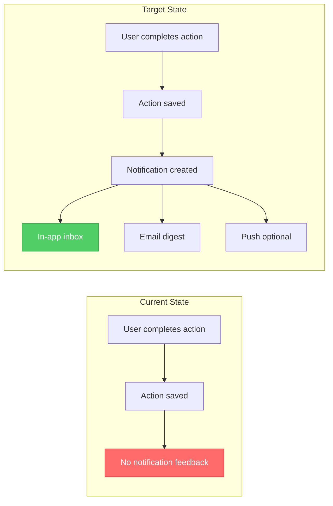
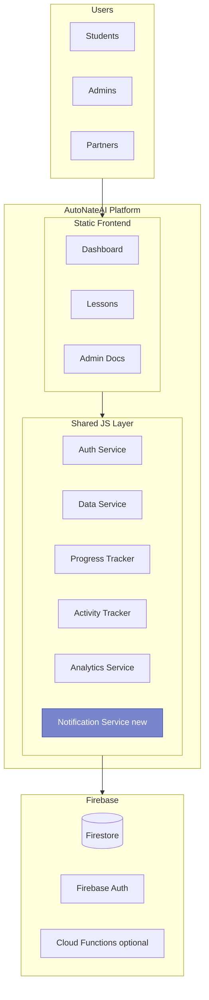
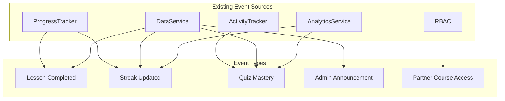
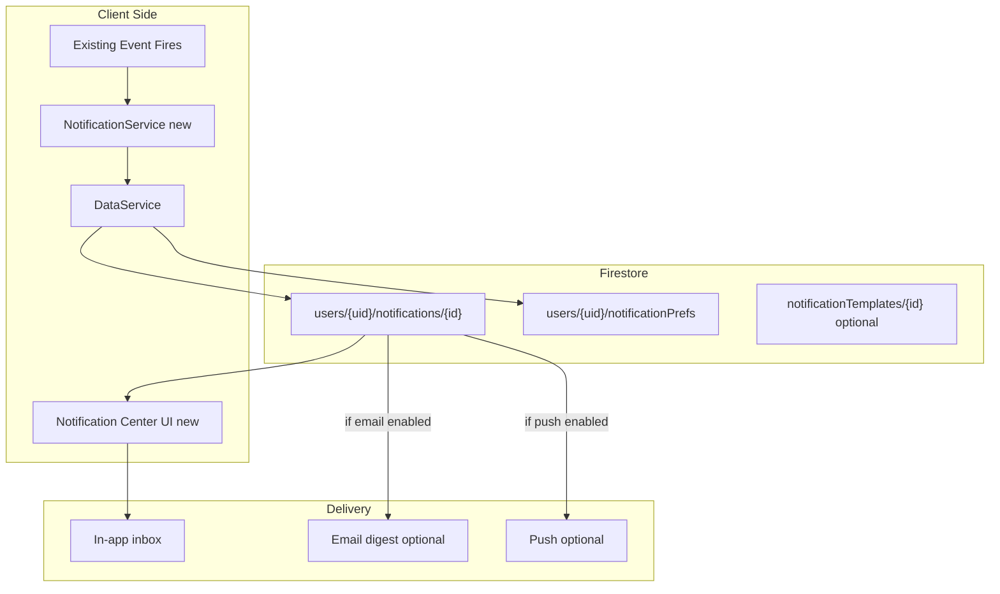
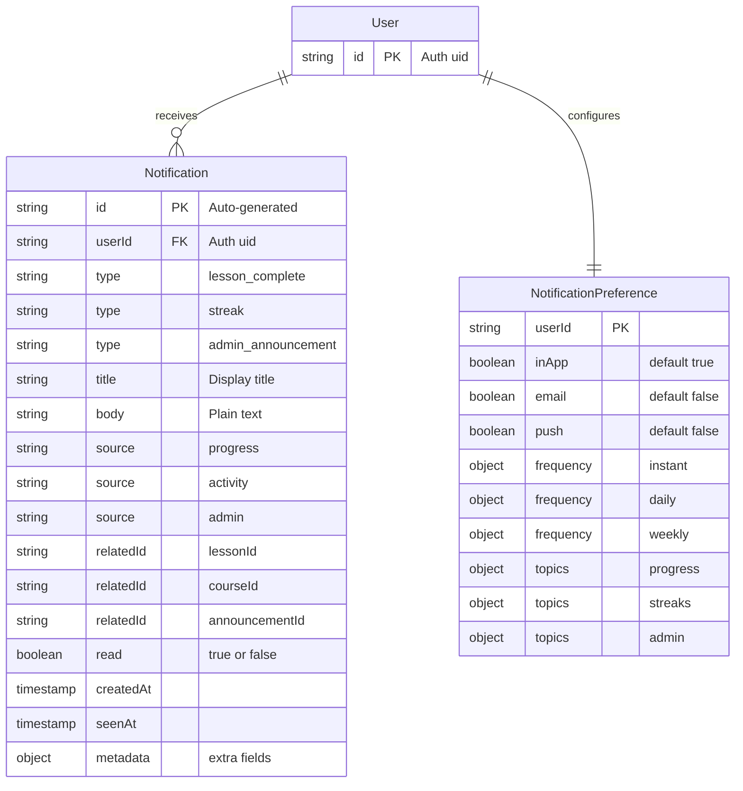
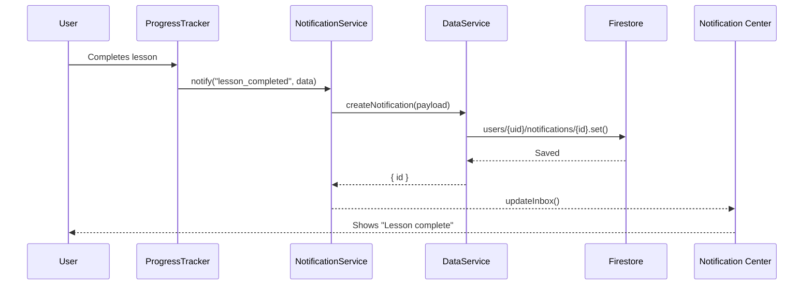
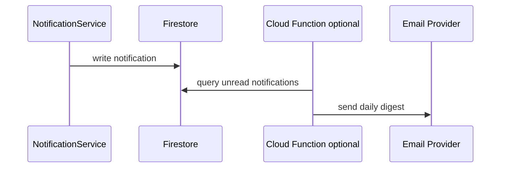
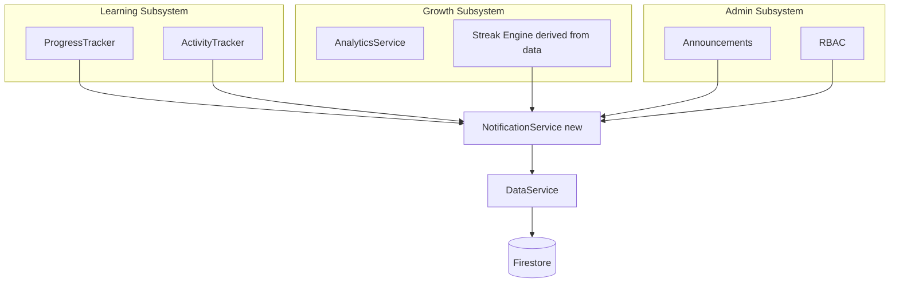
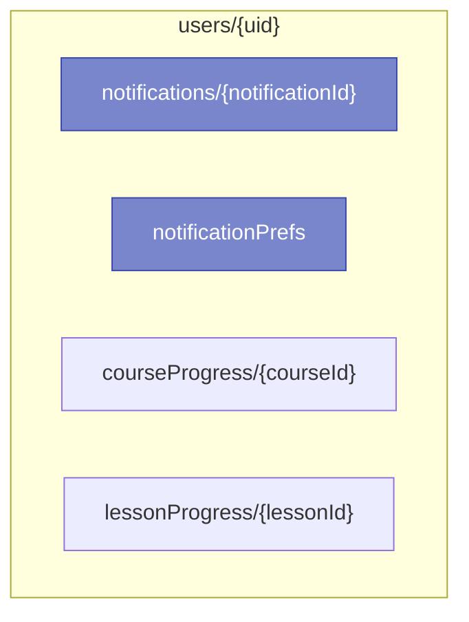
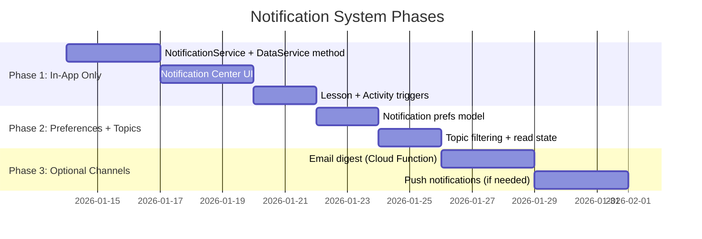

# Notification Architecture Research (AutoNateAI)

> **Purpose:** Define a reuse-first notification architecture that integrates with AutoNateAI subsystems without introducing unnecessary new patterns.

## The Vision

### The Story: Closing the Feedback Loop

AutoNateAI already captures progress, activity attempts, and analytics. But when a student finishes a lesson or earns a streak, nothing **tells** them it happened. Notifications turn silent achievements into visible momentum — without adding new infrastructure unless it is required.

---

## Reuse-First Principles

| Principle                     | Reuse Target                                            | Why It Matters                                  |
| ---------------------------- | ------------------------------------------------------- | ----------------------------------------------- |
| **Shared JS Services**       | `data-service.js`, `auth.js`, `analytics-service.js`    | Consistent patterns, less duplication           |
| **Firestore-Centric Data**   | `users/{uid}/...` collections                            | Matches existing data model                     |
| **Client-First Rendering**   | Dashboard + lesson UI patterns                           | Minimal backend needs                           |
| **RBAC + Route Guard**       | Partner and admin access controls                        | Notifications should respect org boundaries     |
| **Event-Driven by Existing** | ProgressTracker + ActivityTracker events                | No new tracking system required                 |

---

## System Context

---

## Notification Sources (Reuse Existing Subsystems)

**Why reuse matters:** These subsystems already emit or detect the moments that matter. The notification layer should **listen** to existing events instead of creating new ones.

---

## Proposed Architecture (Minimal New Patterns)

### The Story: Keep It Client-First

The first iteration keeps notifications **in-app only** by default. Email or push are **optional extensions** and only add backend work if truly necessary.

---

## Data Model (Firestore)

---

## Delivery Flow (In-App)

---

## Delivery Flow (Email Digest - Optional)

**Why optional:** Email introduces infrastructure (background jobs, templates, deliverability). It is only justified once in-app usage proves value.

---

## Reuse Patterns vs New Patterns

| Area                         | Reuse                                | New (Only If Necessary)                   | Necessity Trigger                          |
| ---------------------------- | ------------------------------------ | ----------------------------------------- | ------------------------------------------ |
| **Data Access**              | `DataService` write/read conventions | `createNotification()` method             | Single gateway for Firestore writes        |
| **User Identity**            | `AuthService`                        | None                                      | Already required for user scoping          |
| **Event Sources**            | Progress/Activity trackers           | `NotificationService`                    | Glue layer to normalize events             |
| **UI Pattern**               | Dashboard card layouts               | Notification Center panel                 | Visibility and read/unread management      |
| **Delivery**                 | In-app Firestore reads               | Cloud Function for email/push             | Cross-device + scheduled delivery          |
| **Templates**                | Simple inline strings                | `notificationTemplates` collection        | Multi-channel formatting reuse             |

---

## Subsystem Integration Map

---

## Firestore Structure (Reuse Pattern)

**Why this structure:** It mirrors existing `courseProgress` and `lessonProgress` patterns, keeping notifications co-located with user data.

---

## Notification Types (Initial Set)

| Type                    | Trigger Source         | Channel   | Example Message                       |
| ----------------------- | ---------------------- | --------- | ------------------------------------- |
| Lesson Complete         | ProgressTracker        | In-app    | "Lesson complete: Origins ✅"         |
| Chapter Milestone       | DataService aggregate  | In-app    | "2/7 chapters complete — keep going!" |
| Streak Achieved         | Analytics/Derived      | In-app    | "3-day streak! 🔥"                     |
| Admin Announcement      | Admin Docs/RBAC        | In-app    | "New cohort starts Monday"            |
| Partner Access Granted  | RBAC                   | In-app    | "Access approved for Partner Course"  |

---

## Implementation Phases

---

## Key Decisions ✅

| Decision                       | Choice                                  | Rationale                                               |
| ----------------------------- | --------------------------------------- | ------------------------------------------------------- |
| **Default Channel**           | In-app only                              | Zero new infra; fastest feedback loop                   |
| **Data Location**             | `users/{uid}/notifications`              | Matches existing user-scoped collections                |
| **Service Pattern**           | `NotificationService` + `DataService`    | Same layering as progress + activity tracking           |
| **Event Integration**         | Listen to existing trackers               | Avoids a new event bus                                  |
| **Email/Push**                | Optional via Cloud Functions             | Only add when requirements demand cross-device delivery |

---

## Next Steps

1. **Add `NotificationService`** to `courses/shared/js/` following existing service patterns.
2. **Extend `DataService`** with `createNotification()` and `getNotifications()`.
3. **Create Notification Center UI** on dashboard using existing card styles.
4. **Wire triggers** from ProgressTracker and ActivityTracker.
5. **Ship Phase 1** and measure usage before adding new channels.
