# Partnership Portal Architecture

> **Purpose:** Admin-only portal for managing educational partnerships with organizations, schools, churches, foundations, and businesses. Tracks partner relationships, interactions, custom course offerings, and analytics.

## Feature Overview


## Access Control


---

## Data Model

### Collection Hierarchy


### Entity Relationship Diagram


---

## Collection: `partners`

### Path
`partners/{partnerId}`

### Purpose
Store partner organization information, contact details, and relationship status.

### Schema


### Field Descriptions

| Field | Type | Description | Example |
|-------|------|-------------|---------|
| `id` | string | Auto-generated document ID | `"partner_abc123"` |
| `name` | string | Organization name | `"Endless Opportunities Foundation"` |
| `type` | string | Partner category | `"foundation"`, `"school"`, `"church"`, `"business"`, `"community"` |
| `status` | string | Relationship stage | `"prospect"`, `"active"`, `"paused"`, `"churned"` |
| `contact.name` | string | Primary contact name | `"John Smith"` |
| `contact.email` | string | Contact email | `"john@example.org"` |
| `contact.phone` | string | Contact phone | `"(555) 123-4567"` |
| `contact.title` | string | Contact's job title | `"Executive Director"` |
| `website` | string | Organization website | `"https://example.org"` |
| `description` | string | Partnership notes/description | `"Youth AI education program..."` |
| `logoURL` | string | Partner logo URL | `"https://storage..."` |
| `address` | object | Physical address | `{ street, city, state, zip }` |
| `createdAt` | timestamp | When partner was added | `2024-01-15T...` |
| `updatedAt` | timestamp | Last update time | `2024-01-20T...` |
| `createdBy` | string | Admin UID who created | `"admin_uid"` |
| `lastInteractionId` | string | Most recent interaction | `"inter_xyz789"` |
| `lastInteractionAt` | timestamp | Last interaction date | `2024-01-18T...` |
| `totalInteractions` | number | Count of all interactions | `12` |
| `metrics.totalStudents` | number | Students enrolled | `150` |
| `metrics.totalCourses` | number | Courses offered | `3` |
| `metrics.activeCohorts` | number | Current live cohorts | `1` |
| `metrics.revenue` | number | Total partnership revenue | `5000` |
| `tags` | array | Custom tags | `["ai-education", "youth", "q1-2024"]` |

### Partner Types

| Type | Description |
|------|-------------|
| `school` | K-12 schools, school districts |
| `university` | Colleges and universities |
| `church` | Religious organizations |
| `foundation` | Non-profit foundations |
| `business` | Corporate partners |
| `community` | Community organizations |
| `government` | Government agencies |

### Partner Status Flow


---

## Collection: `partners/{partnerId}/interactions`

### Path
`partners/{partnerId}/interactions/{interactionId}`

### Purpose
Track all touchpoints with partners: calls, meetings, emails, milestones.

### Schema

```javascript
{
  id: "inter_abc123",
  partnerId: "partner_xyz789",
  type: "meeting",           // call | meeting | email | milestone | note
  title: "Discovery Call - AI Education Goals",
  description: "Discussed their goals for teaching AI to youth members...",
  outcome: "Positive - interested in custom curriculum",
  nextSteps: "Send proposal by Friday",
  interactionDate: Timestamp,  // When the interaction occurred
  createdAt: Timestamp,        // When this record was created
  createdBy: "admin_uid",
  attachmentIds: ["attach_1", "attach_2"]
}
```

### Interaction Types

| Type | Icon | Description |
|------|------|-------------|
| `call` | 📞 | Phone or video call |
| `meeting` | 🤝 | In-person or virtual meeting |
| `email` | 📧 | Email correspondence |
| `milestone` | 🎯 | Major achievement (contract signed, cohort started) |
| `note` | 📝 | General note or observation |
| `demo` | 🖥️ | Platform demonstration |
| `proposal` | 📋 | Proposal sent/reviewed |

### Interaction Flow


---

## Collection: `partners/{partnerId}/attachments`

### Path
`partners/{partnerId}/attachments/{attachmentId}`

### Purpose
Store metadata for files associated with partners (actual files in Firebase Storage).

### Schema

```javascript
{
  id: "attach_abc123",
  partnerId: "partner_xyz789",
  interactionId: "inter_123",   // Optional - linked to specific interaction
  type: "document",             // document | image | video | presentation
  name: "Partnership_Proposal_2024.pdf",
  url: "https://storage.googleapis.com/...",
  storagePath: "partners/xyz789/attachments/abc123.pdf",
  mimeType: "application/pdf",
  sizeBytes: 245678,
  description: "Q1 2024 partnership proposal",
  uploadedAt: Timestamp,
  uploadedBy: "admin_uid"
}
```

### Attachment Types

| Type | Extensions | Icon |
|------|------------|------|
| `document` | pdf, doc, docx, txt | 📄 |
| `image` | jpg, png, gif, webp | 🖼️ |
| `video` | mp4, mov, webm | 🎬 |
| `presentation` | ppt, pptx, key | 📊 |
| `spreadsheet` | xls, xlsx, csv | 📈 |
| `screenshot` | png, jpg | 📸 |

### Storage Structure

```
partners/
├── {partnerId}/
│   ├── logo/
│   │   └── logo.png
│   └── attachments/
│       ├── {attachmentId}.pdf
│       ├── {attachmentId}.png
│       └── {attachmentId}.mp4
```

---

## Collection: `partners/{partnerId}/courses`

### Path
`partners/{partnerId}/courses/{courseId}`

### Purpose
Track custom courses and cohorts for each partner.

### Schema

```javascript
{
  id: "pcourse_abc123",
  partnerId: "partner_xyz789",
  courseId: "endless-opportunities",   // Reference to course in system
  courseType: "custom",                 // evergreen | custom | live-cohort
  courseName: "Endless Opportunities AI Bootcamp",
  status: "active",                     // planning | active | completed | cancelled
  cohortSize: 25,
  startDate: Timestamp,
  endDate: Timestamp,
  schedule: "Saturdays 10am-12pm",
  instructor: "Nathan Baker",
  createdAt: Timestamp,
  metrics: {
    enrolled: 25,
    completed: 18,
    avgProgress: 72,
    avgQuizScore: 85
  }
}
```

### Course Types

| Type | Description | Billing |
|------|-------------|---------|
| `evergreen` | One of 4 free core courses | Free |
| `custom` | Custom-built curriculum | Project fee |
| `live-cohort` | Live teaching sessions | Per-cohort fee |
| `digital-access` | Self-paced digital only | Subscription |

---

## Collection: `partners/{partnerId}/analytics`

### Path
`partners/{partnerId}/analytics/{eventId}`

### Purpose
Time-series analytics events for tracking partner engagement over time.

### Schema

```javascript
{
  id: "event_abc123",
  partnerId: "partner_xyz789",
  eventType: "student_enrolled",
  data: {
    courseId: "endless-opportunities",
    studentCount: 5
  },
  timestamp: Timestamp,
  date: "2024-01-15"   // For date-range queries
}
```

### Event Types

| Event Type | Description | Data Fields |
|------------|-------------|-------------|
| `student_enrolled` | New student enrollment | `courseId`, `studentCount` |
| `cohort_started` | Cohort begins | `courseId`, `cohortSize` |
| `cohort_completed` | Cohort finishes | `courseId`, `completionRate` |
| `lesson_completed` | Aggregate lesson completions | `courseId`, `lessonId`, `count` |
| `status_changed` | Partner status update | `oldStatus`, `newStatus` |
| `interaction_logged` | Interaction recorded | `interactionType` |
| `revenue_recorded` | Payment received | `amount`, `invoiceId` |

### Time Series Queries

```javascript
// Get partner activity for last 30 days
db.collection('partners').doc(partnerId)
  .collection('analytics')
  .where('date', '>=', thirtyDaysAgo)
  .orderBy('date', 'desc')

// Get all enrollments for a partner
db.collection('partners').doc(partnerId)
  .collection('analytics')
  .where('eventType', '==', 'student_enrolled')
  .orderBy('timestamp', 'desc')
```

---

## Service Layer: PartnerService

### Architecture


### API Reference

| Method | Parameters | Returns | Description |
|--------|------------|---------|-------------|
| `getPartners(filters?)` | `{ status?, type?, search? }` | `Partner[]` | List all partners with optional filters |
| `getPartner(id)` | `partnerId` | `Partner` | Get single partner |
| `createPartner(data)` | `PartnerInput` | `{ success, partnerId }` | Create new partner |
| `updatePartner(id, data)` | `partnerId, Partial<Partner>` | `{ success }` | Update partner |
| `deletePartner(id)` | `partnerId` | `{ success }` | Soft delete partner |
| `getInteractions(partnerId)` | `partnerId` | `Interaction[]` | Get partner interactions |
| `createInteraction(partnerId, data)` | `partnerId, InteractionInput` | `{ success, interactionId }` | Add interaction |
| `uploadAttachment(partnerId, file, meta)` | `partnerId, File, metadata` | `{ success, attachmentId, url }` | Upload file |
| `getAttachments(partnerId)` | `partnerId` | `Attachment[]` | List attachments |
| `getAnalytics(partnerId, range)` | `partnerId, { start, end }` | `AnalyticsEvent[]` | Get time-series data |
| `recordAnalyticsEvent(partnerId, event)` | `partnerId, EventData` | `{ success }` | Record analytics event |
| `getPartnerStats()` | none | `DashboardStats` | Aggregate stats for dashboard |

### Service Implementation Pattern

```javascript
// shared/js/partner-service.js
const PartnerService = {
  COLLECTION: 'partners',
  
  /**
   * Get all partners with optional filtering
   */
  async getPartners(filters = {}) {
    let query = db.collection(this.COLLECTION);
    
    if (filters.status) {
      query = query.where('status', '==', filters.status);
    }
    if (filters.type) {
      query = query.where('type', '==', filters.type);
    }
    
    query = query.orderBy('updatedAt', 'desc');
    
    const snapshot = await query.get();
    return snapshot.docs.map(doc => ({ id: doc.id, ...doc.data() }));
  },

  /**
   * Create new partner
   */
  async createPartner(data) {
    const user = AuthService.getUser();
    if (!user) throw new Error('Not authenticated');
    
    const permissions = await RBACService.getUserPermissions();
    if (!permissions.isAdmin) throw new Error('Admin access required');
    
    const partner = {
      ...data,
      createdAt: firebase.firestore.FieldValue.serverTimestamp(),
      updatedAt: firebase.firestore.FieldValue.serverTimestamp(),
      createdBy: user.uid,
      totalInteractions: 0,
      metrics: {
        totalStudents: 0,
        totalCourses: 0,
        activeCohorts: 0,
        revenue: 0
      }
    };
    
    const docRef = await db.collection(this.COLLECTION).add(partner);
    
    // Record analytics event
    await this.recordAnalyticsEvent(docRef.id, {
      eventType: 'partner_created',
      data: { partnerType: data.type }
    });
    
    return { success: true, partnerId: docRef.id };
  },

  /**
   * Add interaction to partner
   */
  async createInteraction(partnerId, data) {
    const user = AuthService.getUser();
    
    const interaction = {
      ...data,
      partnerId,
      createdAt: firebase.firestore.FieldValue.serverTimestamp(),
      createdBy: user.uid,
      attachmentIds: []
    };
    
    const interactionRef = await db.collection(this.COLLECTION)
      .doc(partnerId)
      .collection('interactions')
      .add(interaction);
    
    // Update partner's last interaction
    await db.collection(this.COLLECTION).doc(partnerId).update({
      lastInteractionId: interactionRef.id,
      lastInteractionAt: firebase.firestore.FieldValue.serverTimestamp(),
      totalInteractions: firebase.firestore.FieldValue.increment(1),
      updatedAt: firebase.firestore.FieldValue.serverTimestamp()
    });
    
    // Record analytics event
    await this.recordAnalyticsEvent(partnerId, {
      eventType: 'interaction_logged',
      data: { interactionType: data.type }
    });
    
    return { success: true, interactionId: interactionRef.id };
  },

  /**
   * Upload attachment to Firebase Storage
   */
  async uploadAttachment(partnerId, file, metadata = {}) {
    const user = AuthService.getUser();
    const attachmentId = db.collection('_').doc().id;
    
    // Upload to Storage
    const storagePath = `partners/${partnerId}/attachments/${attachmentId}_${file.name}`;
    const storageRef = firebase.storage().ref(storagePath);
    await storageRef.put(file);
    const url = await storageRef.getDownloadURL();
    
    // Create Firestore record
    const attachment = {
      id: attachmentId,
      partnerId,
      interactionId: metadata.interactionId || null,
      type: this._getAttachmentType(file.type),
      name: file.name,
      url,
      storagePath,
      mimeType: file.type,
      sizeBytes: file.size,
      description: metadata.description || '',
      uploadedAt: firebase.firestore.FieldValue.serverTimestamp(),
      uploadedBy: user.uid
    };
    
    await db.collection(this.COLLECTION)
      .doc(partnerId)
      .collection('attachments')
      .doc(attachmentId)
      .set(attachment);
    
    return { success: true, attachmentId, url };
  },

  /**
   * Get time-series analytics for a partner
   */
  async getAnalytics(partnerId, { startDate, endDate }) {
    const snapshot = await db.collection(this.COLLECTION)
      .doc(partnerId)
      .collection('analytics')
      .where('timestamp', '>=', startDate)
      .where('timestamp', '<=', endDate)
      .orderBy('timestamp', 'asc')
      .get();
    
    return snapshot.docs.map(doc => ({ id: doc.id, ...doc.data() }));
  },

  /**
   * Get aggregate dashboard statistics
   */
  async getPartnerStats() {
    const snapshot = await db.collection(this.COLLECTION).get();
    
    const stats = {
      total: 0,
      byStatus: { prospect: 0, active: 0, paused: 0, churned: 0 },
      byType: {},
      totalStudents: 0,
      totalRevenue: 0,
      recentInteractions: []
    };
    
    snapshot.docs.forEach(doc => {
      const partner = doc.data();
      stats.total++;
      stats.byStatus[partner.status] = (stats.byStatus[partner.status] || 0) + 1;
      stats.byType[partner.type] = (stats.byType[partner.type] || 0) + 1;
      stats.totalStudents += partner.metrics?.totalStudents || 0;
      stats.totalRevenue += partner.metrics?.revenue || 0;
    });
    
    return stats;
  },

  // Helper methods
  _getAttachmentType(mimeType) {
    if (mimeType.startsWith('image/')) return 'image';
    if (mimeType.startsWith('video/')) return 'video';
    if (mimeType.includes('presentation') || mimeType.includes('powerpoint')) return 'presentation';
    if (mimeType.includes('spreadsheet') || mimeType.includes('excel')) return 'spreadsheet';
    return 'document';
  }
};
```

---

## Frontend Pages

### Page Structure

```
admin/
├── partnerships/
│   ├── index.html        # Partner list dashboard
│   ├── partner.html      # Single partner detail
│   ├── add.html          # Add new partner
│   └── analytics.html    # Partnership analytics
```

### Route Guard Configuration

```javascript
// Add to RBACService.COURSE_REGISTRY or route-guard.js
{
  'admin/partnerships': {
    requiresAuth: true,
    requiresRole: 'admin'
  }
}
```

### Partner List Page (`index.html`)


### Partner Detail Page (`partner.html`)


### UI Components


---

## Analytics Dashboard

### Time Series Visualization

```mermaid
flowchart TB
    subgraph DataSources["📊 Data Sources"]
        INTERACTIONS[Interaction Events]
        ENROLLMENTS[Enrollment Events]
        COMPLETIONS[Completion Events]
        REVENUE[Revenue Events]
    end

    subgraph Processing["⚙️ Processing"]
        AGG[Aggregate by Date]
        CALC[Calculate Trends]
        COMPARE[Period Comparison]
    end

    subgraph Visualization["📈 Charts"]
        LINE[Activity Line Chart]
        BAR[Partners by Status]
        PIE[Partners by Type]
        TABLE[Top Partners Table]
    end

    DataSources --> Processing
    Processing --> Visualization
```



### Dashboard Widgets

| Widget | Data Source | Visualization |
|--------|-------------|---------------|
| Partners by Status | `partners` collection | Donut chart |
| Partners by Type | `partners` collection | Bar chart |
| Activity Timeline | `analytics` subcollection | Line chart |
| Recent Interactions | All `interactions` | Feed/list |
| Top Partners | Aggregated metrics | Table |
| Student Enrollment | `analytics` events | Area chart |
| Revenue Over Time | `analytics` events | Line chart |

### Chart Library

Use Chart.js (already in stack) or ApexCharts for:
- Time series line charts
- Bar/column charts  
- Donut/pie charts
- Area charts with gradients

```html
<!-- Chart.js setup -->
<script src="https://cdn.jsdelivr.net/npm/chart.js"></script>

<canvas id="activityChart"></canvas>

<script>
  const ctx = document.getElementById('activityChart');
  new Chart(ctx, {
    type: 'line',
    data: {
      labels: dates,
      datasets: [{
        label: 'Interactions',
        data: interactionCounts,
        borderColor: '#7986cb',
        tension: 0.4
      }]
    },
    options: {
      responsive: true,
      plugins: {
        legend: { position: 'top' }
      }
    }
  });
</script>
```

---

## Security Rules

```javascript
rules_version = '2';
service cloud.firestore {
  match /databases/{database}/documents {
    // Helper: Check if user is admin
    function isAdmin() {
      return request.auth != null && 
             get(/databases/$(database)/documents/users/$(request.auth.uid)).data.role == 'admin';
    }
    
    // Partners collection - admin only
    match /partners/{partnerId} {
      allow read, write: if isAdmin();
      
      // Subcollections
      match /interactions/{interactionId} {
        allow read, write: if isAdmin();
      }
      
      match /attachments/{attachmentId} {
        allow read, write: if isAdmin();
      }
      
      match /courses/{courseId} {
        allow read, write: if isAdmin();
      }
      
      match /analytics/{eventId} {
        allow read, write: if isAdmin();
      }
    }
  }
}
```

### Storage Rules

```javascript
rules_version = '2';
service firebase.storage {
  match /b/{bucket}/o {
    // Partner attachments - admin only
    match /partners/{partnerId}/{allPaths=**} {
      allow read, write: if request.auth != null && 
        firestore.get(/databases/(default)/documents/users/$(request.auth.uid)).data.role == 'admin';
    }
  }
}
```

---

## Implementation Phases

### Phase 1: Foundation
- [ ] Create `partners` collection and schema
- [ ] Implement `PartnerService` basic CRUD
- [ ] Create partner list page (`admin/partnerships/index.html`)
- [ ] Create add partner form (`admin/partnerships/add.html`)
- [ ] Add security rules

### Phase 2: Interactions
- [ ] Create `interactions` subcollection
- [ ] Implement interaction CRUD in service
- [ ] Create partner detail page with timeline
- [ ] Add interaction form modal

### Phase 3: Attachments
- [ ] Set up Firebase Storage structure
- [ ] Implement file upload in service
- [ ] Create attachment gallery component
- [ ] Link attachments to interactions

### Phase 4: Analytics
- [ ] Create `analytics` subcollection
- [ ] Implement analytics recording
- [ ] Build analytics dashboard
- [ ] Add time-series charts

### Phase 5: Polish
- [ ] Add search and filtering
- [ ] Implement export functionality
- [ ] Add bulk operations
- [ ] Performance optimization

---

## Index Requirements

### Composite Indexes Needed

| Collection | Fields | Order |
|------------|--------|-------|
| `partners` | `status`, `updatedAt` | ASC, DESC |
| `partners` | `type`, `updatedAt` | ASC, DESC |
| `interactions` | `partnerId`, `interactionDate` | ASC, DESC |
| `analytics` | `partnerId`, `timestamp` | ASC, ASC |
| `analytics` | `eventType`, `timestamp` | ASC, DESC |

---

## Related Documentation

- [02-page-types.md](./02-page-types.md) - Admin page patterns
- [03-data-model.md](./03-data-model.md) - Firestore patterns
- [04-authentication-rbac.md](./04-authentication-rbac.md) - RBAC system
- [01-service-layer.md](./01-service-layer.md) - Service architecture
