# Interactive Lessons Migration Plan

> **Transform static lessons into AI-narrated, animated learning experiences with integrated quizzes**

This document outlines the architecture for migrating the SWE Hackers course lessons from static HTML to the interactive storytelling format used in the platform documentation.

---

## Table of Contents

1. [Executive Summary](#executive-summary)
2. [Current Architecture Analysis](#current-architecture-analysis)
3. [Target Architecture](#target-architecture)
4. [Service Layer Inventory](#service-layer-inventory)
5. [Data Model Requirements](#data-model-requirements)
6. [Component Mapping](#component-mapping)
7. [Migration Strategy](#migration-strategy)
8. [Implementation Phases](#implementation-phases)
9. [File Structure](#file-structure)

---

## Executive Summary

### The Vision

Transform SWE Hackers course lessons from **static educational content** into **interactive, AI-narrated storytelling experiences** that:

- 🎬 **Animate concepts** with Cytoscape.js graph diagrams
- 🎙️ **Narrate explanations** with pre-generated AI voices
- 📊 **Track progress** visually with step-by-step progression
- 📝 **Test understanding** with integrated quizzes after each concept
- ⏯️ **Allow control** via play/pause, speed adjustment, and navigation dots

### What Makes This Phenomenal

```mermaid
graph LR
    subgraph CURRENT["📚 Current Lessons"]
        A1[Static Mermaid Diagrams]
        A2[Basic Quizzes]
        A3[Scroll-Based Progress]
    end

    subgraph UPGRADE["🚀 Interactive Lessons"]
        B1[Animated Cytoscape Diagrams]
        B2[AI Voice Narration]
        B3[Step-by-Step Stories]
        B4[Integrated Quiz System]
        B5[Word-by-Word Highlighting]
    end

    CURRENT -->|Transform| UPGRADE

    style CURRENT fill:#2d2d44,stroke:#8b949e
    style UPGRADE fill:#1a3a2a,stroke:#4db6ac
```

---

## Current Architecture Analysis

### Current Lesson Structure

```
courses/
├── apprentice/           # 7 chapters
│   ├── ch0-origins/
│   ├── ch1-stone/        # Variables, data types
│   ├── ch2-lightning/    # Conditionals
│   ├── ch3-magnetism/    # Loops
│   ├── ch4-architect/    # Functions
│   ├── ch5-capstone1/
│   └── ch6-capstone2/
├── undergrad/            # 7 chapters (same structure)
├── junior/               # 7 chapters (same structure)
├── senior/               # 7 chapters (same structure)
└── shared/
    ├── css/
    │   └── lesson.css
    └── js/
        ├── firebase-config.js
        ├── auth.js
        ├── data-service.js
        ├── progress-tracker.js
        ├── activity-tracker.js
        ├── lesson-integration.js
        └── lesson.js
```

### Current Lesson Components

Each lesson currently uses:

| Component       | Technology            | Limitations                        |
| --------------- | --------------------- | ---------------------------------- |
| **Diagrams**    | Mermaid.js            | Static, no animation, no narration |
| **Code Blocks** | Custom CSS + Prism.js | No guided walkthrough              |
| **Quizzes**     | Basic quiz containers | Not tied to learning flow          |
| **Progress**    | IntersectionObserver  | Scroll-based, not concept-based    |
| **Activities**  | Drag-drop, demos      | Isolated, not story-integrated     |

### Current Services Used by Lessons

```mermaid
flowchart TD
    subgraph LESSON["📚 Lesson Page"]
        HTML[lesson HTML]
    end

    subgraph SERVICES["⚙️ Shared Services"]
        FC[firebase-config.js]
        AUTH[auth.js]
        DATA[data-service.js]
        LI[lesson-integration.js]
        PT[progress-tracker.js]
        AT[activity-tracker.js]
        LS[lesson.js]
    end

    HTML --> FC
    HTML --> AUTH
    HTML --> DATA
    HTML --> LI
    HTML --> PT
    HTML --> AT
    HTML --> LS

    FC --> AUTH
    AUTH --> DATA
    DATA --> PT
    DATA --> AT
    LI --> PT
    LI --> AT

    style LESSON fill:#2d2d44,stroke:#7986cb
    style SERVICES fill:#1a2a1a,stroke:#4db6ac
```

---

## Target Architecture

### Interactive Docs Template Structure

The `interactive-docs` system uses this component stack:

```mermaid
flowchart TD
    subgraph HTML["📄 Lesson HTML"]
        HEAD[Head: Fonts, Styles, Deps]
        HEADER[Header: Nav, Branding]
        SECTIONS[Sections: Stories + Quizzes]
        SCRIPTS[Scripts: Engines + Data]
    end

    subgraph ENGINES["⚙️ Shared Engines"]
        DU[diagram-utils.js]
        AE[audio-engine.js]
        SD[storytelling-diagram.js]
        QS[quiz-system.js]
    end

    subgraph DATA["📦 Story Data"]
        JSON[lessonId.json]
        AUDIO[audio/stories/lessonId/]
    end

    subgraph LIBS["📚 External Libraries"]
        CYTO[Cytoscape.js]
        ANIME[Anime.js]
        DAGRE[Dagre Layout]
    end

    SECTIONS --> ENGINES
    ENGINES --> DATA
    ENGINES --> LIBS

    style HTML fill:#2d2d44,stroke:#7986cb
    style ENGINES fill:#1a2a1a,stroke:#4db6ac
    style DATA fill:#2d2d44,stroke:#ffd54f
    style LIBS fill:#1a1a2d,stroke:#8b949e
```

### Template Anatomy (from `00-overview.html`)

```html
<!-- 1. SECTION: Audio Info Banner -->
<section class="section audio-info-section">
  <div class="info-box compact">
    <span class="info-icon">🎙️</span>
    <h4>Self-Narrating Architecture</h4>
    <p>Watch diagrams come alive with AI narration...</p>
  </div>
</section>

<!-- 2. SECTION: Story + Diagram + Quiz -->
<section class="section" id="concept-section">
  <h2>Concept Title</h2>
  <p>Introduction paragraph...</p>

  <!-- DIAGRAM CONTAINER -->
  <div class="diagram-container" id="concept-container">
    <div class="diagram-header">
      <span class="diagram-title">📊 Diagram Title</span>
    </div>
    <div id="concept-story" class="diagram-canvas storytelling"></div>

    <!-- Live Caption Area -->
    <div class="diagram-story" id="concept-story-caption">
      <div class="story-step">
        <div class="story-icon visible">🚀</div>
        <div class="story-content">
          <div class="story-title visible">Ready to Explore</div>
          <div class="story-text visible">Click Play...</div>
        </div>
      </div>
    </div>

    <!-- Playback Controls -->
    <div class="playback-controls">
      <button class="diagram-btn play-btn" data-action="play">▶ Play</button>
      <div class="story-progress" id="concept-story-progress"></div>
      <button class="diagram-btn small" data-action="fit">Fit</button>
    </div>

    <!-- Settings: Speed, Audio, Voice -->
    <div class="settings-bar">
      <select id="concept-speed-select">
        ...
      </select>
      <button class="audio-toggle">🔊</button>
      <select class="voice-select">
        ...
      </select>
    </div>
  </div>

  <!-- QUIZ CARD -->
  <div class="quiz-card" id="concept-quiz">
    <div class="quiz-header">
      <h4>📝 Check Your Understanding</h4>
      <div class="quiz-progress">...</div>
    </div>
    <div class="quiz-carousel"></div>
    <div class="quiz-nav">...</div>
  </div>
</section>
```

---

## Service Layer Inventory

### Current Platform Services

| Service               | File                    | Purpose                       | Used By Lessons      |
| --------------------- | ----------------------- | ----------------------------- | -------------------- |
| **FirebaseApp**       | `firebase-config.js`    | Firebase SDK initialization   | ✅ Yes               |
| **AuthService**       | `auth.js`               | User authentication           | ✅ Yes               |
| **DataService**       | `data-service.js`       | Firestore CRUD operations     | ✅ Yes               |
| **RBACService**       | `rbac.js`               | Role-based access control     | Partner courses only |
| **ProgressTracker**   | `progress-tracker.js`   | Scroll-based section tracking | ✅ Yes               |
| **ActivityTracker**   | `activity-tracker.js`   | Quiz/activity completion      | ✅ Yes               |
| **AnalyticsService**  | `analytics-service.js`  | Learning metrics calculation  | Dashboard only       |
| **RouteGuard**        | `route-guard.js`        | Page access protection        | Protected pages      |
| **LessonIntegration** | `lesson-integration.js` | Lesson page orchestration     | ✅ Yes               |
| **Lesson**            | `lesson.js`             | UI animations, interactions   | ✅ Yes               |
| **Navbar**            | `navbar.js`             | Navigation component          | All pages            |
| **Blog**              | `blog.js`               | Blog-specific features        | Blog only            |
| **PartnerService**    | `partner-service.js`    | Partner org management        | Partner portal       |

### Interactive Docs Engines (NEW)

| Engine                   | File                      | Purpose                            | Needs Integration    |
| ------------------------ | ------------------------- | ---------------------------------- | -------------------- |
| **DiagramUtils**         | `diagram-utils.js`        | Cytoscape styling, layouts, export | New component        |
| **AudioNarrationEngine** | `audio-engine.js`         | Audio playback, word timing        | New component        |
| **StorytellingDiagram**  | `storytelling-diagram.js` | Animated story orchestration       | New component        |
| **Quiz**                 | `quiz-system.js`          | Carousel quiz with scoring         | Replace current quiz |

### Service Dependency Graph

```mermaid
flowchart TB
    subgraph PLATFORM["🏗️ Platform Services (Keep)"]
        FC[firebase-config.js]
        AUTH[auth.js]
        DATA[data-service.js]
        RBAC[rbac.js]
        RG[route-guard.js]
        AN[analytics-service.js]
    end

    subgraph TRACKERS["📊 Tracking Services (Keep)"]
        PT[progress-tracker.js]
        AT[activity-tracker.js]
    end

    subgraph LESSON_CURRENT["📚 Current Lesson (Replace)"]
        LI[lesson-integration.js]
        LS[lesson.js]
    end

    subgraph INTERACTIVE["🚀 Interactive Engines (Add)"]
        DU[diagram-utils.js]
        AE[audio-engine.js]
        SD[storytelling-diagram.js]
        QS[quiz-system.js]
    end

    FC --> AUTH
    AUTH --> DATA
    AUTH --> RBAC
    RBAC --> RG
    DATA --> PT
    DATA --> AT
    DATA --> AN

    LI --> PT
    LI --> AT

    SD --> DU
    SD --> AE
    SD --> QS

    PT -.->|Integrate| SD
    AT -.->|Integrate| QS

    style PLATFORM fill:#2d2d44,stroke:#7986cb
    style TRACKERS fill:#1a2a1a,stroke:#4db6ac
    style LESSON_CURRENT fill:#3d2d2d,stroke:#ef5350
    style INTERACTIVE fill:#1a3a2a,stroke:#4db6ac
```

---

## Data Model Requirements

### Story JSON Schema

Each lesson needs a JSON file following this schema:

```json
{
  "pageId": "ch1-stone",
  "courseId": "apprentice",
  "stories": [
    {
      "id": "variables-story",
      "diagramId": "variables-diagram",
      "title": "Variables: Your Computer's Memory",
      "steps": [
        {
          "nodeId": "brain",
          "icon": "🧠",
          "title": "Your Brain Has Memory",
          "narration": "Imagine your brain had no memory...",
          "connectsTo": null
        },
        {
          "nodeId": "variable",
          "edges": [{ "from": "brain", "to": "variable" }],
          "icon": "📦",
          "title": "Variables Are Labeled Boxes",
          "narration": "A variable is like a labeled box...",
          "connectsTo": "Brain"
        }
      ]
    }
  ],
  "quizzes": [
    {
      "storyId": "variables-story",
      "questions": [
        {
          "question": "What is a variable?",
          "options": ["A number", "A labeled container for data", "A command"],
          "correct": 1,
          "explanation": "Variables store values with names."
        }
      ]
    }
  ]
}
```

### Audio File Structure

```
courses/
└── audio/
    └── stories/
        └── apprentice/
            └── ch1-stone/
                └── variables-story/
                    ├── step-0.mp3    # "Imagine your brain..."
                    ├── step-1.mp3    # "A variable is like..."
                    ├── step-2.mp3
                    └── timing.json   # Word timings for highlighting
```

### Progress Data Model Updates

Current progress tracking needs extension:

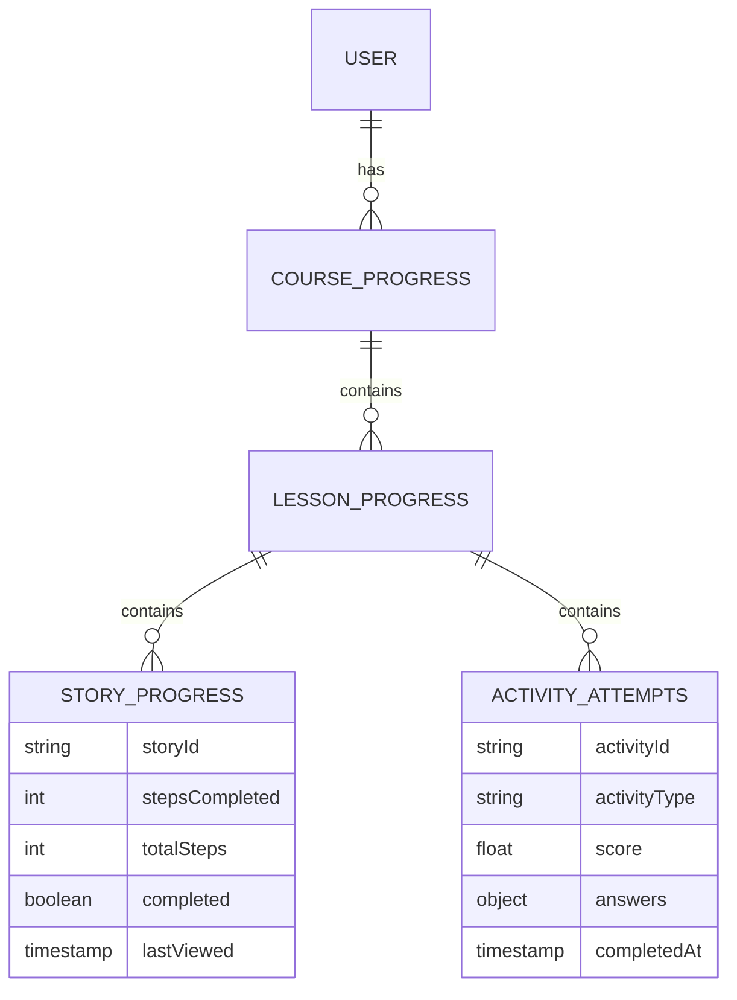

### New Firestore Collections

```javascript
// Path: users/{uid}/courseProgress/{courseId}/lessonProgress/{lessonId}
{
  lessonId: "ch1-stone",
  courseId: "apprentice",

  // Existing fields
  progress: 75,
  sectionsViewed: ["hero", "story", "concepts"],
  completedAt: null,

  // NEW: Story-specific progress
  stories: {
    "variables-story": {
      stepsCompleted: 5,
      totalSteps: 8,
      completed: false,
      lastStepIndex: 4
    },
    "datatypes-story": {
      stepsCompleted: 3,
      totalSteps: 6,
      completed: false,
      lastStepIndex: 2
    }
  }
}
```

---

## Component Mapping

### Current → Interactive Transformation

| Current Component  | Interactive Equivalent          | Migration Complexity          |
| ------------------ | ------------------------------- | ----------------------------- |
| Mermaid diagram    | Cytoscape StorytellingDiagram   | 🔴 High (content rewrite)     |
| Static code block  | Animated code walkthrough story | 🔴 High (new format)          |
| Quiz container     | Quiz carousel with carousel nav | 🟡 Medium (same data, new UI) |
| Drag-drop activity | Keep as-is, add quiz fallback   | 🟢 Low (keep existing)        |
| Demo container     | Keep as-is, track in stories    | 🟢 Low (keep existing)        |
| Concept cards      | Transform to story steps        | 🟡 Medium (content mapping)   |

### Content Transformation Example

**Current Chapter 1 Sections:**

1. 🌌 The Story (brain memory analogy)
2. 📦 Core Concepts (concept cards)
3. 📦 Variables Deep Dive (code + demo)
4. 🏷️ Data Types (diagram + drag-drop)
5. 🧠 Quiz 1
6. 📥 Input (code examples)
7. ⚡ Try It (code challenge)
8. 🔨 Chapter Project

**Transformed to Stories:**

```mermaid
flowchart LR
    subgraph STORY1["Story 1: Memory Metaphor"]
        S1A[Brain has memory]
        S1B[Computer needs memory too]
        S1C[Variables = labeled boxes]
        S1D[Store and retrieve]
    end

    subgraph QUIZ1["Quiz 1"]
        Q1[What is a variable?]
    end

    subgraph STORY2["Story 2: Data Types"]
        S2A[Strings = text]
        S2B[Integers = whole numbers]
        S2C[Floats = decimals]
        S2D[Booleans = true/false]
    end

    subgraph QUIZ2["Quiz 2"]
        Q2[Match the type]
    end

    subgraph STORY3["Story 3: Input/Output"]
        S3A[input gets user data]
        S3B[print shows output]
        S3C[Combining them]
    end

    STORY1 --> QUIZ1
    QUIZ1 --> STORY2
    STORY2 --> QUIZ2
    QUIZ2 --> STORY3

    style STORY1 fill:#1a3a2a,stroke:#4db6ac
    style STORY2 fill:#1a3a2a,stroke:#4db6ac
    style STORY3 fill:#1a3a2a,stroke:#4db6ac
    style QUIZ1 fill:#3a2a1a,stroke:#ffd54f
    style QUIZ2 fill:#3a2a1a,stroke:#ffd54f
```

---

## Migration Strategy

### Overview: Cursor Rule + Parallel Agents

The migration leverages **Cursor rules** to enable **parallel agent conversion**. After the foundation is in place, a dedicated cursor rule guides any agent through the conversion process, allowing multiple lessons to be converted simultaneously.

```mermaid
flowchart LR
    subgraph PHASE1["Phase 1: Foundation"]
        P1A[Copy interactive engines]
        P1B[Create integration layer]
        P1C[Test with pilot lesson]
    end

    subgraph PHASE2["Phase 2: Cursor Rule"]
        P2A[Create convert-lesson.mdc]
        P2B[Document conversion process]
        P2C[Test rule with ch1-stone]
    end

    subgraph PHASE3["Phase 3: Parallel Conversion"]
        A1[Agent 1: ch0-origins]
        A2[Agent 2: ch1-stone]
        A3[Agent 3: ch2-lightning]
        A4[Agent N: ...]
    end

    subgraph PHASE4["Phase 4: Audio + Testing"]
        P4A[Generate audio files]
        P4B[Test each lesson]
        P4C[Fix issues]
    end

    PHASE1 --> PHASE2
    PHASE2 --> PHASE3
    PHASE3 --> PHASE4

    style PHASE1 fill:#2d2d44,stroke:#7986cb
    style PHASE2 fill:#1a3a2a,stroke:#4db6ac
    style PHASE3 fill:#3a2a1a,stroke:#ffd54f
    style PHASE4 fill:#2d3a2d,stroke:#81c784
```

### Phase 1: Foundation (Week 1)

**Goal:** Set up shared infrastructure for interactive lessons

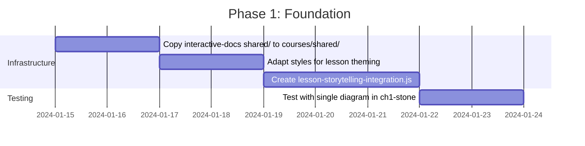

**Tasks:**

1. Copy `interactive-docs/shared/` → `courses/shared/js/interactive/`
2. Create `lesson-styles-interactive.css` extending base styles
3. Build `lesson-storytelling-integration.js`:
   - Initialize `StorytellingDiagram` instances
   - Connect to `ProgressTracker` and `ActivityTracker`
   - Handle story completion → progress save
4. Test: Add one interactive story to ch1-stone

**Deliverables:**

- [ ] `courses/shared/js/interactive/` folder with all engines
- [ ] `courses/shared/css/lesson-interactive.css`
- [ ] Working pilot in ch1-stone with one diagram

### Phase 2: Create Cursor Rule (Week 2)

**Goal:** Create a reusable cursor rule that any agent can follow to convert a lesson

**Cursor Rule Location:** `.cursor/rules/convert-lesson.mdc`

The rule will:

1. Read the existing lesson HTML
2. Preserve the storytelling essence and chapter theme
3. Extract concepts into animated story steps
4. Create story JSON with narration text
5. Generate Cytoscape diagram elements
6. Update HTML with interactive components
7. Convert existing quizzes to new format
8. Output files ready for audio generation

**Deliverables:**

- [ ] `.cursor/rules/convert-lesson.mdc` - The conversion rule
- [ ] Tested on ch1-stone end-to-end
- [ ] Documentation for parallel agent usage

### Phase 3: Parallel Agent Conversion (Week 3-4)

**Goal:** Convert all 28 lessons using parallel Cursor agents

Each agent receives:

- The cursor rule `@convert-lesson`
- A specific lesson path (e.g., `@swe-hackers/courses/apprentice/ch2-lightning/index.html`)

**Parallelization Strategy:**

```mermaid
flowchart TB
    subgraph APPRENTICE["Apprentice (7 lessons)"]
        direction LR
        A0[ch0-origins]
        A1[ch1-stone]
        A2[ch2-lightning]
        A3[ch3-magnetism]
        A4[ch4-architect]
        A5[ch5-capstone1]
        A6[ch6-capstone2]
    end

    subgraph UNDERGRAD["Undergrad (7 lessons)"]
        direction LR
        U0[ch0-origins]
        U1[ch1-stone]
        U2[ch2-lightning]
        U3[ch3-magnetism]
        U4[ch4-architect]
        U5[ch5-capstone1]
        U6[ch6-capstone2]
    end

    subgraph JUNIOR["Junior (7 lessons)"]
        direction LR
        J0[ch0-origins]
        J1[ch1-stone]
        J2[ch2-lightning]
        J3[ch3-magnetism]
        J4[ch4-architect]
        J5[ch5-capstone1]
        J6[ch6-capstone2]
    end

    subgraph SENIOR["Senior (7 lessons)"]
        direction LR
        S0[ch0-origins]
        S1[ch1-stone]
        S2[ch2-lightning]
        S3[ch3-magnetism]
        S4[ch4-architect]
        S5[ch5-capstone1]
        S6[ch6-capstone2]
    end

    style APPRENTICE fill:#1a3a2a,stroke:#4db6ac
    style UNDERGRAD fill:#2d2d44,stroke:#7986cb
    style JUNIOR fill:#3a2a1a,stroke:#ffd54f
    style SENIOR fill:#2d3a2d,stroke:#81c784
```

**Agent Command Template:**

```
@convert-lesson Convert @swe-hackers/courses/apprentice/ch2-lightning/index.html
```

**Batch Conversion Order:**

| Batch   | Lessons                       | Agents Needed |
| ------- | ----------------------------- | ------------- |
| Batch 1 | All ch0-origins (4 lessons)   | 4 agents      |
| Batch 2 | All ch1-stone (4 lessons)     | 4 agents      |
| Batch 3 | All ch2-lightning (4 lessons) | 4 agents      |
| Batch 4 | All ch3-magnetism (4 lessons) | 4 agents      |
| Batch 5 | All ch4-architect (4 lessons) | 4 agents      |
| Batch 6 | All ch5-capstone1 (4 lessons) | 4 agents      |
| Batch 7 | All ch6-capstone2 (4 lessons) | 4 agents      |

**Or by course (less parallel, more focused):**

| Batch   | Course     | Lessons | Agents   |
| ------- | ---------- | ------- | -------- |
| Batch 1 | Apprentice | 7       | 7 agents |
| Batch 2 | Undergrad  | 7       | 7 agents |
| Batch 3 | Junior     | 7       | 7 agents |
| Batch 4 | Senior     | 7       | 7 agents |

### Phase 4: Audio Generation & Testing (Week 5-6)

**Goal:** Generate AI narration and validate all lessons

**Audio Generation Pipeline:**

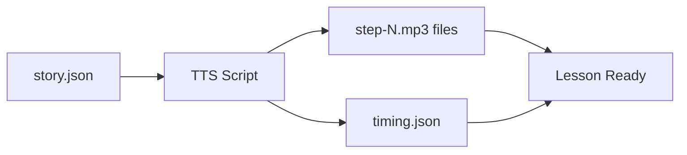

**Testing Checklist (per lesson):**

- [ ] All stories play correctly
- [ ] Audio syncs with word highlighting
- [ ] Quizzes load and score correctly
- [ ] Progress saves to Firestore
- [ ] Responsive on mobile
- [ ] Accessible (keyboard nav, screen reader)

### Phase 5: Enhancement (Ongoing)

- Add more voice options
- Implement story branching (choose your path)
- Add code execution in stories (live REPL)
- A/B test with analytics

---

## Implementation Phases

### Phase 1 Deliverables

```
courses/shared/
├── css/
│   ├── lesson.css              # Existing
│   └── lesson-interactive.css  # NEW: Interactive story styles
└── js/
    ├── firebase-config.js      # Existing
    ├── auth.js                 # Existing
    ├── data-service.js         # Existing
    ├── progress-tracker.js     # Existing (modify)
    ├── activity-tracker.js     # Existing (modify)
    ├── lesson-integration.js   # Existing (modify)
    └── interactive/            # NEW FOLDER
        ├── diagram-utils.js    # Copied from interactive-docs
        ├── audio-engine.js     # Copied from interactive-docs
        ├── storytelling-diagram.js  # Copied from interactive-docs
        ├── quiz-system.js      # Copied from interactive-docs
        └── lesson-story.js     # NEW: Lesson-specific orchestration
```

### Integration Points

```javascript
// lesson-story.js - New file to bridge existing services with interactive engines

class LessonStoryIntegration {
  constructor(courseId, lessonId) {
    this.courseId = courseId;
    this.lessonId = lessonId;
    this.audioEngine = null;
    this.stories = new Map();
    this.quizzes = new Map();
  }

  async init() {
    // Load story JSON
    const response = await fetch(
      `audio/stories/${this.courseId}/${this.lessonId}.json`
    );
    const pageData = await response.json();

    // Create shared audio engine
    this.audioEngine = new AudioNarrationEngine(
      `audio/stories/${this.courseId}/${this.lessonId}`
    );

    // Initialize each story
    for (const story of pageData.stories) {
      const elements = await this.loadDiagramElements(story.diagramId);
      const storyDiagram = new StorytellingDiagram(
        `${story.diagramId}-story`,
        elements,
        story.steps,
        { audioEngine: this.audioEngine, storyId: story.id }
      );

      // Connect to progress tracker
      storyDiagram.onStepComplete = (stepIndex) => {
        this.saveStoryProgress(story.id, stepIndex);
      };

      this.stories.set(story.id, storyDiagram);
    }

    // Initialize quizzes
    for (const quiz of pageData.quizzes) {
      const quizInstance = new Quiz(
        `${quiz.storyId.replace("-story", "")}-quiz`,
        quiz.questions
      );

      // Connect to activity tracker
      quizInstance.onComplete = (score, answers) => {
        window.ActivityTracker?.recordQuizCompletion(
          quiz.storyId,
          score,
          answers
        );
      };

      this.quizzes.set(quiz.storyId, quizInstance);
    }
  }

  async saveStoryProgress(storyId, stepIndex) {
    const storyProgress = {
      storyId,
      stepsCompleted: stepIndex + 1,
      lastStepIndex: stepIndex,
      updatedAt: new Date(),
    };

    // Update via DataService
    await window.DataService?.updateStoryProgress(
      this.courseId,
      this.lessonId,
      storyProgress
    );
  }
}

// Initialize on page load
document.addEventListener("DOMContentLoaded", () => {
  const courseId = document.body.dataset.course;
  const lessonId = document.body.dataset.lesson;

  if (courseId && lessonId) {
    window.LessonStoryIntegration = new LessonStoryIntegration(
      courseId,
      lessonId
    );
    window.LessonStoryIntegration.init();
  }
});
```

---

## File Structure

### Target Structure After Migration

```
courses/
├── apprentice/
│   ├── ch0-origins/
│   │   ├── index.html           # Updated with interactive sections
│   │   ├── diagrams.js          # Cytoscape element definitions
│   │   └── story.json           # Story + quiz data
│   ├── ch1-stone/
│   │   ├── index.html
│   │   ├── diagrams.js
│   │   └── story.json
│   └── ... (ch2-ch6)
│
├── audio/
│   └── stories/
│       └── apprentice/
│           ├── ch0-origins/
│           │   └── intro-story/
│           │       ├── step-0.mp3
│           │       ├── step-1.mp3
│           │       └── timing.json
│           └── ch1-stone/
│               ├── variables-story/
│               ├── datatypes-story/
│               └── input-story/
│
├── shared/
│   ├── css/
│   │   ├── lesson.css
│   │   └── lesson-interactive.css
│   └── js/
│       ├── firebase-config.js
│       ├── auth.js
│       ├── data-service.js
│       ├── progress-tracker.js
│       ├── activity-tracker.js
│       ├── lesson-integration.js
│       └── interactive/
│           ├── diagram-utils.js
│           ├── audio-engine.js
│           ├── storytelling-diagram.js
│           ├── quiz-system.js
│           └── lesson-story.js
│
└── course/
    ├── apprentice.html
    ├── undergrad.html
    ├── junior.html
    └── senior.html
```

---

## Summary: What You're Building

### The Offer Transformation

| Aspect            | Before               | After                            |
| ----------------- | -------------------- | -------------------------------- |
| **Learning Mode** | Read and scroll      | Watch, listen, interact          |
| **Diagrams**      | Static images        | Animated, narrated stories       |
| **Engagement**    | Passive              | Active (play/pause, navigate)    |
| **Quizzes**       | Isolated checkpoints | Integrated after each concept    |
| **Retention**     | Variable             | Enhanced via multimodal learning |
| **Accessibility** | Text-focused         | Audio + visual + text            |

### Competitive Edge

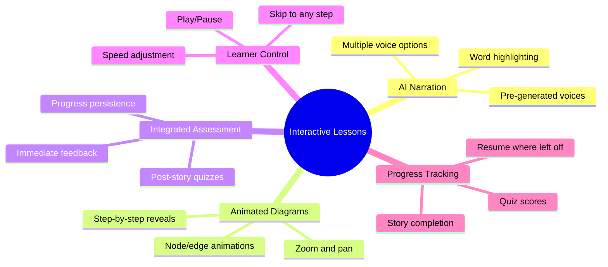

This architecture transforms SWE Hackers into a **premium learning experience** that stands out from static tutorials and video courses by offering the best of both worlds: **structured progression like video** with **interactivity like a tutorial**.

---

## Cursor Rule Reference

### Rule Location

```
autonateai-cursor-rules/.cursor/rules/convert-lesson.mdc
```

### Rule Usage

To convert a lesson, invoke the rule with the lesson path:

```
@convert-lesson Convert this lesson: @swe-hackers/courses/apprentice/ch2-lightning/index.html
```

### What the Rule Does

1. **Reads** the existing lesson HTML
2. **Analyzes** the content structure (hero, sections, quizzes, activities)
3. **Preserves** the chapter theme, metaphors, and storytelling tone
4. **Extracts** key concepts into animated story steps
5. **Creates** `story.json` with narration text and quiz questions
6. **Generates** Cytoscape diagram elements in a `diagrams.js` file
7. **Updates** the HTML to use interactive components
8. **Maintains** existing activities (drag-drop, demos, code challenges)

### Outputs Per Lesson

After conversion, each lesson folder will contain:

```
courses/{course}/{chapter}/
├── index.html          # Updated with interactive sections
├── story.json          # Story steps, narration, quizzes
└── diagrams.js         # Cytoscape element definitions
```

---

## Next Steps

### Immediate Actions

1. **✅ Approve architecture** → Review this document
2. **🔧 Phase 1: Foundation** → Set up shared infrastructure
3. **📝 Phase 2: Create Cursor Rule** → Build `convert-lesson.mdc`
4. **🚀 Phase 3: Parallel Conversion** → Spin up agents per lesson
5. **🎙️ Phase 4: Audio Generation** → Run TTS pipeline
6. **✅ Phase 5: Testing** → Validate all lessons

### Command to Start Phase 1

```bash
# Create the interactive folder structure
mkdir -p courses/shared/js/interactive
mkdir -p courses/shared/css

# Copy interactive engines from interactive-docs
cp diagrams_and_docs/interactive-docs/shared/*.js courses/shared/js/interactive/
cp diagrams_and_docs/interactive-docs/shared/styles.css courses/shared/css/lesson-interactive.css
```

### Command to Convert a Lesson (After Phase 2)

```
@convert-lesson Convert @swe-hackers/courses/apprentice/ch1-stone/index.html
```

---

_Document created: January 2026_
_Last updated: January 2026_
_Cursor Rule: `@autonateai-cursor-rules/.cursor/rules/convert-lesson.mdc`_
