# Admin Portal Interactive Docs Integration

> **Integrate AI-narrated architecture documentation into the admin portal for team onboarding**

This document provides a complete inventory of platform services, data models, and a step-by-step plan to integrate the interactive documentation into the admin portal with proper authentication guards.

---

## Table of Contents

1. [Executive Summary](#executive-summary)
2. [Service Layer Inventory](#service-layer-inventory)
3. [Data Model Overview](#data-model-overview)
4. [Interactive Docs Overview](#interactive-docs-overview)
5. [Integration Architecture](#integration-architecture)
6. [Implementation Plan](#implementation-plan)
7. [File Structure](#file-structure)

---

## Executive Summary

### The Goal

Move the interactive architecture documentation from `diagrams_and_docs/interactive-docs/` into the admin portal at `courses/admin/docs/` with:

- 🔐 **Admin-only access** via RouteGuard + RBACService
- 🎨 **Consistent styling** with admin portal dashboard
- 🧭 **Integrated navigation** from admin sidebar
- 🎙️ **Full AI narration** with word-level highlighting
- 📊 **All 8 documentation pages** covering platform architecture

### Current State


### Target State


---

## Service Layer Inventory

### Complete Service Map

```mermaid
graph TB
    subgraph CORE["🔥 Core Services"]
        FC[FirebaseConfig]
        AS[AuthService]
        RBAC[RBACService]
        RG[RouteGuard]
    end
    
    subgraph DATA["💾 Data Services"]
        DS[DataService]
        PS[PartnerService]
        ANS[AnalyticsService]
    end
    
    subgraph TRACKING["📊 Tracking Services"]
        PT[ProgressTracker]
        AT[ActivityTracker]
    end
    
    subgraph UI["🎨 UI Services"]
        NB[Navbar]
        LS[Lesson]
        LI[LessonIntegration]
        BL[Blog]
    end
    
    FC --> AS
    AS --> RBAC
    RBAC --> RG
    AS --> DS
    AS --> PS
    DS --> ANS
    DS --> PT
    DS --> AT
    
    style CORE fill:#e3f2fd,stroke:#1565c0
    style DATA fill:#e8f5e9,stroke:#2e7d32
    style TRACKING fill:#fff3e0,stroke:#ef6c00
    style UI fill:#fce4ec,stroke:#c2185b
```



### Service Details

| Service | File | Purpose | Dependencies |
|---------|------|---------|--------------|
| **FirebaseConfig** | `firebase-config.js` | Initialize Firebase app, Firestore, Auth | None |
| **AuthService** | `auth.js` | User registration, login, logout, session management | FirebaseConfig |
| **RBACService** | `rbac.js` | Role hierarchy (user/enterprise/admin), organization access, course permissions | AuthService |
| **RouteGuard** | `route-guard.js` | Page protection, redirect flows, admin requirement | AuthService, RBACService |
| **DataService** | `data-service.js` | Course progress, lesson completion, quiz attempts, cognitive metrics | AuthService |
| **PartnerService** | `partner-service.js` | Partner CRUD, interactions, attachments, analytics | AuthService, RBACService |
| **AnalyticsService** | `analytics-service.js` | Learning velocity, quiz mastery, streaks, cognitive scores | DataService |
| **ProgressTracker** | `progress-tracker.js` | Scroll-based section visibility, IntersectionObserver | DataService |
| **ActivityTracker** | `activity-tracker.js` | Quiz answers, drag-drop completion, offline queue | DataService |
| **Navbar** | `navbar.js` | Navigation state, user menu, course links | AuthService |
| **Lesson** | `lesson.js` | Lesson page utilities, section navigation | ProgressTracker |
| **LessonIntegration** | `lesson-integration.js` | Connect trackers to UI | ProgressTracker, ActivityTracker |
| **Blog** | `blog.js` | Blog-specific utilities | None |

---

### AuthService Flow


### RBACService Role Hierarchy

```mermaid
graph TD
    subgraph ROLES["Role Hierarchy"]
        ADMIN["👑 admin"]
        ENT["🏢 enterprise"]
        USER["👤 user"]
        GUEST["👻 guest"]
    end
    
    ADMIN -->|"inherits"| ENT
    ENT -->|"inherits"| USER
    USER -->|"inherits"| GUEST
    
    subgraph PERMISSIONS["Permissions"]
        P_ALL["All Courses"]
        P_ADMIN["Admin Tools"]
        P_PARTNER["Partner Courses"]
        P_PUBLIC["Public Courses"]
        P_DASH["Dashboard"]
    end
    
    ADMIN --> P_ALL
    ADMIN --> P_ADMIN
    ENT --> P_PARTNER
    USER --> P_PUBLIC
    USER --> P_DASH
    
    style ADMIN fill:#ffd54f,stroke:#f9a825
    style ENT fill:#81d4fa,stroke:#0288d1
    style USER fill:#a5d6a7,stroke:#388e3c
```



### RouteGuard Decision Tree

```mermaid
flowchart TD
    START[Page Load] --> CHECK_PUBLIC{Is Public Page?}
    
    CHECK_PUBLIC -->|Yes| ALLOW_PUBLIC[Allow Access]
    CHECK_PUBLIC -->|No| WAIT_AUTH[Wait for Auth State]
    
    WAIT_AUTH --> CHECK_USER{User Signed In?}
    
    CHECK_USER -->|No| REDIRECT_LOGIN[Redirect to Login]
    CHECK_USER -->|Yes| CHECK_COURSE{Course Page?}
    
    CHECK_COURSE -->|No| CHECK_ADMIN{Admin Page?}
    CHECK_COURSE -->|Yes| CHECK_RBAC[Check RBAC Access]
    
    CHECK_ADMIN -->|Yes| REQUIRE_ADMIN[requireAdmin()]
    CHECK_ADMIN -->|No| ALLOW[Allow Access]
    
    REQUIRE_ADMIN --> HAS_ADMIN{Is Admin?}
    HAS_ADMIN -->|Yes| ALLOW
    HAS_ADMIN -->|No| DENY[Access Denied]
    
    CHECK_RBAC --> CAN_ACCESS{canAccessCourse()?}
    CAN_ACCESS -->|Yes| ALLOW
    CAN_ACCESS -->|No| DENY
    
    style ALLOW fill:#4caf50,stroke:#2e7d32
    style DENY fill:#f44336,stroke:#c62828
    style REDIRECT_LOGIN fill:#ff9800,stroke:#ef6c00
```

---

## Data Model Overview

### Firestore Collections


### User Document Schema

```javascript
// users/{uid}
{
  uid: "abc123",
  email: "user@example.com",
  displayName: "John Doe",
  role: "user" | "enterprise" | "admin",
  organizationAccess: ["endless-opportunities", "partner-x"],
  courseAccess: ["custom-course-1"],
  createdAt: Timestamp,
  lastLogin: Timestamp,
  currentStreak: 5,
  longestStreak: 12,
  lastActiveDate: "2024-01-15"
}
```

### Partner Document Schema

```javascript
// partners/{partnerId}
{
  id: "partner-abc",
  name: "Grand Rapids Public Schools",
  type: "school",
  status: "active",
  contact: {
    name: "Jane Smith",
    email: "jane@grps.org",
    phone: "616-555-1234",
    role: "IT Director"
  },
  address: {
    street: "1331 Franklin SE",
    city: "Grand Rapids",
    state: "MI",
    zip: "49507"
  },
  notes: "Interested in after-school program",
  totalInteractions: 15,
  totalStudents: 120,
  lastInteractionAt: Timestamp,
  createdAt: Timestamp,
  createdBy: "admin-uid"
}
```

---

## Interactive Docs Overview

### Current Interactive Docs Structure

```
diagrams_and_docs/interactive-docs/
├── 00-overview.html          # System context, service flow
├── 01-service-layer.html     # All 13 services detailed
├── 02-page-types.html        # Marketing, auth, lessons, dashboard
├── 03-data-model.html        # Firestore schema
├── 04-authentication-rbac.html  # Auth flow, role hierarchy
├── 05-progress-tracking.html    # Scroll/activity tracking
├── 06-frontend-patterns.html    # CSS, animations, components
├── 07-partnership-portal.html   # Partner CRM system
├── audio/
│   ├── echo/                 # Female storyteller voice
│   ├── alloy/                # Neutral narrator
│   ├── fable/                # British professor
│   ├── onyx/                 # Male guide
│   ├── nova/                 # Energetic coach
│   ├── shimmer/              # Warm mentor
│   └── stories/              # JSON story definitions
└── shared/
    ├── styles.css            # Dark theme styling
    ├── storytelling-diagram.js  # Cytoscape + animation
    ├── audio-engine.js       # Narration playback
    ├── quiz-system.js        # Quiz components
    └── diagram-utils.js      # Cytoscape helpers
```

### Interactive Docs Features

| Feature | Description |
|---------|-------------|
| **AI Narration** | Pre-generated TTS with word-level timestamps |
| **6 Voice Options** | Different narrator personalities |
| **Animated Diagrams** | Cytoscape.js with step-by-step reveals |
| **Edge Animations** | Dashed line flow between nodes |
| **Progress Dots** | Click to jump, visual completion state |
| **Speed Control** | 0.5s - 10s per slide |
| **Integrated Quizzes** | Test understanding after concepts |
| **Responsive Design** | Works on all screen sizes |

### Story Coverage (278 Total Nodes)

| Page | Stories | Nodes |
|------|---------|-------|
| 00-overview | 3 | 31 |
| 01-service-layer | 5 | 42 |
| 02-page-types | 4 | 28 |
| 03-data-model | 5 | 38 |
| 04-authentication-rbac | 6 | 57 |
| 05-progress-tracking | 7 | 60 |
| 06-frontend-patterns | 8 | 87 |
| 07-partnership-portal | 8 | 74 |

---

## Integration Architecture

### Target Admin Portal Structure

```
courses/admin/
├── index.html              # Admin dashboard (add docs link)
├── partnerships/
│   ├── index.html          # Partner list
│   ├── partner.html        # Partner detail
│   ├── add.html            # Add partner
│   └── analytics.html      # Partnership analytics
└── docs/                   # ← INTEGRATION TARGET
    ├── index.html          # NEW: Docs home with cards
    ├── 00-overview.html
    ├── 01-service-layer.html
    ├── 02-page-types.html
    ├── 03-data-model.html
    ├── 04-authentication-rbac.html
    ├── 05-progress-tracking.html
    ├── 06-frontend-patterns.html
    ├── 07-partnership-portal.html
    ├── audio/              # All narration files
    └── shared/             # Storytelling modules
```

### Authentication Integration

```mermaid
sequenceDiagram
    participant U as Admin User
    participant P as Docs Page
    participant RG as RouteGuard
    participant RBAC as RBACService
    participant AS as AuthService
    
    U->>P: Navigate to /admin/docs/
    P->>RG: DOMContentLoaded
    RG->>AS: waitForAuthState()
    AS-->>RG: User object
    
    alt No User
        RG->>U: Redirect to /auth/login.html
    else User Exists
        RG->>RBAC: hasRole('admin')
        alt Not Admin
            RBAC-->>RG: false
            RG->>U: Access Denied → /dashboard/
        else Is Admin
            RBAC-->>RG: true
            RG-->>P: Allow access
            P->>P: Initialize StorytellingDiagram
        end
    end
```



### Script Loading Order

```html
<!-- Firebase (required first) -->
<script src="https://www.gstatic.com/firebasejs/9.x/firebase-app-compat.js"></script>
<script src="https://www.gstatic.com/firebasejs/9.x/firebase-auth-compat.js"></script>
<script src="https://www.gstatic.com/firebasejs/9.x/firebase-firestore-compat.js"></script>

<!-- Core Services -->
<script src="../../shared/js/firebase-config.js"></script>
<script src="../../shared/js/auth.js"></script>
<script src="../../shared/js/rbac.js"></script>
<script src="../../shared/js/route-guard.js"></script>

<!-- Interactive Docs Modules -->
<script src="shared/diagram-utils.js"></script>
<script src="shared/audio-engine.js"></script>
<script src="shared/storytelling-diagram.js"></script>
<script src="shared/quiz-system.js"></script>
```

---

## Implementation Plan

### Phase 1: Create Docs Index Page

Create `courses/admin/docs/index.html` with:
- Admin header with navigation
- Card grid linking to all 8 docs
- Admin route protection

### Phase 2: Update Doc Pages with Auth

Add to each doc page:
1. Firebase + auth scripts from `../../shared/js/`
2. `RouteGuard.requireAdmin()` call
3. Admin-style header with back navigation

### Phase 3: Update Admin Navigation

Add "📚 Team Docs" link to:
- Admin dashboard sidebar
- Partnership portal navigation

### Phase 4: Verify Audio Paths

Ensure all audio file paths work from new location:
- `audio/echo/story-name/step-N.mp3`
- `audio/stories/page-name.json`

### Implementation Checklist

- [ ] Create `admin/docs/index.html` with card navigation
- [ ] Add Firebase scripts to all doc pages
- [ ] Add `RouteGuard.requireAdmin()` to all doc pages
- [ ] Update header navigation in all doc pages
- [ ] Add docs link to admin sidebar
- [ ] Test all audio playback
- [ ] Test all quiz functionality
- [ ] Verify mobile responsiveness

---

## File Structure

### Files to Create

```
courses/admin/docs/index.html       # NEW: Docs landing page
```

### Files to Modify

```
courses/admin/docs/00-overview.html
courses/admin/docs/01-service-layer.html
courses/admin/docs/02-page-types.html
courses/admin/docs/03-data-model.html
courses/admin/docs/04-authentication-rbac.html
courses/admin/docs/05-progress-tracking.html
courses/admin/docs/06-frontend-patterns.html
courses/admin/docs/07-partnership-portal.html
```

### Changes Per Doc Page

1. **Add Firebase scripts** (before closing `</body>`):
```html
<!-- Firebase -->
<script src="https://www.gstatic.com/firebasejs/9.22.0/firebase-app-compat.js"></script>
<script src="https://www.gstatic.com/firebasejs/9.22.0/firebase-auth-compat.js"></script>
<script src="https://www.gstatic.com/firebasejs/9.22.0/firebase-firestore-compat.js"></script>

<!-- Auth Services -->
<script src="../../shared/js/firebase-config.js"></script>
<script src="../../shared/js/auth.js"></script>
<script src="../../shared/js/rbac.js"></script>
<script src="../../shared/js/route-guard.js"></script>
```

2. **Add admin check** in DOMContentLoaded:
```javascript
document.addEventListener('DOMContentLoaded', async () => {
  // Wait for auth, require admin role
  const hasAccess = await RouteGuard.requireAdmin();
  if (!hasAccess) return;
  
  // ... existing initialization
});
```

3. **Update header navigation** to link back to admin:
```html
<nav class="nav-links">
  <a href="../index.html">← Admin</a>
  <a href="index.html">Docs Home</a>
  <a href="00-overview.html">Overview</a>
  <!-- ... -->
</nav>
```

---

## Summary

This integration brings the interactive architecture documentation into the protected admin portal, giving your team:

1. **Secure access** - Only admins can view internal documentation
2. **Consistent UX** - Same navigation patterns as partnership portal
3. **Full functionality** - All AI narration, animations, and quizzes work
4. **Single location** - Team members find everything in the admin portal

The implementation is straightforward:
- Add auth scripts to doc pages
- Call `RouteGuard.requireAdmin()`
- Create a docs index page
- Link from admin navigation

Total estimated effort: **2-3 hours**
