# Number Guessing Game System Architecture 🎯

A systems-thinking breakdown of a simple number guessing game where the computer randomly selects a number and the user has to guess it.

---

## 🎮 Game Flow Overview

```mermaid
flowchart TD
    A[🎮 Start Game] --> B[🎲 Generate Random Number]
    B --> C[Set Available Chances]
    C --> D[👤 User Enters Guess]

    D --> E{Is Guess Correct?}

    E -->|✅ Yes| F[🎉 User Wins!]
    F --> G[Display Victory Message]
    G --> H[🔚 End Game]

    E -->|❌ No| I{Chances Remaining?}

    I -->|Yes| J{Guess Too High or Low?}
    J -->|Too High| K[📉 Hint: Go Lower]
    J -->|Too Low| L[📈 Hint: Go Higher]
    K --> M[Decrement Chances]
    L --> M
    M --> D

    I -->|No| N[😔 User Loses]
    N --> O[Reveal Correct Number]
    O --> H

    style A fill:#4CAF50,color:#fff
    style F fill:#FFD700,color:#000
    style N fill:#f44336,color:#fff
    style H fill:#9E9E9E,color:#fff
```

## Game Flow Summary

| Phase              | Description                                  |
| ------------------ | -------------------------------------------- |
| **Initialization** | Generate random number & set max chances     |
| **Input**          | User submits their guess                     |
| **Validation**     | Check if guess matches the target            |
| **Feedback**       | Provide "too high" or "too low" hints        |
| **Termination**    | Win (correct guess) or Lose (out of chances) |

---

_Diagram created as part of Systems Thinking challenge • SWE Hackers 🏗️_
